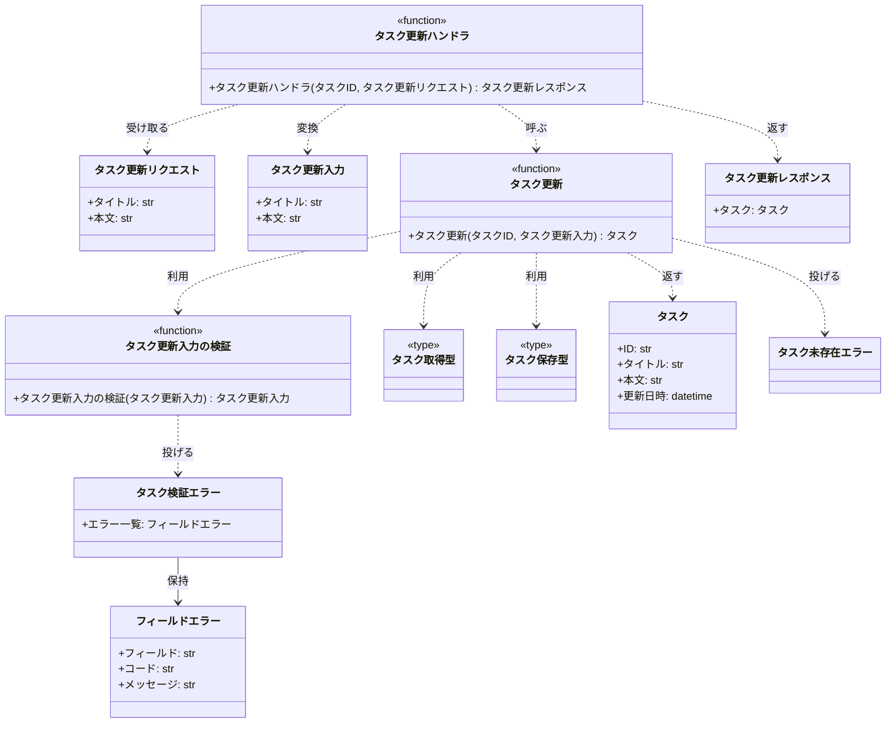
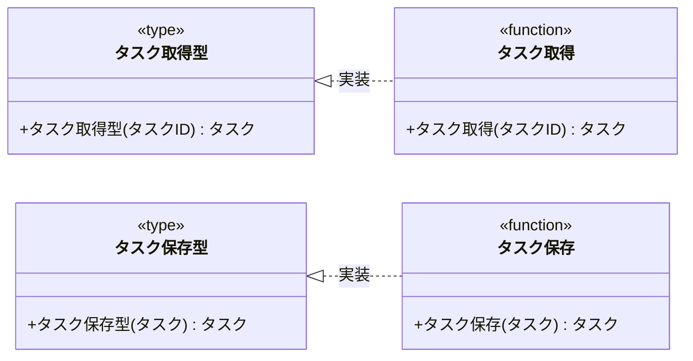

# モジュール構成: バックエンド / タスク

`タスク` ドメイン（バックエンド側）に属する構成要素詳細。

- 対応テストファイル: 未記入

## 一覧

| ユースケース | 役割 | コンテナ | 種別 | 名前 | 概要 | 補足 |
| --- | --- | --- | --- | --- | --- | --- |
| 共通 | ドメインモデル | `features/tasks/types.py` | データモデル | [`Task`](#タスク) | タスクのドメインモデル | - |
| 共通 | エラー詳細 | `features/tasks/types.py` | データモデル | [`FieldError`](#フィールドエラー) | フィールド単位の検証エラー 1 件 | - |
| 共通 | 例外 | `features/tasks/types.py` | クラス | [`TaskValidationError`](#タスク検証エラー) | フィールド単位の検証エラーをまとめた例外 | `ValidationError` を継承 |
| 共通 | 例外 | `features/tasks/types.py` | クラス | [`TaskNotFoundError`](#タスク未存在エラー) | 対象タスクが存在しない例外 | `NotFoundError` を継承 |
| タスク更新 | DTO | `features/tasks/types.py` | データモデル | [`TaskUpdateInput`](#タスク更新入力) | 更新の入力値 | - |
| タスク更新 | リポジトリ型（DI） | `features/tasks/types.py` | 関数型 | [`FindTask`](#タスク取得型) | タスク取得のシグネチャ | DI / Mock 差し替え用 |
| タスク更新 | リポジトリ型（DI） | `features/tasks/types.py` | 関数型 | [`SaveTask`](#タスク保存型) | タスク保存のシグネチャ | DI / Mock 差し替え用 |
| タスク更新 | バリデータ | `features/tasks/service.py` | 関数 | [`validate_task_update`](#タスク更新入力の検証) | 更新入力の検証 | 失敗時 `TaskValidationError` |
| タスク更新 | サービス | `features/tasks/service.py` | 関数 | [`update_task`](#タスク更新) | タスク更新のドメインロジック | - |
| タスク更新 | リポジトリ | `features/tasks/db.py` | 関数 | [`find_task`](#タスク取得) | ID でタスクを 1 件取得 | - |
| タスク更新 | リポジトリ | `features/tasks/db.py` | 関数 | [`save_task`](#タスク保存) | タスクを保存 | - |
| タスク更新 | リクエストスキーマ | `features/tasks/schemas.py` | データモデル | [`UpdateTaskRequest`](#タスク更新リクエスト) | 更新リクエストのボディ | - |
| タスク更新 | レスポンススキーマ | `features/tasks/schemas.py` | データモデル | [`UpdateTaskResponse`](#タスク更新レスポンス) | 更新レスポンス | - |
| タスク更新 | ハンドラ | `features/tasks/route.py` | 関数 | [`update_task_route`](#タスク更新ハンドラ) | PUT /tasks/{task_id} のハンドラ | - |

## ディレクトリ構成

```
src/app/features/tasks/
├── types.py      # Task / TaskUpdateInput / FieldError / 例外 / 関数型
├── service.py    # update_task / validate_task_update
├── db.py         # find_task / save_task
├── schemas.py    # UpdateTaskRequest / UpdateTaskResponse
└── route.py      # PUT /tasks/{task_id}
```

## 構成図

### タスク更新



### 永続化



## タスク
> 物理名: `Task`<br>
> 種別: データモデル<br>
> コンテナ: `features/tasks/types.py`

タスクのドメインモデル。

### プロパティ

| 論理名 | プロパティ名 | 型 | 可視性 | デフォルト | 説明 | 例 | 補足 |
| --- | --- | --- | --- | --- | --- | --- | --- |
| ID | `id` | `str` | 公開 | - | タスク ID | `"3f2b1c88-2a17-4c0e-9f1e-6d2b7a5c0e11"` | UUID |
| タイトル | `title` | `str` | 公開 | - | タスク名 | `"決算資料の作成"` | - |
| 本文 | `body` | `str` | 公開 | - | タスク本文 | `"第 4 四半期分をまとめる"` | 未入力は空文字 |
| 更新日時 | `updated_at` | `datetime` | 公開 | - | 最終更新日時 | `datetime(2026, 8, 5, 2, 14, 33, tzinfo=UTC)` | UTC・タイムゾーン付き |

### メソッド

なし

### 単体テスト

なし

### 補足

- `@dataclass(frozen=True, slots=True, kw_only=True)` の不変 DTO として定義する。
  更新は既存インスタンスの書き換えではなく `dataclasses.replace` による新インスタンスの生成で表現する。

## タスク更新入力
> 物理名: `TaskUpdateInput`<br>
> 種別: データモデル<br>
> コンテナ: `features/tasks/types.py`

タスク更新で受け取る入力値。

### プロパティ

| 論理名 | プロパティ名 | 型 | 可視性 | デフォルト | 説明 | 例 | 補足 |
| --- | --- | --- | --- | --- | --- | --- | --- |
| タイトル | `title` | `str` | 公開 | - | 更新後のタスク名 | `"決算資料の作成"` | - |
| 本文 | `body` | `str \| None` | 公開 | `None` | 更新後のタスク本文 | `"第 4 四半期分をまとめる"` | `None` は現在値を保持 |

### メソッド

なし

### 単体テスト

なし

## フィールドエラー
> 物理名: `FieldError`<br>
> 種別: データモデル<br>
> コンテナ: `features/tasks/types.py`

検証に失敗したフィールド 1 件分のエラー内容。

### プロパティ

| 論理名 | プロパティ名 | 型 | 可視性 | デフォルト | 説明 | 例 | 補足 |
| --- | --- | --- | --- | --- | --- | --- | --- |
| フィールド | `field` | `str` | 公開 | - | 対象フィールド名 | `"title"` | リクエストのフィールド名と一致 |
| コード | `code` | `Literal["required", "too_long"]` | 公開 | - | エラー種別 | `"required"` | - |
| メッセージ | `message` | `str` | 公開 | - | 表示用メッセージ | `"タスク名を入力してください"` | 日本語 |

### メソッド

なし

### 単体テスト

なし

## タスク検証エラー
> 物理名: `TaskValidationError`<br>
> 種別: クラス<br>
> コンテナ: `features/tasks/types.py`<br>
> 継承元: `ValidationError`

フィールド単位の検証エラーをまとめて運ぶ例外。

### プロパティ

| 論理名 | プロパティ名 | 型 | 可視性 | デフォルト | 説明 | 例 | 補足 |
| --- | --- | --- | --- | --- | --- | --- | --- |
| エラー一覧 | `errors` | [`list[FieldError]`](#フィールドエラー) | 公開 | - | 検証に失敗した全フィールド | `[FieldError(field="title", code="required", ...)]` | 1 件以上 |

### メソッド

なし

### 単体テスト

なし

### 補足

- `shared/errors.py` の `ValidationError`（`AppError` 系）を継承する。
  最上位の例外ハンドラが `AppError` 1 つで拾える階層を崩さないため。

## タスク未存在エラー
> 物理名: `TaskNotFoundError`<br>
> 種別: クラス<br>
> コンテナ: `features/tasks/types.py`<br>
> 継承元: `NotFoundError`

指定 ID のタスクが存在しないことを表す例外。

### プロパティ

なし

### メソッド

なし

### 単体テスト

なし

## `features/tasks/types.py`
> 種別: ファイル

タスクドメインの DTO・例外・関数型エイリアスを集約するファイル。

---

### タスク取得型
> 物理名: `FindTask`<br>
> 種別: 関数型

ID でタスクを 1 件取得する関数のシグネチャ。
DI / Mock 差し替え用。

#### 引数

| 論理名 | 引数名 | 型 | 必須 | デフォルト | 説明 | 補足 |
| --- | --- | --- | --- | --- | --- | --- |
| タスク ID | `task_id` | `str` | ✅ | - | 取得対象のタスク ID | - |

#### 戻り値

| 型 | 説明 | 補足 |
| --- | --- | --- |
| [`Task \| None`](#タスク) | 見つかったタスク | 見つからない場合は `None` |

#### 実装

| 実装 | 補足 |
| --- | --- |
| [タスク取得](#タスク取得) | 本番の実装（PostgreSQL） |

---

### タスク保存型
> 物理名: `SaveTask`<br>
> 種別: 関数型

タスクを保存する関数のシグネチャ。
DI / Mock 差し替え用。

#### 引数

| 論理名 | 引数名 | 型 | 必須 | デフォルト | 説明 | 補足 |
| --- | --- | --- | --- | --- | --- | --- |
| タスク | `task` | [`Task`](#タスク) | ✅ | - | 保存するタスク | - |

#### 戻り値

| 型 | 説明 | 補足 |
| --- | --- | --- |
| [`Task`](#タスク) | 保存後のタスク | `updated_at` は保存時刻で確定した値 |

#### 実装

| 実装 | 補足 |
| --- | --- |
| [タスク保存](#タスク保存) | 本番の実装（PostgreSQL） |

## `features/tasks/service.py`
> 種別: ファイル

タスク更新のドメインロジックを束ねる関数ファイル。

---

### タスク更新入力の検証
> 物理名: `validate_task_update`<br>
> 種別: 関数

タスク更新の入力値を検証し、正規化した入力を返す。

#### 引数

| 論理名 | 引数名 | 型 | 必須 | デフォルト | 説明 | 補足 |
| --- | --- | --- | --- | --- | --- | --- |
| 入力 | `input` | [`TaskUpdateInput`](#タスク更新入力) | ✅ | - | 検証対象の入力値 | - |

引数例:

```python
validate_task_update(TaskUpdateInput(title="  決算資料の作成  ", body="第 4 四半期分"))
```

#### 戻り値

| 型 | 説明 | 補足 |
| --- | --- | --- |
| [`TaskUpdateInput`](#タスク更新入力) | 正規化済みの入力値 | `title` は前後の空白を除去済み |

戻り値例:

```python
TaskUpdateInput(title="決算資料の作成", body="第 4 四半期分")
```

#### 処理

1. `title` の前後の空白を取り除く
2. `title` の検証エラーを集める
   - 空文字の場合、`title` / `required` のエラーを追加する
   - 100 文字を超える場合、`title` / `too_long` のエラーを追加する
3. 集めたエラーの有無で結果を確定する
   - 1 件以上ある場合、`TaskValidationError` を投げる
     - `[WARNING]` タスク更新の入力検証に失敗した（`エラーになったフィールド名の一覧`）
   - 0 件の場合、正規化済みの入力を返す

#### 例外

| 例外名 | 発生条件 | メッセージ | 補足 |
| --- | --- | --- | --- |
| `TaskValidationError` | 検証エラーが 1 件以上ある | `"タスク更新の入力が不正です"` | エラー内容は `errors` が持つ |

#### 単体テスト

| テスト名 | 正常/異常 | 概要 | 条件 | Mock | 期待値 | 補足 |
| --- | --- | --- | --- | --- | --- | --- |
| `test_validate_task_update` | 正常 | 妥当な入力を正規化して返す | `title` が前後に空白を含む 10 文字 | なし | 空白除去済みの `TaskUpdateInput` を返す | - |
| `test_validate_task_update_when_title_is_100_chars` | 正常 | 上限ちょうどを許容する | `title` が 100 文字 | なし | 入力をそのまま返す | 境界値 |
| `test_validate_task_update_when_title_is_empty` | 異常 | タスク名が空 | `title` が空文字 | なし | `TaskValidationError`（`title` / `required` 1 件）を throw | 例外表「検証エラーが 1 件以上」に対応 |
| `test_validate_task_update_when_title_is_blank` | 異常 | タスク名が空白のみ | `title` が `"   "` | なし | `TaskValidationError`（`title` / `required` 1 件）を throw | 例外表「検証エラーが 1 件以上」に対応 |
| `test_validate_task_update_when_title_is_too_long` | 異常 | タスク名が上限超過 | `title` が 101 文字 | なし | `TaskValidationError`（`title` / `too_long` 1 件）を throw | 例外表「検証エラーが 1 件以上」に対応 |

---

### タスク更新
> 物理名: `update_task`<br>
> 種別: 関数

既存タスクのタイトル・本文を検証して更新する。

#### 引数

| 論理名 | 引数名 | 型 | 必須 | デフォルト | 説明 | 補足 |
| --- | --- | --- | --- | --- | --- | --- |
| タスク ID | `task_id` | `str` | ✅ | - | 更新対象のタスク ID | - |
| 入力 | `input` | [`TaskUpdateInput`](#タスク更新入力) | ✅ | - | 更新後の値 | - |
| タスク取得 | `find` | [`FindTask`](#タスク取得型) | ✅ | - | 取得処理の注入口 | キーワード引数 |
| タスク保存 | `save` | [`SaveTask`](#タスク保存型) | ✅ | - | 保存処理の注入口 | キーワード引数 |

引数例:

```python
update_task("3f2b1c88", TaskUpdateInput(title="決算資料の作成"), find=find_task, save=save_task)
```

#### 戻り値

| 型 | 説明 | 補足 |
| --- | --- | --- |
| [`Task`](#タスク) | 更新後のタスク | - |

戻り値例:

```python
Task(id="3f2b1c88", title="決算資料の作成", body="第 4 四半期分", updated_at=datetime(2026, 8, 5, 2, 14, 33, tzinfo=UTC))
```

#### 処理

1. 入力値を検証して正規化する（[タスク更新入力の検証](#タスク更新入力の検証)）
2. `task_id` でタスクを取得する（[タスク取得型](#タスク取得型)）
3. 取得結果で処理の継続可否を確定する
   - `None` の場合、`TaskNotFoundError` を投げる
     - `[WARNING]` 存在しないタスクの更新を拒否した（`task_id`）
4. 取得したタスクにタイトル・本文を反映した新しいタスクを組み立てる
   - `body` が `None` の場合は現在値を保持する
5. タスクを保存して返す（[タスク保存型](#タスク保存型)）
   - `[INFO]` タスクを更新した（`task_id`）

#### 例外

| 例外名 | 発生条件 | メッセージ | 補足 |
| --- | --- | --- | --- |
| `TaskNotFoundError` | `task_id` に対応するタスクが存在しない | `"タスクが見つかりません: {task_id}"` | - |

#### 単体テスト

| テスト名 | 正常/異常 | 概要 | 条件 | Mock | 期待値 | 補足 |
| --- | --- | --- | --- | --- | --- | --- |
| `test_update_task` | 正常 | タイトル・本文を更新 | 対象タスクが存在し `title` / `body` を指定 | `find` / `save` | 更新後の `Task` を返し、`save` に反映済みタスクが渡る | - |
| `test_update_task_when_body_is_none` | 正常 | 本文を省略した更新 | `body` が `None` | `find` / `save` | `save` に渡るタスクの `body` が現在値のまま | 分岐: 本文の保持 |
| `test_update_task_when_task_missing` | 異常 | 対象タスクが存在しない | `find` が `None` を返す | `find` / `save` | `TaskNotFoundError` を throw し、`save` は呼ばれない | 例外表「タスクが存在しない」に対応 |

## `features/tasks/db.py`
> 種別: ファイル

タスクの永続化操作を集約する関数ファイル。

---

### タスク取得
> 物理名: `find_task`<br>
> 種別: 関数<br>
> 継承元: [`FindTask`](#タスク取得型)

ID でタスクを 1 件取得する。

#### 引数

| 論理名 | 引数名 | 型 | 必須 | デフォルト | 説明 | 補足 |
| --- | --- | --- | --- | --- | --- | --- |
| タスク ID | `task_id` | `str` | ✅ | - | 取得対象のタスク ID | - |

引数例:

```python
find_task("3f2b1c88-2a17-4c0e-9f1e-6d2b7a5c0e11")
```

#### 戻り値

| 型 | 説明 | 補足 |
| --- | --- | --- |
| [`Task \| None`](#タスク) | 見つかったタスク | 見つからない場合は `None` |

戻り値例:

```python
Task(id="3f2b1c88", title="決算資料の作成", body="第 4 四半期分", updated_at=datetime(2026, 8, 5, 2, 14, 33, tzinfo=UTC))
```

#### 処理

1. `task_id` で tasks テーブルを 1 件検索する
2. 検索結果を `Task` に変換して返す
   - 該当行が無い場合、`None` を返す

#### 例外

なし

#### 単体テスト

| テスト名 | 正常/異常 | 概要 | 条件 | Mock | 期待値 | 補足 |
| --- | --- | --- | --- | --- | --- | --- |
| `test_find_task` | 正常 | 該当行を `Task` に変換 | tasks に対象行あり | DB 接続 | `Task` を返す | - |
| `test_find_task_when_row_missing` | 正常 | 該当行なし | tasks に対象行なし | DB 接続 | `None` を返す | 分岐: 該当行なし |

---

### タスク保存
> 物理名: `save_task`<br>
> 種別: 関数<br>
> 継承元: [`SaveTask`](#タスク保存型)

タスクを保存する。

#### 引数

| 論理名 | 引数名 | 型 | 必須 | デフォルト | 説明 | 補足 |
| --- | --- | --- | --- | --- | --- | --- |
| タスク | `task` | [`Task`](#タスク) | ✅ | - | 保存するタスク | - |

引数例:

```python
save_task(Task(id="3f2b1c88", title="決算資料の作成", body="第 4 四半期分", updated_at=now))
```

#### 戻り値

| 型 | 説明 | 補足 |
| --- | --- | --- |
| [`Task`](#タスク) | 保存後のタスク | `updated_at` は DB が確定した値 |

戻り値例:

```python
Task(id="3f2b1c88", title="決算資料の作成", body="第 4 四半期分", updated_at=datetime(2026, 8, 5, 2, 14, 33, tzinfo=UTC))
```

#### 処理

1. tasks テーブルの該当行の `title` / `body` / `updated_at` を更新する（書き込みに失敗した場合は DB の例外がそのまま伝播する）
2. 更新後の行を `Task` に変換して返す

#### 例外

なし

#### 単体テスト

| テスト名 | 正常/異常 | 概要 | 条件 | Mock | 期待値 | 補足 |
| --- | --- | --- | --- | --- | --- | --- |
| `test_save_task` | 正常 | 該当行を更新して返す | tasks に対象行あり | DB 接続 | 更新後の `Task` を返す | - |

## `features/tasks/schemas.py`
> 種別: ファイル

タスク API のリクエスト / レスポンススキーマを集約するファイル。

## タスク更新リクエスト
> 物理名: `UpdateTaskRequest`<br>
> 種別: データモデル<br>
> コンテナ: `features/tasks/schemas.py`

PUT /tasks/{task_id} のリクエストボディ。

### プロパティ

| 論理名 | プロパティ名 | 型 | 可視性 | デフォルト | 説明 | 例 | 補足 |
| --- | --- | --- | --- | --- | --- | --- | --- |
| タイトル | `title` | `str` | 公開 | - | 更新後のタスク名 | `"決算資料の作成"` | 値の検証は [タスク更新入力の検証](#タスク更新入力の検証) が行う |
| 本文 | `body` | `str \| None` | 公開 | `None` | 更新後のタスク本文 | `"第 4 四半期分をまとめる"` | `None` は現在値を保持 |

### メソッド

なし

### 単体テスト

なし

### 補足

- `pydantic.BaseModel` として定義する（外部境界のため）。
- 文字数・空文字の検証は Pydantic の `Field` ではなく [タスク更新入力の検証](#タスク更新入力の検証) に寄せる。
  フィールド単位のエラー内容を業務仕様どおりの形（`code` / `message`）で返すため。

## タスク更新レスポンス
> 物理名: `UpdateTaskResponse`<br>
> 種別: データモデル<br>
> コンテナ: `features/tasks/schemas.py`

PUT /tasks/{task_id} のレスポンスボディ。

### プロパティ

| 論理名 | プロパティ名 | 型 | 可視性 | デフォルト | 説明 | 例 | 補足 |
| --- | --- | --- | --- | --- | --- | --- | --- |
| タスク | `task` | `TaskPayload` | 公開 | - | 更新後のタスク | `TaskPayload(id="3f2b1c88", ...)` | `TaskPayload = { id, title, body, updatedAt }` |

### メソッド

なし

### 単体テスト

なし

### 補足

- `pydantic.BaseModel` として定義し、[`Task`](#タスク) からの変換は `from_domain` クラスメソッドで行う。
- `updated_at` はレスポンス上 `updatedAt` になる（`alias` で変換）。

## `features/tasks/route.py`
> 種別: ファイル

タスク API のルーターを定義するファイル。

---

### タスク更新ハンドラ
> 物理名: `update_task_route`<br>
> 種別: 関数

PUT /tasks/{task_id} を受けてタスク更新サービスを呼ぶ。

#### 引数

| 論理名 | 引数名 | 型 | 必須 | デフォルト | 説明 | 補足 |
| --- | --- | --- | --- | --- | --- | --- |
| タスク ID | `task_id` | `str` | ✅ | - | 更新対象のタスク ID | パスパラメータ |
| リクエスト | `body` | [`UpdateTaskRequest`](#タスク更新リクエスト) | ✅ | - | 更新後の値 | リクエストボディ |
| ハンドラ束 | `handlers` | `Handlers` | ✅ | - | 配線済み関数の束 | `Depends` で注入 |

引数例:

```python
await update_task_route("3f2b1c88", UpdateTaskRequest(title="決算資料の作成"), handlers)
```

#### 戻り値

| 型 | 説明 | 補足 |
| --- | --- | --- |
| [`UpdateTaskResponse`](#タスク更新レスポンス) | 更新後のタスク | HTTP 200 |

戻り値例:

```python
UpdateTaskResponse(task=TaskPayload(id="3f2b1c88", title="決算資料の作成", body="第 4 四半期分", updatedAt="2026-08-05T02:14:33+00:00"))
```

#### 処理

1. リクエストを [`TaskUpdateInput`](#タスク更新入力) に変換する
2. タスク更新を呼ぶ（[タスク更新](#タスク更新)）
3. 更新後のタスクを [`UpdateTaskResponse`](#タスク更新レスポンス) に変換して返す

#### 例外

なし

#### 単体テスト

| テスト名 | 正常/異常 | 概要 | 条件 | Mock | 期待値 | 補足 |
| --- | --- | --- | --- | --- | --- | --- |
| `test_update_task_route` | 正常 | サービスを呼んでレスポンスに変換 | 妥当なリクエスト | `update_task` | `UpdateTaskResponse` を返し、`update_task` に変換済み入力が渡る | - |

### 補足

- `TaskValidationError` / `TaskNotFoundError` の HTTP 変換は本ファイルでは行わず、`register_exception_handlers` に任せる。
  `TaskValidationError` は 400（`errors` をボディに展開）、`TaskNotFoundError` は 404 に対応する。
