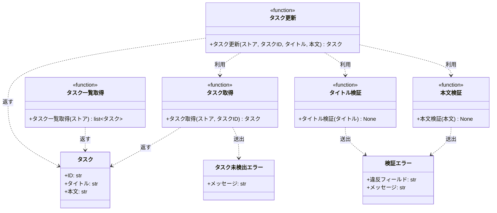

# モジュール構成: バックエンド / タスク

`タスク` ドメイン（バックエンド側）に属する構成要素詳細。

- 対応テストファイル: `tests/unit/tasks/test_service.py`

## 一覧

| ユースケース | 役割 | コンテナ | 種別 | 名前 | 概要 | 補足 |
| --- | --- | --- | --- | --- | --- | --- |
| 共通 | ドメインモデル | `tasks/models.py` | データモデル | [`Task`](#タスク) | タスク 1 件 | - |
| 共通 | ストア型 | `tasks/models.py` | データモデル | `TaskStore` | タスク ID をキーにしたタスクの辞書 | `dict[str, Task]` の型エイリアス |
| 共通 | 例外 | `tasks/errors.py` | クラス | [`TaskNotFoundError`](#タスク未検出エラー) | 指定 ID のタスクが存在しない | - |
| 共通 | 例外 | `tasks/errors.py` | クラス | [`ValidationError`](#検証エラー) | 入力値が制約を満たさない | 違反フィールド名を持つ |
| 共通 | 定数 | `tasks/constants.py` | 定数 | `TITLE_MAX_LENGTH` | タイトルの最大文字数 | `100` |
| 共通 | 定数 | `tasks/constants.py` | 定数 | `CONTENT_MAX_LENGTH` | 本文の最大文字数 | `1000` |
| 共通 | 参照 | `tasks/service.py` | 関数 | [`get_task`](#タスク取得) | ストアからタスクを 1 件取得する | 既存 |
| タスク編集 | サービス | `tasks/service.py` | 関数 | [`update_task`](#タスク更新) | タスクのタイトルと本文を更新する | - |
| タスク編集 | バリデータ | `tasks/service.py` | 関数 | [`_validate_title`](#タイトル検証) | タイトルの制約を検証する | - |
| タスク編集 | バリデータ | `tasks/service.py` | 関数 | [`_validate_content`](#本文検証) | 本文の制約を検証する | - |
| タスク編集 | 参照 | `tasks/service.py` | 関数 | [`list_tasks`](#タスク一覧取得) | ストアの全タスクを一覧で返す | 編集結果が一覧に反映されたかの確認に使う |

## ディレクトリ構成

```
src/tasks/
├── models.py       # Task / TaskStore
├── errors.py       # TaskNotFoundError / ValidationError
├── constants.py    # 検証の上限値
└── service.py      # get_task / update_task / list_tasks / 検証ヘルパー
```

## 構成図



## タスク
> 物理名: `Task`<br>
> 種別: データモデル<br>
> コンテナ: `tasks/models.py`

タスク 1 件を表す不変のデータモデル。

### プロパティ

| 論理名 | プロパティ名 | 型 | 可視性 | デフォルト | 説明 | 例 | 補足 |
| --- | --- | --- | --- | --- | --- | --- | --- |
| ID | `id` | `str` | 公開 | - | タスクの一意識別子 | `t1` | ストアのキーと一致する |
| タイトル | `title` | `str` | 公開 | - | タスクのタイトル | `新タイトル` | 1〜100 文字 |
| 本文 | `content` | `str` | 公開 | `""` | タスクの詳細 | `新本文` | 1000 文字以内 |

### メソッド

なし

### 単体テスト

なし

### 補足

- `@dataclass(frozen=True, slots=True, kw_only=True)` で定義する。
  更新は新しいインスタンスを作ってストアに入れ替える

## タスク未検出エラー
> 物理名: `TaskNotFoundError`<br>
> 種別: クラス<br>
> コンテナ: `tasks/errors.py`

指定 ID のタスクがストアに存在しない。

### プロパティ

なし

### メソッド

なし

### 単体テスト

なし

## 検証エラー
> 物理名: `ValidationError`<br>
> 種別: クラス<br>
> コンテナ: `tasks/errors.py`

入力値が制約を満たさない。
どのフィールドが違反したかを属性で持ち、呼び出し元がフィールド単位のエラー表示に使う。

### プロパティ

| 論理名 | プロパティ名 | 型 | 可視性 | デフォルト | 説明 | 例 | 補足 |
| --- | --- | --- | --- | --- | --- | --- | --- |
| 違反フィールド | `field` | `str` | 公開 | - | 制約を満たさなかったフィールドの物理名 | `title` | - |
| メッセージ | `message` | `str` | 公開 | - | 違反内容の説明 | `タイトルは必須です` | - |

### 初期化
> 物理名: `__init__`<br>
> 種別: メソッド

違反フィールドとメッセージを保持する。

#### 引数

| 論理名 | 引数名 | 型 | 必須 | デフォルト | 説明 | 補足 |
| --- | --- | --- | --- | --- | --- | --- |
| 違反フィールド | `field` | `str` | ✅ | - | 制約を満たさなかったフィールドの物理名 | - |
| メッセージ | `message` | `str` | ✅ | - | 違反内容の説明 | - |

引数例:

```python
raise ValidationError("title", "タイトルは必須です")
```

#### 戻り値

| 型 | 説明 | 補足 |
| --- | --- | --- |
| `None` | なし | - |

#### 処理

1. `field` と `message` を属性に保持する
2. `{field}: {message}` を基底クラスの引数に渡す

#### 例外

なし

#### 単体テスト

| テスト名 | 正常/異常 | 概要 | 条件 | Mock | 期待値 | 補足 |
| --- | --- | --- | --- | --- | --- | --- |
| `test_validation_error` | 正常 | 違反フィールドとメッセージを保持する | `ValidationError("title", "タイトルは必須です")` | なし | `field` / `message` が引数と一致し、`str()` が `"title: タイトルは必須です"` になる | - |

### 単体テスト

なし

## `tasks/service.py`
> 種別: ファイル

タスクの取得・更新・一覧のドメインロジックを束ねる関数ファイル。
ストアは引数で受け取り、モジュール内で状態を保持しない。

---

### タスク取得
> 物理名: `get_task`<br>
> 種別: 関数

ストアからタスクを 1 件取得する。

#### 引数

| 論理名 | 引数名 | 型 | 必須 | デフォルト | 説明 | 補足 |
| --- | --- | --- | --- | --- | --- | --- |
| ストア | `store` | `TaskStore` | ✅ | - | 取得元のタスクストア | - |
| タスク ID | `task_id` | `str` | ✅ | - | 取得するタスクの ID | - |

引数例:

```python
get_task(store, "t1")
```

#### 戻り値

| 型 | 説明 | 補足 |
| --- | --- | --- |
| [`Task`](#タスク) | 取得したタスク | - |

戻り値例:

```python
Task(id="t1", title="旧タイトル", content="旧本文")
```

#### 処理

1. `task_id` がストアに無ければ [`TaskNotFoundError`](#タスク未検出エラー) を送出する
2. ストアから該当タスクを返す

#### 例外

| 例外名 | 発生条件 | メッセージ | 補足 |
| --- | --- | --- | --- |
| [`TaskNotFoundError`](#タスク未検出エラー) | `task_id` がストアに存在しない | `"task not found: {task_id}"` | - |

#### 単体テスト

セットアップ:

| セットアップ | 説明 | 補足 |
| --- | --- | --- |
| ストア | `t1` のタスクを 1 件登録した辞書 | `_store()` ヘルパーで組み立てる |

| テスト名 | 正常/異常 | 概要 | 条件 | Mock | 期待値 | 補足 |
| --- | --- | --- | --- | --- | --- | --- |
| `test_get_task` | 正常 | 登録済み ID でタスクを取得する | `t1` を渡す | なし | 登録した `Task` を返す | - |
| `test_get_task_when_task_missing` | 異常 | 未登録 ID を渡す | `missing` を渡す | なし | `TaskNotFoundError` を送出する | 例外表「`task_id` がストアに存在しない」に対応 |

---

### タスク更新
> 物理名: `update_task`<br>
> 種別: 関数

タスクのタイトルと本文を検証したうえで更新する。

#### 引数

| 論理名 | 引数名 | 型 | 必須 | デフォルト | 説明 | 補足 |
| --- | --- | --- | --- | --- | --- | --- |
| ストア | `store` | `TaskStore` | ✅ | - | 更新対象のタスクストア | この辞書を直接書き換える |
| タスク ID | `task_id` | `str` | ✅ | - | 更新するタスクの ID | - |
| タイトル | `title` | `str` | ✅ | - | 更新後のタイトル | 1〜100 文字 |
| 本文 | `content` | `str` | - | `""` | 更新後の本文 | 1000 文字以内。省略時は空文字で上書きする |

引数例:

```python
update_task(store, "t1", "新タイトル", "新本文")
```

#### 戻り値

| 型 | 説明 | 補足 |
| --- | --- | --- |
| [`Task`](#タスク) | 更新後のタスク | ストアに入れ替えたインスタンスと同一 |

戻り値例:

```python
Task(id="t1", title="新タイトル", content="新本文")
```

#### 処理

1. 更新対象のタスクを取得する（[タスク取得](#タスク取得)）
2. タイトルを検証する（[タイトル検証](#タイトル検証)）
3. 本文を検証する（[本文検証](#本文検証)）
4. 検証済みの値で新しい [`Task`](#タスク) を作り、ストアの同じ ID に入れ替える
5. 入れ替えた [`Task`](#タスク) を返す

#### 例外

| 例外名 | 発生条件 | メッセージ | 補足 |
| --- | --- | --- | --- |
| [`TaskNotFoundError`](#タスク未検出エラー) | `task_id` がストアに存在しない | `"task not found: {task_id}"` | [タスク取得](#タスク取得) から伝播する |
| [`ValidationError`](#検証エラー) | `title` が空文字 or 100 文字超 | `"タイトルは必須です"` / `"タイトルは 100 文字以内にしてください"` | [タイトル検証](#タイトル検証) から伝播する |
| [`ValidationError`](#検証エラー) | `content` が 1000 文字超 | `"本文は 1000 文字以内にしてください"` | [本文検証](#本文検証) から伝播する |

#### 単体テスト

セットアップ:

| セットアップ | 説明 | 補足 |
| --- | --- | --- |
| ストア | `t1` のタスクを 1 件登録した辞書 | `_store()` ヘルパーで組み立てる |

| テスト名 | 正常/異常 | 概要 | 条件 | Mock | 期待値 | 補足 |
| --- | --- | --- | --- | --- | --- | --- |
| `test_update_task` | 正常 | タイトルと本文を更新する | 新タイトルと新本文を渡す | なし | 返る `Task` とストアの値が更新後になる | - |
| `test_update_task_when_content_omitted` | 正常 | 本文を省略する | `content` を渡さない | なし | 返る `Task` の本文が空文字になる | 省略時の分岐 |
| `test_update_task_when_task_missing` | 異常 | 未登録 ID を渡す | `missing` を渡す | なし | `TaskNotFoundError` を送出し、ストアが変わらない | 例外表「`task_id` がストアに存在しない」に対応 |
| `test_update_task_when_title_empty` | 異常 | 空のタイトルを渡す | `title` に空文字 | なし | `ValidationError`（`field` が `title`）を送出し、ストアが変わらない | 例外表「`title` が空文字 or 100 文字超」に対応 |
| `test_update_task_when_title_too_long` | 異常 | 101 文字のタイトルを渡す | `title` に 101 文字 | なし | `ValidationError`（`field` が `title`）を送出し、ストアが変わらない | 例外表「`title` が空文字 or 100 文字超」に対応 |
| `test_update_task_when_content_too_long` | 異常 | 1001 文字の本文を渡す | `content` に 1001 文字 | なし | `ValidationError`（`field` が `content`）を送出し、ストアが変わらない | 例外表「`content` が 1000 文字超」に対応 |

---

### タイトル検証
> 物理名: `_validate_title`<br>
> 種別: 関数

タイトルが制約を満たすか検証する。

#### 引数

| 論理名 | 引数名 | 型 | 必須 | デフォルト | 説明 | 補足 |
| --- | --- | --- | --- | --- | --- | --- |
| タイトル | `title` | `str` | ✅ | - | 検証するタイトル | - |

引数例:

```python
_validate_title("新タイトル")
```

#### 戻り値

| 型 | 説明 | 補足 |
| --- | --- | --- |
| `None` | なし | 制約を満たす場合は何も返さない |

#### 処理

1. タイトルの検証結果で送出を決める
   - 空文字の場合、[`ValidationError`](#検証エラー) を送出する
   - `TITLE_MAX_LENGTH` を超える場合、[`ValidationError`](#検証エラー) を送出する

#### 例外

| 例外名 | 発生条件 | メッセージ | 補足 |
| --- | --- | --- | --- |
| [`ValidationError`](#検証エラー) | `title` が空文字 | `"タイトルは必須です"` | `field` は `title` |
| [`ValidationError`](#検証エラー) | `title` が `TITLE_MAX_LENGTH` を超える | `"タイトルは 100 文字以内にしてください"` | `field` は `title` |

#### 単体テスト

| テスト名 | 正常/異常 | 概要 | 条件 | Mock | 期待値 | 補足 |
| --- | --- | --- | --- | --- | --- | --- |
| `test_validate_title` | 正常 | 制約を満たすタイトル | `"新タイトル"` | なし | 例外を送出しない | - |
| `test_validate_title_when_max_length` | 正常 | 上限ちょうどのタイトル | `"a" * 100` | なし | 例外を送出しない | 境界値 |
| `test_validate_title_when_empty` | 異常 | 空文字のタイトル | `""` | なし | `ValidationError`（`field` が `title`）を送出する | 例外表「`title` が空文字」に対応 |
| `test_validate_title_when_too_long` | 異常 | 上限を超えるタイトル | `"a" * 101` | なし | `ValidationError`（`field` が `title`）を送出する | 例外表「`title` が `TITLE_MAX_LENGTH` を超える」に対応 |

---

### 本文検証
> 物理名: `_validate_content`<br>
> 種別: 関数

本文が制約を満たすか検証する。

#### 引数

| 論理名 | 引数名 | 型 | 必須 | デフォルト | 説明 | 補足 |
| --- | --- | --- | --- | --- | --- | --- |
| 本文 | `content` | `str` | ✅ | - | 検証する本文 | 空文字は許容する |

引数例:

```python
_validate_content("新本文")
```

#### 戻り値

| 型 | 説明 | 補足 |
| --- | --- | --- |
| `None` | なし | 制約を満たす場合は何も返さない |

#### 処理

1. 本文が `CONTENT_MAX_LENGTH` を超える場合、[`ValidationError`](#検証エラー) を送出する

#### 例外

| 例外名 | 発生条件 | メッセージ | 補足 |
| --- | --- | --- | --- |
| [`ValidationError`](#検証エラー) | `content` が `CONTENT_MAX_LENGTH` を超える | `"本文は 1000 文字以内にしてください"` | `field` は `content` |

#### 単体テスト

| テスト名 | 正常/異常 | 概要 | 条件 | Mock | 期待値 | 補足 |
| --- | --- | --- | --- | --- | --- | --- |
| `test_validate_content` | 正常 | 制約を満たす本文 | `"新本文"` | なし | 例外を送出しない | - |
| `test_validate_content_when_empty` | 正常 | 空文字の本文 | `""` | なし | 例外を送出しない | 本文は任意入力 |
| `test_validate_content_when_max_length` | 正常 | 上限ちょうどの本文 | `"a" * 1000` | なし | 例外を送出しない | 境界値 |
| `test_validate_content_when_too_long` | 異常 | 上限を超える本文 | `"a" * 1001` | なし | `ValidationError`（`field` が `content`）を送出する | 例外表「`content` が `CONTENT_MAX_LENGTH` を超える」に対応 |

---

### タスク一覧取得
> 物理名: `list_tasks`<br>
> 種別: 関数

ストアの全タスクを一覧で返す。

#### 引数

| 論理名 | 引数名 | 型 | 必須 | デフォルト | 説明 | 補足 |
| --- | --- | --- | --- | --- | --- | --- |
| ストア | `store` | `TaskStore` | ✅ | - | 取得元のタスクストア | - |

引数例:

```python
list_tasks(store)
```

#### 戻り値

| 型 | 説明 | 補足 |
| --- | --- | --- |
| [`list[Task]`](#タスク) | ストアに登録された全タスク | ストアへの登録順 |

戻り値例:

```python
[Task(id="t1", title="新タイトル", content="新本文")]
```

#### 処理

1. ストアの値を登録順のままリストにして返す

#### 例外

なし

#### 単体テスト

| テスト名 | 正常/異常 | 概要 | 条件 | Mock | 期待値 | 補足 |
| --- | --- | --- | --- | --- | --- | --- |
| `test_list_tasks` | 正常 | 登録済みタスクを一覧で返す | `t1` を登録済み | なし | `t1` の `Task` を 1 件含むリストを返す | - |
| `test_list_tasks_when_empty` | 正常 | 空のストア | 空の辞書 | なし | 空リストを返す | 境界値 |

---

### 補足

- 検証の失敗は例外で呼び出し元に伝える（Result 型は使わない）
- 更新は [タスク取得](#タスク取得) → 検証 → 書き戻しの順で行い、検証に失敗した時点でストアを変更しない
