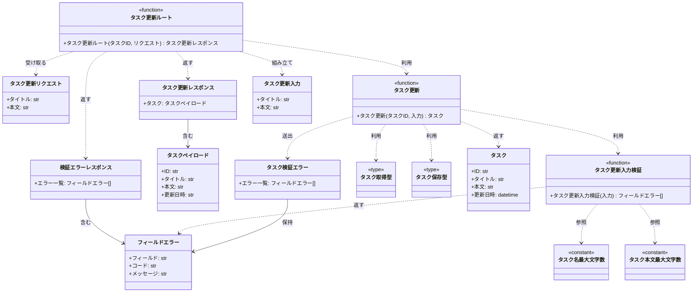
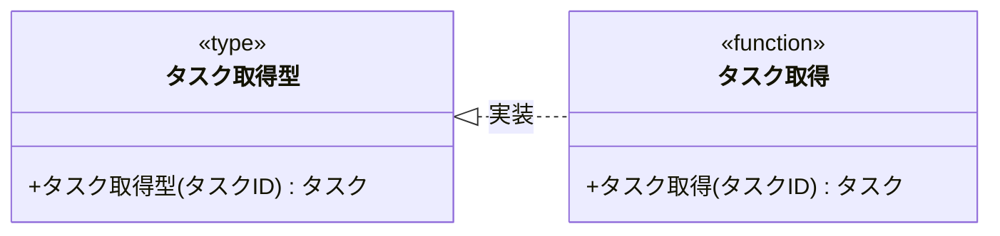
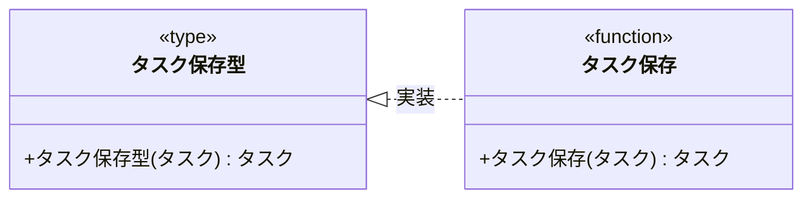

# モジュール構成: バックエンド / タスク

`タスク` ドメイン（バックエンド側）に属する構成要素詳細。

- 対応テストファイル: `tests/unit/features/tasks/test_validators.py` / `tests/unit/features/tasks/test_service.py` / `tests/unit/features/tasks/test_db.py` / `tests/unit/features/tasks/test_route.py`

## 一覧

| ユースケース | 役割 | コンテナ | 種別 | 名前 | 概要 | 補足 |
| --- | --- | --- | --- | --- | --- | --- |
| 共通 | ドメインモデル | `features/tasks/types.py` | データモデル | [`Task`](#タスク) | タスク 1 件の内容 | - |
| 共通 | 定数 | `features/tasks/constants.py` | 定数 | `TASK_TITLE_MAX_LENGTH` | タスク名の最大文字数 | 値は `100` |
| 共通 | 定数 | `features/tasks/constants.py` | 定数 | `TASK_BODY_MAX_LENGTH` | タスク本文の最大文字数 | 値は `10000` |
| 共通 | リポジトリ型（DI） | `features/tasks/types.py` | 関数型 | [`FindTask`](#タスク取得型) | タスク 1 件取得のシグネチャ型 | Mock 差し替え用 |
| 共通 | リポジトリ | `features/tasks/db.py` | 関数 | [`find_task_by_id`](#タスク取得) | ID でタスクを 1 件取得 | - |
| 共通 | リポジトリ型（DI） | `features/tasks/types.py` | 関数型 | [`SaveTask`](#タスク保存型) | タスク保存のシグネチャ型 | Mock 差し替え用 |
| 共通 | リポジトリ | `features/tasks/db.py` | 関数 | [`save_task`](#タスク保存) | タスクを DB に書き戻す | - |
| タスク更新 | DTO | `features/tasks/types.py` | データモデル | [`UpdateTaskInput`](#タスク更新入力) | 更新に使う入力値 | - |
| タスク更新 | DTO | `features/tasks/types.py` | データモデル | [`FieldError`](#フィールドエラー) | フィールド単位の検証エラー 1 件 | - |
| タスク更新 | 例外 | `features/tasks/types.py` | クラス | [`TaskValidationError`](#タスク検証エラー) | 検証エラー一覧を運ぶ例外 | `ValidationError` を継承 |
| タスク更新 | バリデータ | `features/tasks/validators.py` | 関数 | [`validate_update_task_input`](#タスク更新入力検証) | 更新の入力値を検証 | - |
| タスク更新 | サービス | `features/tasks/service.py` | 関数 | [`update_task`](#タスク更新) | 検証 → 取得 → 保存を束ねる | - |
| タスク更新 | リクエストスキーマ | `features/tasks/schemas.py` | データモデル | [`UpdateTaskRequest`](#タスク更新リクエスト) | 更新リクエストのボディ | - |
| タスク更新 | レスポンススキーマ | `features/tasks/schemas.py` | データモデル | [`TaskPayload`](#タスクペイロード) | レスポンスに載せるタスク表現 | - |
| タスク更新 | レスポンススキーマ | `features/tasks/schemas.py` | データモデル | [`UpdateTaskResponse`](#タスク更新レスポンス) | 更新成功時のボディ | - |
| タスク更新 | レスポンススキーマ | `features/tasks/schemas.py` | データモデル | [`ValidationErrorResponse`](#検証エラーレスポンス) | 検証失敗時のボディ | - |
| タスク更新 | ハンドラ | `features/tasks/route.py` | 関数 | [`update_task_route`](#タスク更新ルート) | `PUT /tasks/{taskId}` のハンドラ | - |

## ディレクトリ構成

```
features/tasks/
├── types.py        # Task / UpdateTaskInput / FieldError / TaskValidationError / FindTask / SaveTask
├── constants.py    # タスク名・本文の最大文字数
├── validators.py   # 更新入力の検証
├── service.py      # 更新のドメインロジック
├── db.py           # tasks テーブルの読み書き
├── schemas.py      # HTTP リクエスト / レスポンスの Pydantic モデル
└── route.py        # PUT /tasks/{taskId} のハンドラ
```

## 構成図

### タスク更新



---

### タスク取得型



---

### タスク保存型



## タスク
> 物理名: `Task`<br>
> 種別: データモデル<br>
> コンテナ: `features/tasks/types.py`

タスク 1 件の内容を表す内部 DTO。

### プロパティ

| 論理名 | プロパティ名 | 型 | 可視性 | デフォルト | 説明 | 例 | 補足 |
| --- | --- | --- | --- | --- | --- | --- | --- |
| ID | `id` | `str` | 公開 | - | タスク ID | `"3f2b1c88-5f4a-4d1b-9a2e-77c0d1b3e001"` | UUID |
| タイトル | `title` | `str` | 公開 | - | タスク名 | `"決算資料の作成"` | - |
| 本文 | `body` | `str` | 公開 | `""` | タスク本文 | `"Q2 の売上集計をまとめる"` | - |
| 更新日時 | `updated_at` | `datetime` | 公開 | - | 最終更新日時 | `datetime(2026, 8, 6, 2, 15, 30, tzinfo=UTC)` | UTC で保持 |

### メソッド

なし

### 単体テスト

なし

### 補足

- `@dataclass(frozen=True, slots=True, kw_only=True)` で定義する（更新は差し替えた新しいインスタンスを作る）
- 状態・期限などの他項目は本ユースケースで扱わないため持たせない

## タスク更新入力
> 物理名: `UpdateTaskInput`<br>
> 種別: データモデル<br>
> コンテナ: `features/tasks/types.py`

タスク更新に使う入力値をまとめた内部 DTO。

### プロパティ

| 論理名 | プロパティ名 | 型 | 可視性 | デフォルト | 説明 | 例 | 補足 |
| --- | --- | --- | --- | --- | --- | --- | --- |
| タイトル | `title` | `str` | 公開 | - | 更新後のタスク名 | `"決算資料の作成"` | 未検証の生の値 |
| 本文 | `body` | `str` | 公開 | `""` | 更新後のタスク本文 | `"Q2 の売上集計をまとめる"` | 未検証の生の値 |

### メソッド

なし

### 単体テスト

なし

### 補足

- 検証前の値を運ぶため、この時点では文字数・空文字の制約を満たしていない場合がある

## フィールドエラー
> 物理名: `FieldError`<br>
> 種別: データモデル<br>
> コンテナ: `features/tasks/types.py`

検証に失敗したフィールド 1 件分の情報。

### プロパティ

| 論理名 | プロパティ名 | 型 | 可視性 | デフォルト | 説明 | 例 | 補足 |
| --- | --- | --- | --- | --- | --- | --- | --- |
| フィールド | `field` | `Literal["title", "body"]` | 公開 | - | エラーが発生したフィールド名 | `"title"` | リクエストのパラメータ名と一致させる |
| コード | `code` | `Literal["required", "max_length"]` | 公開 | - | エラーの種別 | `"required"` | 画面のメッセージ切り替えに使う |
| メッセージ | `message` | `str` | 公開 | - | 表示用のエラーメッセージ | `"タスク名を入力してください"` | 日本語 |

### メソッド

なし

### 単体テスト

なし

### 補足

- `pydantic.BaseModel` で定義し、[検証エラーレスポンス](#検証エラーレスポンス) にそのまま載せる（内部 DTO と外部スキーマを分けない）

## タスク検証エラー
> 物理名: `TaskValidationError`<br>
> 種別: クラス<br>
> コンテナ: `features/tasks/types.py`<br>
> 継承元: `ValidationError`

検証に失敗した全フィールドのエラーをまとめて運ぶ例外。

### プロパティ

| 論理名 | プロパティ名 | 型 | 可視性 | デフォルト | 説明 | 例 | 補足 |
| --- | --- | --- | --- | --- | --- | --- | --- |
| エラー一覧 | `errors` | [`list[FieldError]`](#フィールドエラー) | 公開 | - | 失敗した全フィールドのエラー | `[FieldError(field="title", code="required", ...)]` | 1 件以上 |

### メソッド

なし

### 単体テスト

なし

### 補足

- 例外に一覧を持たせることで、最初の 1 件で打ち切らずに全フィールド分をまとめて返せる

## タスク更新リクエスト
> 物理名: `UpdateTaskRequest`<br>
> 種別: データモデル<br>
> コンテナ: `features/tasks/schemas.py`

`PUT /tasks/{taskId}` のリクエストボディ。

### プロパティ

| 論理名 | プロパティ名 | 型 | 可視性 | デフォルト | 説明 | 例 | 補足 |
| --- | --- | --- | --- | --- | --- | --- | --- |
| タイトル | `title` | `str` | 公開 | - | 更新後のタスク名 | `"決算資料の作成"` | 文字数の検証は [タスク更新入力検証](#タスク更新入力検証) が行う |
| 本文 | `body` | `str` | 公開 | `""` | 更新後のタスク本文 | `"Q2 の売上集計をまとめる"` | - |

### メソッド

なし

### 単体テスト

なし

### 補足

- `pydantic.BaseModel` で定義する
- 文字数制限を `Field` で書かないのは、失敗時に `errors` 形式で返す必要があり Pydantic の 422 では要件を満たせないため

## タスクペイロード
> 物理名: `TaskPayload`<br>
> 種別: データモデル<br>
> コンテナ: `features/tasks/schemas.py`

レスポンスに載せるタスク 1 件の表現。

### プロパティ

| 論理名 | プロパティ名 | 型 | 可視性 | デフォルト | 説明 | 例 | 補足 |
| --- | --- | --- | --- | --- | --- | --- | --- |
| ID | `id` | `str` | 公開 | - | タスク ID | `"3f2b1c88-5f4a-4d1b-9a2e-77c0d1b3e001"` | - |
| タイトル | `title` | `str` | 公開 | - | 更新後のタスク名 | `"決算資料の作成"` | - |
| 本文 | `body` | `str` | 公開 | - | 更新後のタスク本文 | `"Q2 の売上集計をまとめる"` | - |
| 更新日時 | `updated_at` | `str` | 公開 | - | 更新日時（ISO 8601） | `"2026-08-06T02:15:30+00:00"` | ワイヤ上は `updatedAt` |

### メソッド

なし

### 単体テスト

なし

### 補足

- ワイヤ上の名前が camelCase になるよう `alias_generator` を設定する

## タスク更新レスポンス
> 物理名: `UpdateTaskResponse`<br>
> 種別: データモデル<br>
> コンテナ: `features/tasks/schemas.py`

更新成功時（`200`）のレスポンスボディ。

### プロパティ

| 論理名 | プロパティ名 | 型 | 可視性 | デフォルト | 説明 | 例 | 補足 |
| --- | --- | --- | --- | --- | --- | --- | --- |
| タスク | `task` | [`TaskPayload`](#タスクペイロード) | 公開 | - | 更新後のタスク | `TaskPayload(id="3f2b...", ...)` | - |

### メソッド

なし

### 単体テスト

なし

### 補足

- タスクを `task` でネストさせるのは、後続で警告・メタ情報を並べられるようにするため

## 検証エラーレスポンス
> 物理名: `ValidationErrorResponse`<br>
> 種別: データモデル<br>
> コンテナ: `features/tasks/schemas.py`

検証失敗時（`400`）のレスポンスボディ。

### プロパティ

| 論理名 | プロパティ名 | 型 | 可視性 | デフォルト | 説明 | 例 | 補足 |
| --- | --- | --- | --- | --- | --- | --- | --- |
| エラー一覧 | `errors` | [`list[FieldError]`](#フィールドエラー) | 公開 | - | 失敗した全フィールドのエラー | `[FieldError(field="title", code="required", ...)]` | 1 件以上 |

### メソッド

なし

### 単体テスト

なし

### 補足

- [タスク検証エラー](#タスク検証エラー) を受け取ったアプリ全体の例外ハンドラが本モデルへ変換して返す

## `features/tasks/types.py`
> 種別: ファイル

タスクドメインの内部 DTO・例外・関数型エイリアスを置くファイル。

---

### タスク取得型
> 物理名: `FindTask`<br>
> 種別: 関数型

ID でタスクを 1 件取得する関数のシグネチャ。
DI / Mock 差し替え用。

#### 引数

| 論理名 | 引数名 | 型 | 必須 | デフォルト | 説明 | 補足 |
| --- | --- | --- | --- | --- | --- | --- |
| タスク ID | `task_id` | `str` | ✅ | - | 取得対象のタスク ID | - |

#### 戻り値

| 型 | 説明 | 補足 |
| --- | --- | --- |
| [`Task \| None`](#タスク) | 見つかったタスク | 見つからない場合は `None` |

#### 実装

| 実装 | 補足 |
| --- | --- |
| [タスク取得](#タスク取得) | 本番の実装 |

---

### タスク保存型
> 物理名: `SaveTask`<br>
> 種別: 関数型

タスクを永続化する関数のシグネチャ。
DI / Mock 差し替え用。

#### 引数

| 論理名 | 引数名 | 型 | 必須 | デフォルト | 説明 | 補足 |
| --- | --- | --- | --- | --- | --- | --- |
| タスク | `task` | [`Task`](#タスク) | ✅ | - | 保存するタスク | 既存行の更新のみを行う |

#### 戻り値

| 型 | 説明 | 補足 |
| --- | --- | --- |
| [`Task`](#タスク) | 保存後のタスク | `updated_at` が保存時刻に進む |

#### 実装

| 実装 | 補足 |
| --- | --- |
| [タスク保存](#タスク保存) | 本番の実装 |

## `features/tasks/validators.py`
> 種別: ファイル

タスク更新の入力値を検証する関数ファイル。

---

### タスク更新入力検証
> 物理名: `validate_update_task_input`<br>
> 種別: 関数

タスク更新の入力値を検証し、失敗した全フィールドのエラーを返す。

#### 引数

| 論理名 | 引数名 | 型 | 必須 | デフォルト | 説明 | 補足 |
| --- | --- | --- | --- | --- | --- | --- |
| 入力 | `input` | [`UpdateTaskInput`](#タスク更新入力) | ✅ | - | 検証対象の入力値 | - |

引数例:

```python
validate_update_task_input(UpdateTaskInput(title="決算資料の作成", body="Q2 の売上集計"))
```

#### 戻り値

| 型 | 説明 | 補足 |
| --- | --- | --- |
| [`list[FieldError]`](#フィールドエラー) | 失敗したフィールドのエラー一覧 | 全て通過した場合は空リスト |

戻り値例:

```python
[FieldError(field="title", code="required", message="タスク名を入力してください")]
```

#### 処理

1. エラーを溜めるリストを用意する
2. タイトルを検証する
   - 前後の空白を除いて空文字の場合、`required` のエラーを追加する
   - `TASK_TITLE_MAX_LENGTH` を超える場合、`max_length` のエラーを追加する
3. 本文を検証する
   - `TASK_BODY_MAX_LENGTH` を超える場合、`max_length` のエラーを追加する
4. 溜めたエラー一覧を返す

#### 例外

なし

#### 単体テスト

| テスト名 | 正常/異常 | 概要 | 条件 | Mock | 期待値 | 補足 |
| --- | --- | --- | --- | --- | --- | --- |
| `test_validate_update_task_input` | 正常 | 制限内の入力は通過する | タイトル 10 文字・本文 20 文字 | なし | 空リストを返す | - |
| `test_validate_update_task_input_when_title_empty` | 異常 | タイトルが空文字 | タイトル `""` | なし | `field` が `title`・`code` が `required` の 1 件を返す | - |
| `test_validate_update_task_input_when_title_blank` | 異常 | タイトルが空白のみ | タイトル `"   "` | なし | `field` が `title`・`code` が `required` の 1 件を返す | 空白除去の分岐 |
| `test_validate_update_task_input_when_title_too_long` | 異常 | タイトルが上限超過 | タイトル 101 文字 | なし | `field` が `title`・`code` が `max_length` の 1 件を返す | 境界値 |
| `test_validate_update_task_input_when_title_at_limit` | 正常 | タイトルが上限ちょうど | タイトル 100 文字 | なし | 空リストを返す | 境界値 |
| `test_validate_update_task_input_when_body_too_long` | 異常 | 本文が上限超過 | 本文 10001 文字 | なし | `field` が `body`・`code` が `max_length` の 1 件を返す | 境界値 |
| `test_validate_update_task_input_when_title_and_body_invalid` | 異常 | 複数フィールドが失敗 | タイトル `""` + 本文 10001 文字 | なし | エラーを 2 件返す | 打ち切らず全件返す |

## `features/tasks/db.py`
> 種別: ファイル

tasks テーブルの読み書きを行う関数ファイル。

---

### タスク取得
> 物理名: `find_task_by_id`<br>
> 種別: 関数<br>
> 継承元: [`FindTask`](#タスク取得型)

ID でタスクを 1 件取得する。

#### 引数

| 論理名 | 引数名 | 型 | 必須 | デフォルト | 説明 | 補足 |
| --- | --- | --- | --- | --- | --- | --- |
| タスク ID | `task_id` | `str` | ✅ | - | 取得対象のタスク ID | - |

引数例:

```python
find_task_by_id("3f2b1c88-5f4a-4d1b-9a2e-77c0d1b3e001")
```

#### 戻り値

| 型 | 説明 | 補足 |
| --- | --- | --- |
| [`Task \| None`](#タスク) | 見つかったタスク | 見つからない場合は `None` |

戻り値例:

```python
Task(id="3f2b1c88-...", title="旧タイトル", body="旧本文", updated_at=datetime(2026, 8, 1, tzinfo=UTC))
```

#### 処理

1. `task_id` で tasks テーブルを検索する
2. 検索結果で返す値を確定する
   - 該当行がある場合、[タスク](#タスク) に詰め替えて返す
   - 該当行がない場合、`None` を返す

#### 例外

なし

#### 単体テスト

| テスト名 | 正常/異常 | 概要 | 条件 | Mock | 期待値 | 補足 |
| --- | --- | --- | --- | --- | --- | --- |
| `test_find_task_by_id` | 正常 | 既存タスクを取得 | tasks テーブルに該当行あり | DB 接続 | [タスク](#タスク) を返す | - |
| `test_find_task_by_id_when_missing` | 正常 | 該当行なし | tasks テーブルに該当行なし | DB 接続 | `None` を返す | - |

---

### タスク保存
> 物理名: `save_task`<br>
> 種別: 関数<br>
> 継承元: [`SaveTask`](#タスク保存型)

タスクを tasks テーブルに書き戻す。

#### 引数

| 論理名 | 引数名 | 型 | 必須 | デフォルト | 説明 | 補足 |
| --- | --- | --- | --- | --- | --- | --- |
| タスク | `task` | [`Task`](#タスク) | ✅ | - | 保存するタスク | 既存行の更新のみを行う |

引数例:

```python
save_task(Task(id="3f2b1c88-...", title="決算資料の作成", body="Q2 の売上集計", updated_at=now))
```

#### 戻り値

| 型 | 説明 | 補足 |
| --- | --- | --- |
| [`Task`](#タスク) | 保存後のタスク | `updated_at` が保存時刻に進む |

戻り値例:

```python
Task(id="3f2b1c88-...", title="決算資料の作成", body="Q2 の売上集計", updated_at=datetime(2026, 8, 6, 2, 15, 30, tzinfo=UTC))
```

#### 処理

1. `task` の `title` / `body` / `updated_at` で tasks テーブルの該当行を更新する（更新に失敗した場合は `DatabaseError`）
   - `[INFO]` タスクを保存した（`task.id`）
2. 更新後の値を [タスク](#タスク) に詰め替えて返す

#### 例外

| 例外名 | 発生条件 | メッセージ | 補足 |
| --- | --- | --- | --- |
| `DatabaseError` | UPDATE 実行時に SQL 例外 | `"タスクの保存に失敗しました: {task_id}"` | 監視アラート対象 |

#### 単体テスト

| テスト名 | 正常/異常 | 概要 | 条件 | Mock | 期待値 | 補足 |
| --- | --- | --- | --- | --- | --- | --- |
| `test_save_task` | 正常 | 既存行を更新 | tasks テーブルに該当行あり | DB 接続 | 更新後の [タスク](#タスク) を返す | - |
| `test_save_task_when_db_error` | 異常 | UPDATE で SQL 例外 | DB 接続が例外を投げる | DB 接続 | `DatabaseError` を送出 | 例外表「UPDATE 実行時に SQL 例外」に対応 |

## `features/tasks/service.py`
> 種別: ファイル

タスク更新のドメインロジックを束ねる関数ファイル。

---

### タスク更新
> 物理名: `update_task`<br>
> 種別: 関数

入力値を検証してから既存タスクのタイトル・本文を差し替えて保存する。

#### 引数

| 論理名 | 引数名 | 型 | 必須 | デフォルト | 説明 | 補足 |
| --- | --- | --- | --- | --- | --- | --- |
| タスク ID | `task_id` | `str` | ✅ | - | 更新対象のタスク ID | - |
| 入力 | `input` | [`UpdateTaskInput`](#タスク更新入力) | ✅ | - | 更新に使う入力値 | - |
| タスク取得 | `find` | [`FindTask`](#タスク取得型) | ✅ | - | タスク取得の実装 | キーワード専用引数 |
| タスク保存 | `save` | [`SaveTask`](#タスク保存型) | ✅ | - | タスク保存の実装 | キーワード専用引数 |

引数例:

```python
update_task(
    "3f2b1c88-...",
    UpdateTaskInput(title="決算資料の作成", body="Q2 の売上集計"),
    find=find_task_by_id,
    save=save_task,
)
```

#### 戻り値

| 型 | 説明 | 補足 |
| --- | --- | --- |
| [`Task`](#タスク) | 更新後のタスク | - |

戻り値例:

```python
Task(id="3f2b1c88-...", title="決算資料の作成", body="Q2 の売上集計", updated_at=datetime(2026, 8, 6, 2, 15, 30, tzinfo=UTC))
```

#### 処理

1. 入力値を検証する（[タスク更新入力検証](#タスク更新入力検証)）
   - エラーが 1 件以上ある場合、[タスク検証エラー](#タスク検証エラー) を投げる
     - `[WARNING]` 検証に失敗した更新を拒否した（`task_id` / 失敗したフィールド名）
2. `task_id` でタスクを取得する（[タスク取得](#タスク取得)）
3. 取得結果で処理の続きを決める
   - `None` の場合、`NotFoundError` を投げる
     - `[WARNING]` 存在しないタスクの更新を拒否した（`task_id`）
   - タスクが取れた場合、次のステップへ進む
4. タイトル・本文・更新日時を差し替えた [タスク](#タスク) を組み立てる
5. 組み立てたタスクを保存して返す（[タスク保存](#タスク保存)）
   - `[INFO]` タスクを更新した（`task_id`）

#### 例外

| 例外名 | 発生条件 | メッセージ | 補足 |
| --- | --- | --- | --- |
| `TaskValidationError` | 入力値の検証でエラーが 1 件以上 | `"入力値が不正です"` | 失敗した全フィールドを `errors` に載せる |
| `NotFoundError` | `task_id` に一致するタスクが無い | `"タスクが見つかりません: {task_id}"` | - |

#### 単体テスト

| テスト名 | 正常/異常 | 概要 | 条件 | Mock | 期待値 | 補足 |
| --- | --- | --- | --- | --- | --- | --- |
| `test_update_task` | 正常 | 検証通過で更新成功 | 制限内の入力 + 既存タスクあり | `find` / `save` | 更新後の [タスク](#タスク) を返し、`save` に差し替え後の値が渡る | - |
| `test_update_task_when_input_invalid` | 異常 | 検証エラー | タイトルが空文字 | `find` / `save` | `TaskValidationError` を送出し、`find` / `save` を呼ばない | 例外表「検証でエラーが 1 件以上」に対応 |
| `test_update_task_when_task_missing` | 異常 | 対象タスクなし | `find` が `None` を返す | `find` / `save` | `NotFoundError` を送出し、`save` を呼ばない | 例外表「一致するタスクが無い」に対応 |
| `test_update_task_when_save_fails` | 異常 | 保存が失敗 | `save` が `DatabaseError` を投げる | `find` / `save` | `DatabaseError` をそのまま伝播する | キャッチしないことの確認 |

## `features/tasks/route.py`
> 種別: ファイル

`PUT /tasks/{taskId}` のハンドラを置くファイル。

---

### タスク更新ルート
> 物理名: `update_task_route`<br>
> 種別: 関数

`PUT /tasks/{taskId}` を受けてタスク更新を呼び出し、更新後のタスクを返す。

#### 引数

| 論理名 | 引数名 | 型 | 必須 | デフォルト | 説明 | 補足 |
| --- | --- | --- | --- | --- | --- | --- |
| タスク ID | `task_id` | `str` | ✅ | - | 更新対象のタスク ID | パスパラメータ |
| リクエスト | `request` | [`UpdateTaskRequest`](#タスク更新リクエスト) | ✅ | - | リクエストボディ | - |
| ハンドラ束 | `handlers` | `Handlers` | ✅ | - | 配線済みの関数束 | `Depends` で注入 |

引数例:

```python
await update_task_route("3f2b1c88-...", UpdateTaskRequest(title="決算資料の作成", body="Q2 の売上集計"), handlers)
```

#### 戻り値

| 型 | 説明 | 補足 |
| --- | --- | --- |
| [`UpdateTaskResponse`](#タスク更新レスポンス) | 更新後のタスク | - |

戻り値例:

```python
UpdateTaskResponse(task=TaskPayload(id="3f2b1c88-...", title="決算資料の作成", body="Q2 の売上集計", updated_at="2026-08-06T02:15:30+00:00"))
```

#### 処理

1. リクエストボディを [タスク更新入力](#タスク更新入力) に詰め替える
2. タスクを更新する（[タスク更新](#タスク更新)）
   - 検証に失敗した場合は [タスク検証エラー](#タスク検証エラー)、対象が無い場合は `NotFoundError` がそのまま伝播する
3. 更新後のタスクから [タスク更新レスポンス](#タスク更新レスポンス) を組み立てて返す

#### 例外

なし

#### 単体テスト

| テスト名 | 正常/異常 | 概要 | 条件 | Mock | 期待値 | 補足 |
| --- | --- | --- | --- | --- | --- | --- |
| `test_update_task_route` | 正常 | 更新結果をレスポンスに変換 | `update_task` が更新後タスクを返す | `update_task` | [タスク更新レスポンス](#タスク更新レスポンス) を返し、`update_task` に詰め替えた入力が渡る | - |

### 補足

- HTTP ステータスへの変換はアプリ全体の例外ハンドラが担い、本ファイルでは `HTTPException` を直接送出しない
- ルーターへの登録は `APIRouter(prefix="/tasks", tags=["tasks"])` で行う
