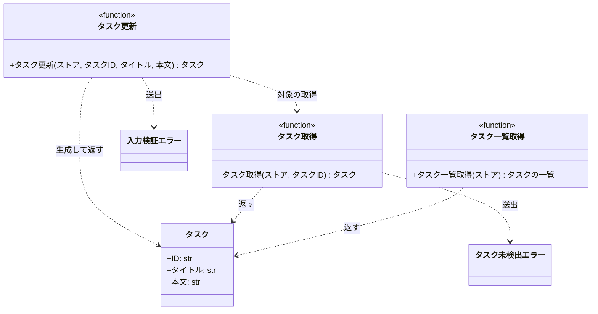

# モジュール構成: バックエンド / タスク

`タスク` ドメイン（バックエンド側）に属する構成要素詳細。
タスクのデータモデル・ドメイン例外・タスクを操作する関数を扱う。

タスクの入れ物（ストア）は呼び出し側が持つ辞書で受け渡し、本ドメインは永続化層を持たない。

## 一覧

| ユースケース | 役割 | コンテナ | 種別 | 名前 | 概要 | 補足 |
| --- | --- | --- | --- | --- | --- | --- |
| 共通 | ドメインモデル | `src/tasks/models.py` | データモデル | [`Task`](#タスク) | タスク 1 件 | - |
| 共通 | 例外 | `src/tasks/errors.py` | クラス | [`TaskNotFoundError`](#タスク未検出エラー) | 指定 ID のタスクが存在しない | - |
| 共通 | 例外 | `src/tasks/errors.py` | クラス | [`ValidationError`](#入力検証エラー) | 入力値が制約を満たさない | - |
| 共通 | クエリ | `src/tasks/service.py` | 関数 | [`get_task`](#タスク取得) | ストアからタスクを 1 件取得する | - |
| 共通 | クエリ | `src/tasks/service.py` | 関数 | [`list_tasks`](#タスク一覧取得) | ストアのタスクを ID 順で一覧にする | - |
| タスク編集 | サービス | `src/tasks/service.py` | 関数 | [`update_task`](#タスク更新) | タイトルと本文を更新する | - |

## ディレクトリ構成

```
src/tasks/
├── models.py     # Task
├── errors.py     # TaskNotFoundError / ValidationError
└── service.py    # get_task / list_tasks / update_task
```

## 構成図



## タスク
> 物理名: `Task`<br>
> 種別: データモデル<br>
> コンテナ: `src/tasks/models.py`

タスク 1 件を表す不変のデータモデル。

### プロパティ

| 論理名 | プロパティ名 | 型 | 可視性 | デフォルト | 説明 | 例 | 補足 |
| --- | --- | --- | --- | --- | --- | --- | --- |
| ID | `id` | `str` | 公開 | - | タスクの一意な識別子 | `"t1"` | ストアのキーと一致する |
| タイトル | `title` | `str` | 公開 | - | タスクのタイトル | `"新タイトル"` | - |
| 本文 | `content` | `str` | 公開 | `""` | タスクの本文 | `"新本文"` | - |

### メソッド

なし

### 単体テスト

なし

### 補足

- `@dataclass(frozen=True, slots=True, kw_only=True)` の不変値。
  更新は新しいインスタンスの生成で表現する

## タスク未検出エラー
> 物理名: `TaskNotFoundError`<br>
> 種別: クラス<br>
> コンテナ: `src/tasks/errors.py`

指定 ID のタスクがストアに存在しないことを表すドメイン例外。

### プロパティ

なし

### メソッド

なし

### 単体テスト

なし

## 入力検証エラー
> 物理名: `ValidationError`<br>
> 種別: クラス<br>
> コンテナ: `src/tasks/errors.py`

入力値が制約を満たさないことを表すドメイン例外。

### プロパティ

なし

### メソッド

なし

### 単体テスト

なし

## `src/tasks/service.py`
> 種別: ファイル

タスクの取得・一覧・更新を担う関数ファイル。
全関数がストアを第 1 引数で受け取り、ストア以外の外部依存を持たない。

---

### タスク取得
> 物理名: `get_task`<br>
> 種別: 関数

ストアからタスクを 1 件取得する。

#### 引数

| 論理名 | 引数名 | 型 | 必須 | デフォルト | 説明 | 補足 |
| --- | --- | --- | --- | --- | --- | --- |
| ストア | `store` | [`dict[str, Task]`](#タスク) | ✅ | - | タスク ID をキーにしたタスクの入れ物 | - |
| タスク ID | `task_id` | `str` | ✅ | - | 取得対象のタスク ID | - |

引数例:

```python
get_task({"t1": Task(id="t1", title="旧タイトル", content="旧本文")}, "t1")
```

#### 戻り値

| 型 | 説明 | 補足 |
| --- | --- | --- |
| [`Task`](#タスク) | 取得したタスク | - |

戻り値例:

```python
Task(id="t1", title="旧タイトル", content="旧本文")
```

#### 処理

1. 対象 ID がストアに無ければ例外を投げる（[タスク未検出エラー](#タスク未検出エラー)）
2. ストアから対象タスクを取り出して返す

#### 例外

| 例外名 | 発生条件 | メッセージ | 補足 |
| --- | --- | --- | --- |
| `TaskNotFoundError` | 対象 ID がストアに無い | `"task not found: {task_id}"` | - |

#### 単体テスト

| テスト名 | 正常/異常 | 概要 | 条件 | Mock | 期待値 | 補足 |
| --- | --- | --- | --- | --- | --- | --- |
| `test_get_task` | 正常 | 登録済みの task_id でタスクを 1 件取得する | `t1` のタスクを登録済み | なし | 登録済みのタスクを返す | - |
| `test_get_task_when_task_missing` | 異常 | 未登録の task_id で取得する | ストアに無い ID を指定 | なし | `TaskNotFoundError` を送出 | 例外表「対象 ID がストアに無い」に対応 |

---

### タスク一覧取得
> 物理名: `list_tasks`<br>
> 種別: 関数

ストアのタスクを ID 順で一覧にする。

#### 引数

| 論理名 | 引数名 | 型 | 必須 | デフォルト | 説明 | 補足 |
| --- | --- | --- | --- | --- | --- | --- |
| ストア | `store` | [`dict[str, Task]`](#タスク) | ✅ | - | タスク ID をキーにしたタスクの入れ物 | - |

引数例:

```python
list_tasks({"t1": Task(id="t1", title="旧タイトル", content="旧本文")})
```

#### 戻り値

| 型 | 説明 | 補足 |
| --- | --- | --- |
| [`list[Task]`](#タスク) | ID の昇順に並べたタスクの一覧 | ストアが空なら空リスト |

戻り値例:

```python
[Task(id="t0", title="先頭タイトル", content="先頭本文"), Task(id="t1", title="旧タイトル", content="旧本文")]
```

#### 処理

1. ストアのキーを昇順に並べ、対応するタスクを順に詰めた一覧を返す

#### 例外

なし

#### 単体テスト

| テスト名 | 正常/異常 | 概要 | 条件 | Mock | 期待値 | 補足 |
| --- | --- | --- | --- | --- | --- | --- |
| `test_list_tasks` | 正常 | ストアのタスクを ID 順で一覧にする | ID の昇順とは異なる順で 2 件登録済み | なし | ID の昇順に並んだ一覧を返す | - |

---

### タスク更新
> 物理名: `update_task`<br>
> 種別: 関数

登録済みタスクのタイトルと本文を更新して返す。

#### 引数

| 論理名 | 引数名 | 型 | 必須 | デフォルト | 説明 | 補足 |
| --- | --- | --- | --- | --- | --- | --- |
| ストア | `store` | [`dict[str, Task]`](#タスク) | ✅ | - | タスク ID をキーにしたタスクの入れ物 | 更新は本引数を直接書き換える |
| タスク ID | `task_id` | `str` | ✅ | - | 更新対象のタスク ID | - |
| タイトル | `title` | `str` | ✅ | - | 更新後のタイトル | 1 文字以上 100 文字以内 |
| 本文 | `content` | `str` | - | `""` | 更新後の本文 | 1000 文字以内 |

引数例:

```python
update_task({"t1": Task(id="t1", title="旧タイトル", content="旧本文")}, "t1", "新タイトル", "新本文")
```

#### 戻り値

| 型 | 説明 | 補足 |
| --- | --- | --- |
| [`Task`](#タスク) | 更新後のタスク | ストアに書き戻した値と同一 |

戻り値例:

```python
Task(id="t1", title="新タイトル", content="新本文")
```

#### 処理

1. タイトルの文字数が 1 以上 100 以下でなければ例外を投げる（[入力検証エラー](#入力検証エラー)）
2. 本文の文字数が 1000 を超えていれば例外を投げる（[入力検証エラー](#入力検証エラー)）
3. 対象タスクを取得する（[タスク取得](#タスク取得)）
4. タイトルと本文を差し替えたタスクを生成してストアに書き戻し、それを返す

#### 例外

| 例外名 | 発生条件 | メッセージ | 補足 |
| --- | --- | --- | --- |
| `ValidationError` | タイトルが 0 文字、または 101 文字以上 | `"title は 1 文字以上 100 文字以内"` | - |
| `ValidationError` | 本文が 1001 文字以上 | `"content は 1000 文字以内"` | 同じ例外の別発生箇所 |
| `TaskNotFoundError` | 対象 ID がストアに無い | `"task not found: {task_id}"` | [タスク取得](#タスク取得) から伝播する |

#### 単体テスト

| テスト名 | 正常/異常 | 概要 | 条件 | Mock | 期待値 | 補足 |
| --- | --- | --- | --- | --- | --- | --- |
| `test_update_task` | 正常 | タイトルと本文を更新する | `t1` のタスクを登録済み | なし | 更新後のタスクを返し、ストアの値も差し替わる | - |
| `test_update_task_when_content_omitted` | 正常 | 本文を省略する | 本文を指定せずに呼ぶ | なし | 本文が空文字のタスクを返す | - |
| `test_update_task_when_title_empty` | 異常 | タイトルが空 | 空文字のタイトルを指定 | なし | `ValidationError` を送出 | 例外表「タイトルが 0 文字、または 101 文字以上」に対応 |
| `test_update_task_when_title_too_long` | 異常 | タイトルが 101 文字 | 101 文字のタイトルを指定 | なし | `ValidationError` を送出 | 例外表「タイトルが 0 文字、または 101 文字以上」に対応 |
| `test_update_task_when_content_too_long` | 異常 | 本文が 1001 文字 | 1001 文字の本文を指定 | なし | `ValidationError` を送出 | 例外表「本文が 1001 文字以上」に対応 |
| `test_update_task_when_task_missing` | 異常 | 未登録の task_id を指定する | ストアに無い ID を指定 | なし | `TaskNotFoundError` を送出し、ストアは変わらない | 例外表「対象 ID がストアに無い」に対応 |

---

### 補足

- ストアは呼び出し側が持つ辞書で、本ファイルは永続化層を持たない
- [`Task`](#タスク) が不変のため、更新はインスタンスの再生成とストアへの書き戻しで表現する
