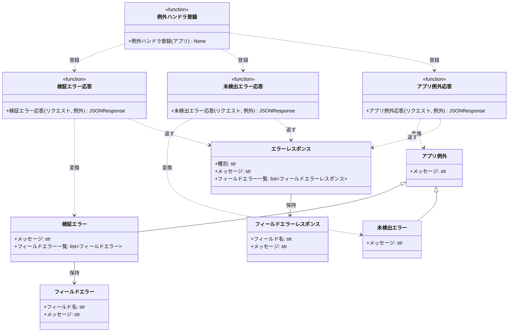

# モジュール構成: バックエンド / 共通

業務ドメインを持たない横断要素（例外階層と、その HTTP レスポンスへのマッピング）の詳細。

- 対応テストファイル: 未記入（テストレビュー時に記入）

## 一覧

| ユースケース | 役割 | コンテナ | 種別 | 名前 | 概要 | 補足 |
| --- | --- | --- | --- | --- | --- | --- |
| 共通 | 例外基底 | `app/shared/errors.py` | クラス | [`AppError`](#アプリ例外) | 業務例外の基底 | - |
| 共通 | 例外 | `app/shared/errors.py` | クラス | [`ValidationError`](#検証エラー) | 入力検証の失敗 | フィールド単位の内訳を持つ |
| 共通 | 例外 | `app/shared/errors.py` | クラス | [`NotFoundError`](#未検出エラー) | 対象が存在しない | - |
| 共通 | DTO | `app/shared/errors.py` | データモデル | [`FieldError`](#フィールドエラー) | 1 フィールド分のエラー内容 | - |
| 共通 | レスポンス DTO | `app/server/error_handlers.py` | データモデル | [`ErrorResponse`](#エラーレスポンス) | エラー応答の共通ボディ | - |
| 共通 | レスポンス DTO | `app/server/error_handlers.py` | データモデル | [`FieldErrorResponse`](#フィールドエラーレスポンス) | エラー応答内のフィールド要素 | - |
| 共通 | ハンドラ登録 | `app/server/error_handlers.py` | 関数 | [`register_exception_handlers`](#例外ハンドラ登録) | 例外と HTTP の対応を一括登録 | - |
| 共通 | ハンドラ | `app/server/error_handlers.py` | 関数 | [`handle_validation_error`](#検証エラー応答) | 検証エラーを 400 に変換 | - |
| 共通 | ハンドラ | `app/server/error_handlers.py` | 関数 | [`handle_not_found_error`](#未検出エラー応答) | 未検出エラーを 404 に変換 | - |
| 共通 | ハンドラ | `app/server/error_handlers.py` | 関数 | [`handle_app_error`](#アプリ例外応答) | その他の業務例外を 500 に変換 | - |

## ディレクトリ構成

```
src/app/
├── shared/
│   └── errors.py           # AppError / ValidationError / NotFoundError / FieldError
└── server/
    └── error_handlers.py   # 例外 → HTTP レスポンスのマッピング
```

## 構成図



## アプリ例外
> 物理名: `AppError`<br>
> 種別: クラス<br>
> コンテナ: `app/shared/errors.py`

業務例外の基底。
最上位のハンドラがこの型 1 つで全ての業務例外を捕まえられるようにする。

### プロパティ

| 論理名 | プロパティ名 | 型 | 可視性 | デフォルト | 説明 | 例 | 補足 |
| --- | --- | --- | --- | --- | --- | --- | --- |
| メッセージ | `args[0]` | `str` | 公開 | - | 例外の内容 | `タスクが見つかりません` | `Exception` の標準プロパティ |

### メソッド

なし

### 単体テスト

なし

### 補足

- 直接 raise せず、必ず派生の例外を使う

## 検証エラー
> 物理名: `ValidationError`<br>
> 種別: クラス<br>
> コンテナ: `app/shared/errors.py`<br>
> 継承元: [`AppError`](#アプリ例外)

入力検証の失敗。
どのフィールドがなぜ不正かの内訳を持ち、画面のインライン表示の元になる。

### プロパティ

| 論理名 | プロパティ名 | 型 | 可視性 | デフォルト | 説明 | 例 | 補足 |
| --- | --- | --- | --- | --- | --- | --- | --- |
| メッセージ | `args[0]` | `str` | 公開 | - | 例外の内容 | `入力内容を確認してください` | - |
| フィールドエラー一覧 | `fields` | [`list[FieldError]`](#フィールドエラー) | 公開 | - | フィールド単位のエラー内訳 | `[FieldError(field="title", ...)]` | 1 件以上を必ず持つ |

### メソッド

なし

### 単体テスト

なし

## 未検出エラー
> 物理名: `NotFoundError`<br>
> 種別: クラス<br>
> コンテナ: `app/shared/errors.py`<br>
> 継承元: [`AppError`](#アプリ例外)

対象のリソースが存在しない。

### プロパティ

| 論理名 | プロパティ名 | 型 | 可視性 | デフォルト | 説明 | 例 | 補足 |
| --- | --- | --- | --- | --- | --- | --- | --- |
| メッセージ | `args[0]` | `str` | 公開 | - | 例外の内容 | `タスクが見つかりません` | - |

### メソッド

なし

### 単体テスト

なし

## フィールドエラー
> 物理名: `FieldError`<br>
> 種別: データモデル<br>
> コンテナ: `app/shared/errors.py`

1 フィールド分のエラー内容。

### プロパティ

| 論理名 | プロパティ名 | 型 | 可視性 | デフォルト | 説明 | 例 | 補足 |
| --- | --- | --- | --- | --- | --- | --- | --- |
| フィールド名 | `field` | `str` | 公開 | - | エラーの対象フィールド | `title` | リクエストのパラメータ名と一致させる |
| メッセージ | `message` | `str` | 公開 | - | 当該フィールドのエラー内容 | `タスク名を入力してください` | 画面にそのまま表示する日本語 |

### メソッド

なし

### 単体テスト

なし

### 補足

- `@dataclass(frozen=True, slots=True, kw_only=True)` で定義する（関数間で受け渡す内部 DTO のため）

## エラーレスポンス
> 物理名: `ErrorResponse`<br>
> 種別: データモデル<br>
> コンテナ: `app/server/error_handlers.py`

エラー応答の共通ボディ。

### プロパティ

| 論理名 | プロパティ名 | 型 | 可視性 | デフォルト | 説明 | 例 | 補足 |
| --- | --- | --- | --- | --- | --- | --- | --- |
| 種別 | `error` | `Literal["validation_error", "not_found", "internal_error"]` | 公開 | - | エラー種別 | `validation_error` | クライアントの分岐キー |
| メッセージ | `message` | `str` | 公開 | - | エラーの概要 | `入力内容を確認してください` | 画面のトースト用 |
| フィールドエラー一覧 | `fields` | [`list[FieldErrorResponse]`](#フィールドエラーレスポンス) | 公開 | `[]` | フィールド単位のエラー | `[{"field": "title", ...}]` | 検証エラー以外では空 |

### メソッド

なし

### 単体テスト

なし

### 補足

- `pydantic.BaseModel` で定義する（HTTP 境界の DTO のため）

## フィールドエラーレスポンス
> 物理名: `FieldErrorResponse`<br>
> 種別: データモデル<br>
> コンテナ: `app/server/error_handlers.py`

エラー応答内のフィールド要素。

### プロパティ

| 論理名 | プロパティ名 | 型 | 可視性 | デフォルト | 説明 | 例 | 補足 |
| --- | --- | --- | --- | --- | --- | --- | --- |
| フィールド名 | `field` | `str` | 公開 | - | エラーの対象フィールド | `title` | - |
| メッセージ | `message` | `str` | 公開 | - | 当該フィールドのエラー内容 | `タスク名を入力してください` | - |

### メソッド

なし

### 単体テスト

なし

## `app/server/error_handlers.py`
> 種別: ファイル

例外を HTTP レスポンスへ変換するハンドラ群。
ルート側で `HTTPException` を直接投げず、業務例外の送出だけで応答が決まるようにする。

---

### 例外ハンドラ登録
> 物理名: `register_exception_handlers`<br>
> 種別: 関数

例外と HTTP レスポンスの対応を FastAPI アプリへ一括登録する。

#### 引数

| 論理名 | 引数名 | 型 | 必須 | デフォルト | 説明 | 補足 |
| --- | --- | --- | --- | --- | --- | --- |
| アプリ | `app` | `FastAPI` | ✅ | - | 登録先のアプリ | - |

引数例:

```python
register_exception_handlers(app)
```

#### 戻り値

| 型 | 説明 | 補足 |
| --- | --- | --- |
| `None` | なし | - |

#### 処理

1. 検証エラーのハンドラを登録する（[検証エラー応答](#検証エラー応答)）
2. 未検出エラーのハンドラを登録する（[未検出エラー応答](#未検出エラー応答)）
3. アプリ例外のハンドラを登録する（[アプリ例外応答](#アプリ例外応答)）

#### 例外

なし

#### 単体テスト

| テスト名 | 正常/異常 | 概要 | 条件 | Mock | 期待値 | 補足 |
| --- | --- | --- | --- | --- | --- | --- |
| `test_register_exception_handlers` | 正常 | 3 種の例外ハンドラが登録される | 空の `FastAPI` を渡す | なし | `app.exception_handlers` に 3 例外の対応が入る | - |

---

### 検証エラー応答
> 物理名: `handle_validation_error`<br>
> 種別: 関数

検証エラーを 400 のエラーレスポンスへ変換する。

#### 引数

| 論理名 | 引数名 | 型 | 必須 | デフォルト | 説明 | 補足 |
| --- | --- | --- | --- | --- | --- | --- |
| リクエスト | `request` | `Request` | ✅ | - | 発生元のリクエスト | FastAPI のハンドラ規約で受ける |
| 例外 | `exc` | [`ValidationError`](#検証エラー) | ✅ | - | 送出された検証エラー | - |

引数例:

```python
await handle_validation_error(request, ValidationError("入力内容を確認してください", fields=[...]))
```

#### 戻り値

| 型 | 説明 | 補足 |
| --- | --- | --- |
| `JSONResponse` | `400` + エラーレスポンス | - |

戻り値例:

```json
{
  "error": "validation_error",
  "message": "入力内容を確認してください",
  "fields": [{ "field": "title", "message": "タスク名を入力してください" }]
}
```

#### 処理

1. 例外のフィールドエラー一覧を[フィールドエラーレスポンス](#フィールドエラーレスポンス)へ詰め替える
2. 種別 `validation_error` の[エラーレスポンス](#エラーレスポンス)を組み立て、`400` で返す

#### 例外

なし

#### 単体テスト

| テスト名 | 正常/異常 | 概要 | 条件 | Mock | 期待値 | 補足 |
| --- | --- | --- | --- | --- | --- | --- |
| `test_handle_validation_error` | 正常 | 400 + フィールド内訳を返す | フィールドエラー 1 件を持つ検証エラー | なし | `400` / `error` が `validation_error` / `fields` が 1 件 | - |

---

### 未検出エラー応答
> 物理名: `handle_not_found_error`<br>
> 種別: 関数

未検出エラーを 404 のエラーレスポンスへ変換する。

#### 引数

| 論理名 | 引数名 | 型 | 必須 | デフォルト | 説明 | 補足 |
| --- | --- | --- | --- | --- | --- | --- |
| リクエスト | `request` | `Request` | ✅ | - | 発生元のリクエスト | - |
| 例外 | `exc` | [`NotFoundError`](#未検出エラー) | ✅ | - | 送出された未検出エラー | - |

引数例:

```python
await handle_not_found_error(request, NotFoundError("タスクが見つかりません"))
```

#### 戻り値

| 型 | 説明 | 補足 |
| --- | --- | --- |
| `JSONResponse` | `404` + エラーレスポンス | - |

戻り値例:

```json
{ "error": "not_found", "message": "タスクが見つかりません", "fields": [] }
```

#### 処理

1. 種別 `not_found` の[エラーレスポンス](#エラーレスポンス)を例外のメッセージから組み立て、`404` で返す

#### 例外

なし

#### 単体テスト

| テスト名 | 正常/異常 | 概要 | 条件 | Mock | 期待値 | 補足 |
| --- | --- | --- | --- | --- | --- | --- |
| `test_handle_not_found_error` | 正常 | 404 を返す | 未検出エラーを渡す | なし | `404` / `error` が `not_found` / `fields` が空 | - |

---

### アプリ例外応答
> 物理名: `handle_app_error`<br>
> 種別: 関数

派生でハンドリングされなかった業務例外を 500 のエラーレスポンスへ変換する。

#### 引数

| 論理名 | 引数名 | 型 | 必須 | デフォルト | 説明 | 補足 |
| --- | --- | --- | --- | --- | --- | --- |
| リクエスト | `request` | `Request` | ✅ | - | 発生元のリクエスト | - |
| 例外 | `exc` | [`AppError`](#アプリ例外) | ✅ | - | 送出された業務例外 | - |

引数例:

```python
await handle_app_error(request, AppError("タスクの保存に失敗しました"))
```

#### 戻り値

| 型 | 説明 | 補足 |
| --- | --- | --- |
| `JSONResponse` | `500` + エラーレスポンス | - |

戻り値例:

```json
{ "error": "internal_error", "message": "サーバー内部でエラーが発生しました", "fields": [] }
```

#### 処理

1. 例外を traceback 付きでログに出す
   - `[ERROR]` 業務例外を 500 として応答した（`例外クラス名` / `メッセージ`）
2. 種別 `internal_error` の[エラーレスポンス](#エラーレスポンス)を固定メッセージで組み立て、`500` で返す
   - 例外のメッセージは内部情報を含みうるため、レスポンスには載せずログにのみ出す

#### 例外

なし

#### 単体テスト

| テスト名 | 正常/異常 | 概要 | 条件 | Mock | 期待値 | 補足 |
| --- | --- | --- | --- | --- | --- | --- |
| `test_handle_app_error` | 正常 | 500 を返す | 業務例外を渡す | なし | `500` / `error` が `internal_error` / ボディに例外メッセージが含まれない | - |

### 補足

- 例外階層に例外を足したときは、本ファイルにハンドラを足すか、既存のどのハンドラで拾われるかを確認する（拾い漏れは 500 になる）
