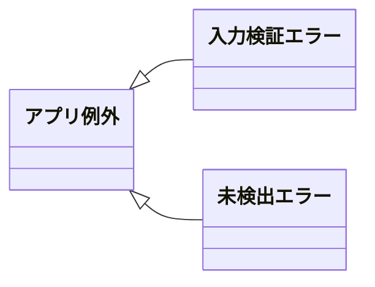
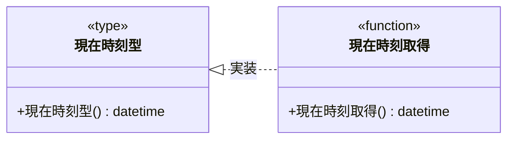

# モジュール構成: バックエンド / 共通基盤

`共通基盤` ドメイン（バックエンド側）に属する構成要素詳細。
どの feature からも参照される例外階層と、時刻取得の関数型を持つ。

- 対応テストファイル: 未記入（テストレビュー完了時に記入）

## 一覧

| ユースケース | 役割 | コンテナ | 種別 | 名前 | 概要 | 補足 |
| --- | --- | --- | --- | --- | --- | --- |
| 共通 | 例外基底 | `shared/errors.py` | クラス | [`AppError`](#アプリ例外) | 業務例外の基底 | - |
| 共通 | 例外 | `shared/errors.py` | クラス | [`ValidationError`](#入力検証エラー) | 入力検証の失敗 | - |
| 共通 | 例外 | `shared/errors.py` | クラス | [`NotFoundError`](#未検出エラー) | 対象が見つからない | - |
| 共通 | 時刻型（DI） | `shared/types.py` | 関数型 | [`NowFn`](#現在時刻型) | 現在時刻取得のシグネチャ | テストで固定値に差し替える |
| 共通 | 時刻取得 | `shared/datetime.py` | 関数 | [`now_utc`](#現在時刻取得) | UTC の現在時刻を返す | - |

## ディレクトリ構成

```
src/app/shared/
├── __init__.py
├── errors.py     # AppError / ValidationError / NotFoundError
├── types.py      # NowFn
└── datetime.py   # now_utc
```

## 構成図

### 例外階層



### 現在時刻



## アプリ例外
> 物理名: `AppError`<br>
> 種別: クラス<br>
> コンテナ: `shared/errors.py`

業務例外の基底。
最上位のハンドラがこの型 1 つで全業務例外を捕まえられるようにする。

### プロパティ

なし

### メソッド

なし

### 単体テスト

なし

### 補足

- `Exception` を継承し、docstring だけを持つ
- vendor 例外（DB ドライバ・HTTP クライアント）をそのまま外へ流さず、境界でこの階層に載せ替える

## 入力検証エラー
> 物理名: `ValidationError`<br>
> 種別: クラス<br>
> コンテナ: `shared/errors.py`<br>
> 継承元: [`AppError`](#アプリ例外)

入力値の検証に失敗したことを表す例外。

### プロパティ

なし

### メソッド

なし

### 単体テスト

なし

### 補足

- フィールド単位のエラー内容が必要な場合は feature 側で継承する（[タスク検証エラー](./タスク.py.md#タスク検証エラー)）

## 未検出エラー
> 物理名: `NotFoundError`<br>
> 種別: クラス<br>
> コンテナ: `shared/errors.py`<br>
> 継承元: [`AppError`](#アプリ例外)

指定した対象が見つからないことを表す例外。

### プロパティ

なし

### メソッド

なし

### 単体テスト

なし

## `shared/types.py`
> 種別: ファイル

複数 feature で共有する型エイリアスを置くファイル。

### 現在時刻型
> 物理名: `NowFn`<br>
> 種別: 関数型

現在時刻を返す関数のシグネチャ。
テストで固定時刻に差し替えるための DI 用。

#### 引数

なし

#### 戻り値

| 型 | 説明 | 補足 |
| --- | --- | --- |
| `datetime` | 現在時刻 | UTC の aware datetime |

#### 実装

| 実装 | 補足 |
| --- | --- |
| [現在時刻取得](#現在時刻取得) | 本番の実装 |

## `shared/datetime.py`
> 種別: ファイル

時刻に関するヘルパー関数を置くファイル。

### 現在時刻取得
> 物理名: `now_utc`<br>
> 種別: 関数<br>
> 継承元: [`NowFn`](#現在時刻型)

UTC の現在時刻を返す。

#### 引数

なし

#### 戻り値

| 型 | 説明 | 補足 |
| --- | --- | --- |
| `datetime` | 現在時刻 | `timezone.utc` 付きの aware datetime |

戻り値例:

```python
datetime(2026, 8, 1, 12, 40, 0, tzinfo=timezone.utc)
```

#### 処理

1. `datetime.now(timezone.utc)` を返す

#### 例外

なし

#### 単体テスト

| テスト名 | 正常/異常 | 概要 | 条件 | Mock | 期待値 | 補足 |
| --- | --- | --- | --- | --- | --- | --- |
| `test_now_utc` | 正常 | UTC の aware datetime を返す | 引数なしで呼ぶ | なし | `tzinfo` が `timezone.utc` になっている | 値そのものは検証しない |
