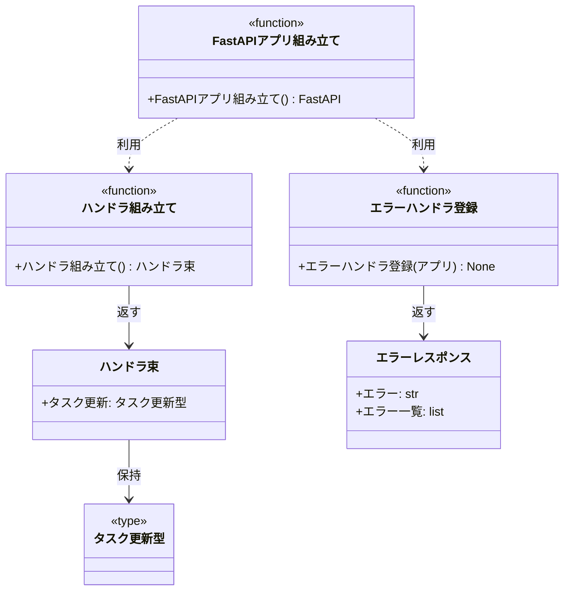

# モジュール構成: バックエンド / 起動

`起動` 分類（バックエンド側）に属する構成要素詳細。
関数依存の配線（composition root）・FastAPI アプリの組み立て・ドメイン例外から HTTP への変換を持つ。

- 対応テストファイル: 未記入（テストレビュー完了時に記入）

## 一覧

| ユースケース | 役割 | コンテナ | 種別 | 名前 | 概要 | 補足 |
| --- | --- | --- | --- | --- | --- | --- |
| 共通 | 配線 DTO | `main.py` | データモデル | [`Handlers`](#ハンドラ束) | 配線済み関数の束 | - |
| 共通 | 配線 | `main.py` | 関数 | [`build_handlers`](#ハンドラ組み立て) | 依存を注入した関数を組み立てる | - |
| 共通 | エラーレスポンス DTO | `server/error_handlers.py` | データモデル | [`ErrorResponse`](#エラーレスポンス) | エラー時のレスポンスボディ | - |
| 共通 | エラーハンドラ | `server/error_handlers.py` | 関数 | [`register_exception_handlers`](#エラーハンドラ登録) | 例外を HTTP へマップする | - |
| 共通 | アプリ組み立て | `server/app.py` | 関数 | [`build_fastapi`](#fastapi-アプリ組み立て) | FastAPI アプリを組み立てる | - |

## ディレクトリ構成

```
src/app/
├── main.py                    # Handlers / build_handlers
└── server/
    ├── app.py                 # build_fastapi
    └── error_handlers.py      # ErrorResponse / register_exception_handlers
```

## 構成図



## ハンドラ束
> 物理名: `Handlers`<br>
> 種別: データモデル<br>
> コンテナ: `main.py`

依存を注入済みの関数を束ねた不変オブジェクト。

### プロパティ

| 論理名 | プロパティ名 | 型 | 可視性 | デフォルト | 説明 | 例 | 補足 |
| --- | --- | --- | --- | --- | --- | --- | --- |
| タスク更新 | `update_task` | [`UpdateTask`](./タスク.py.md#タスク更新型) | 公開 | - | 依存を注入済みのタスク更新 | - | - |

### メソッド

なし

### 単体テスト

なし

### 補足

- `@dataclass(frozen=True, slots=True)` で定義する（dict にしないのは配線漏れ・タイポを静的に検出するため）

## エラーレスポンス
> 物理名: `ErrorResponse`<br>
> 種別: データモデル<br>
> コンテナ: `server/error_handlers.py`

エラー時に返すレスポンスボディ。

### プロパティ

| 論理名 | プロパティ名 | 型 | 可視性 | デフォルト | 説明 | 例 | 補足 |
| --- | --- | --- | --- | --- | --- | --- | --- |
| エラーコード | `error` | `str` | 公開 | - | エラーの識別子 | `"task_not_found"` | フィールド単位のエラーがある場合は `validation_error` |
| エラー一覧 | `errors` | [`list[FieldError] \| None`](./タスク.py.md#フィールドエラー) | 公開 | `None` | フィールド単位のエラー | `[{"field": "title", ...}]` | 検証エラー以外では返さない |

### メソッド

なし

### 単体テスト

なし

### 補足

- 例外の詳細（スタックトレース・SQL 文）をレスポンスに含めない

## `server/error_handlers.py`
> 種別: ファイル

ドメイン例外を HTTP レスポンスへ変換するファイル。

### エラーハンドラ登録
> 物理名: `register_exception_handlers`<br>
> 種別: 関数

FastAPI アプリに例外ハンドラをまとめて登録する。

#### 引数

| 論理名 | 引数名 | 型 | 必須 | デフォルト | 説明 | 補足 |
| --- | --- | --- | --- | --- | --- | --- |
| アプリ | `app` | `FastAPI` | ✅ | - | ハンドラを登録する対象 | - |

引数例:

```python
register_exception_handlers(app)
```

#### 戻り値

| 型 | 説明 | 補足 |
| --- | --- | --- |
| `None` | なし | - |

#### 処理

1. [タスク検証エラー](./タスク.py.md#タスク検証エラー) を `400` + `errors` 付きの [エラーレスポンス](#エラーレスポンス) に変換するハンドラを登録する
2. [未検出エラー](./共通基盤.py.md#未検出エラー) を `404` + `task_not_found` に変換するハンドラを登録する
3. [アプリ例外](./共通基盤.py.md#アプリ例外) を `500` + `internal_error` に変換するハンドラを登録する
   - `[ERROR]` 想定外の業務例外で応答を打ち切った（例外クラス名 / リクエストパス）

#### 例外

なし

#### 単体テスト

| テスト名 | 正常/異常 | 概要 | 条件 | Mock | 期待値 | 補足 |
| --- | --- | --- | --- | --- | --- | --- |
| `test_register_exception_handlers_when_validation_error` | 正常 | 検証エラーを 400 に変換 | ハンドラ登録済みアプリで `TaskValidationError` を送出するルートを呼ぶ | なし | `400` + `errors` に失敗フィールドが載る | - |
| `test_register_exception_handlers_when_not_found` | 正常 | 未検出を 404 に変換 | `TaskNotFoundError` を送出するルートを呼ぶ | なし | `404` + `task_not_found` | - |
| `test_register_exception_handlers_when_app_error` | 正常 | 業務例外を 500 に変換 | `AppError` を送出するルートを呼ぶ | なし | `500` + `internal_error`・本文に例外詳細が含まれない | - |

## `main.py`
> 種別: ファイル

関数依存を組み立てる composition root。

### ハンドラ組み立て
> 物理名: `build_handlers`<br>
> 種別: 関数

各 feature の関数に依存を注入して [ハンドラ束](#ハンドラ束) を作る。

#### 引数

なし

#### 戻り値

| 型 | 説明 | 補足 |
| --- | --- | --- |
| [`Handlers`](#ハンドラ束) | 配線済み関数の束 | - |

戻り値例:

```python
Handlers(update_task=partial(update_task, find=find_task, save=save_task, now=now_utc))
```

#### 処理

1. [タスク更新](./タスク.py.md#タスク更新) に [タスク取得](./タスク.py.md#タスク取得) / [タスク保存](./タスク.py.md#タスク保存) / [現在時刻取得](./共通基盤.py.md#現在時刻取得) を `partial` で束ねる
2. 束ねた関数を [ハンドラ束](#ハンドラ束) に詰めて返す

#### 例外

なし

#### 単体テスト

| テスト名 | 正常/異常 | 概要 | 条件 | Mock | 期待値 | 補足 |
| --- | --- | --- | --- | --- | --- | --- |
| `test_build_handlers` | 正常 | 配線済みの関数束を返す | 引数なしで呼ぶ | なし | `update_task` が 1 引数で呼べる | 配線漏れの検出 |

## `server/app.py`
> 種別: ファイル

FastAPI アプリを組み立てるファイル。

### FastAPI アプリ組み立て
> 物理名: `build_fastapi`<br>
> 種別: 関数

ルーター・例外ハンドラ・依存を登録した FastAPI アプリを返す。

#### 引数

なし

#### 戻り値

| 型 | 説明 | 補足 |
| --- | --- | --- |
| `FastAPI` | 組み立て済みのアプリ | - |

戻り値例:

```python
app = build_fastapi()
```

#### 処理

1. FastAPI インスタンスを作る
2. [ハンドラ組み立て](#ハンドラ組み立て) の結果を `app.state.handlers` に載せる
3. タスクのルーターを登録する（[タスク更新ルート](./タスク.py.md#タスク更新ルート)）
4. 例外ハンドラを登録する（[エラーハンドラ登録](#エラーハンドラ登録)）
5. 組み立てたアプリを返す

#### 例外

なし

#### 単体テスト

| テスト名 | 正常/異常 | 概要 | 条件 | Mock | 期待値 | 補足 |
| --- | --- | --- | --- | --- | --- | --- |
| `test_build_fastapi` | 正常 | ルーターとハンドラが載る | 引数なしで呼ぶ | なし | `PUT /tasks/{task_id}` がルート一覧に含まれ、`app.state.handlers` が設定されている | - |
