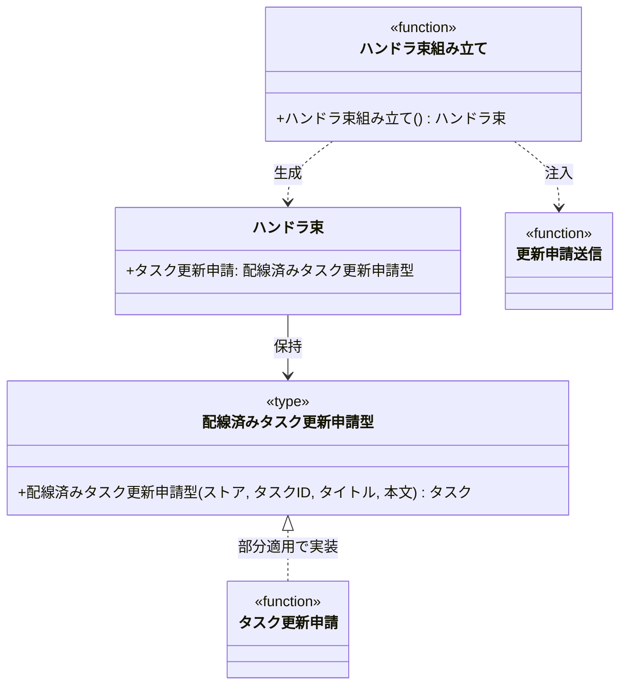

# モジュール構成: バックエンド / 起動

プロセスの入口（composition root）に属する構成要素詳細。
外部依存を持つ関数へ実装を注入し、配線済みの関数束を組み立てる。

## 一覧

| ユースケース | 役割 | コンテナ | 種別 | 名前 | 概要 | 補足 |
| --- | --- | --- | --- | --- | --- | --- |
| 共通 | 配線済み関数束 | `main.py` | データモデル | [`Handlers`](#ハンドラ束) | 配線済み関数をまとめた束 | - |
| 共通 | 配線 | `main.py` | 関数 | [`build_handlers`](#ハンドラ束組み立て) | 外部依存を注入して関数束を作る | - |
| タスク編集 | サービス型（DI） | `main.py` | 関数型 | [`WiredUpdateTask`](#配線済みタスク更新申請型) | 承認基盤を注入済みのタスク更新申請のシグネチャ | - |
| 共通 | 定数 | `main.py` | 定数 | `APPROVAL_ENDPOINT_ENV` | 受付エンドポイントを読む環境変数名 | `"APPROVAL_ENDPOINT"` |

## ディレクトリ構成

```
src/
├── main.py          # Handlers / build_handlers / WiredUpdateTask / APPROVAL_ENDPOINT_ENV
└── tasks/           # タスクドメイン（設計図/モジュール構成/バックエンド/タスク.py.md）
```

## 構成図



## ハンドラ束
> 物理名: `Handlers`<br>
> 種別: データモデル<br>
> コンテナ: `main.py`

外部依存を注入し終えた関数の束。
呼び出し側はこの束だけを受け取り、承認基盤の存在を知らずに済む。

### プロパティ

| 論理名 | プロパティ名 | 型 | 可視性 | デフォルト | 説明 | 例 | 補足 |
| --- | --- | --- | --- | --- | --- | --- | --- |
| タスク更新申請 | `update_task` | [`WiredUpdateTask`](#配線済みタスク更新申請型) | 公開 | - | 承認基盤を注入済みのタスク更新申請 | - | - |

### メソッド

なし

### 単体テスト

なし

### 補足

- dict ではなく `frozen=True` の dataclass にする（タイポを静的に検出でき、配線の一覧が型として明示されるため）

## `main.py`
> 種別: ファイル

外部依存を注入して関数束を組み立てる composition root。

---

### ハンドラ束組み立て
> 物理名: `build_handlers`<br>
> 種別: 関数

環境変数から承認基盤の受付エンドポイントを読み、配線済みの関数束を作る。

#### 引数

なし

引数例:

```python
handlers = build_handlers()
```

#### 戻り値

| 型 | 説明 | 補足 |
| --- | --- | --- |
| [`Handlers`](#ハンドラ束) | 配線済みの関数束 | - |

戻り値例:

```python
Handlers(update_task=functools.partial(update_task, submit=submit))
```

#### 処理

1. 環境変数 `APPROVAL_ENDPOINT_ENV` から受付エンドポイントを読む
   - 未設定の場合、`ValidationError` を送出する
2. 受付エンドポイントを部分適用した更新申請送信を作る（[更新申請送信](./タスク.py.md#更新申請送信)）
3. 更新申請送信を部分適用したタスク更新申請を作る（[タスク更新申請](./タスク.py.md#タスク更新申請)）
4. 配線済みの関数束を返す
   - `[INFO]` ハンドラ束を組み立てた（受付エンドポイント）

#### 例外

| 例外名 | 発生条件 | メッセージ | 補足 |
| --- | --- | --- | --- |
| `ValidationError` | 環境変数 `APPROVAL_ENDPOINT` が未設定 | `"環境変数が未設定です: APPROVAL_ENDPOINT"` | 既定値へのフォールバックは設けない |

#### 単体テスト

| テスト名 | 正常/異常 | 概要 | 条件 | Mock | 期待値 | 補足 |
| --- | --- | --- | --- | --- | --- | --- |
| `test_build_handlers` | 正常 | 環境変数から配線する | `APPROVAL_ENDPOINT` を設定 | `os.environ` | `Handlers` を返す。`update_task` が呼び出し可能 | - |
| `test_build_handlers_when_endpoint_missing` | 異常 | 環境変数が未設定 | `APPROVAL_ENDPOINT` を削除 | `os.environ` | `ValidationError` を送出する | 例外表「環境変数が未設定」に対応 |

---

### 配線済みタスク更新申請型
> 物理名: `WiredUpdateTask`<br>
> 種別: 関数型

承認基盤への送信手段を注入し終えたタスク更新申請のシグネチャ。

#### 引数

| 論理名 | 引数名 | 型 | 必須 | デフォルト | 説明 | 補足 |
| --- | --- | --- | --- | --- | --- | --- |
| ストア | `store` | [`dict[str, Task]`](./タスク.py.md#タスク) | ✅ | - | タスク ID をキーにしたインメモリストア | - |
| タスク ID | `task_id` | `str` | ✅ | - | 更新対象のタスク ID | - |
| タイトル | `title` | `str` | ✅ | - | 申請するタスク名 | - |
| 本文 | `content` | `str` | - | `""` | 申請する本文 | - |

#### 戻り値

| 型 | 説明 | 補足 |
| --- | --- | --- |
| [`Task`](./タスク.py.md#タスク) | 受付済みになったタスク | - |

#### 実装

| 実装 | 補足 |
| --- | --- |
| [タスク更新申請](./タスク.py.md#タスク更新申請) | `submit` を部分適用したもの |

### 補足

- 受付エンドポイントは環境ごとに変わるため環境変数から読み、タイムアウトは業務固定値として `tasks/constants.py` に置く
- 未設定時に既定のエンドポイントへフォールバックしない（設定漏れが実行時まで気付けなくなるため）
