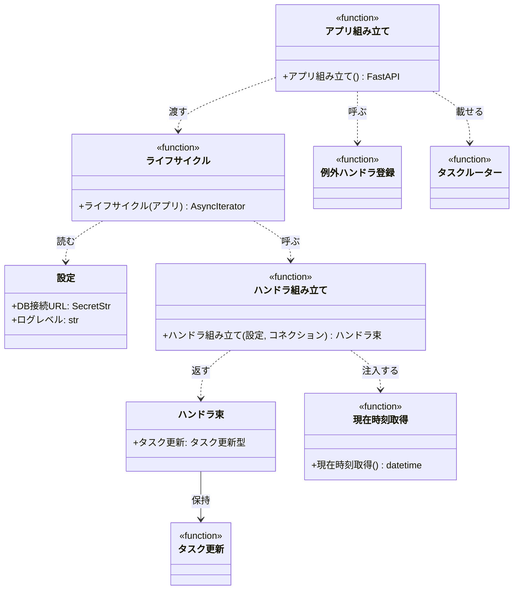

# モジュール構成: バックエンド / 起動

プロセスの入口（設定の読み込み・依存の配線・FastAPI アプリの組み立て）の詳細。

- 対応テストファイル: 未記入（テストレビュー時に記入）

## 一覧

| ユースケース | 役割 | コンテナ | 種別 | 名前 | 概要 | 補足 |
| --- | --- | --- | --- | --- | --- | --- |
| 共通 | 設定 | `app/shared/settings.py` | データモデル | [`Settings`](#設定) | 環境変数から読む設定値 | - |
| 共通 | 配線束 | `app/main.py` | データモデル | [`Handlers`](#ハンドラ束) | 配線済み関数の束 | - |
| 共通 | 配線 | `app/main.py` | 関数 | [`build_handlers`](#ハンドラ組み立て) | 依存を注入した関数を組み立てる | composition root |
| 共通 | 時刻取得 | `app/main.py` | 関数 | [`now_utc`](#現在時刻取得) | 現在時刻 (UTC) を返す | - |
| 共通 | ライフサイクル | `app/server/app.py` | 関数 | [`lifespan`](#ライフサイクル) | 起動時の接続確立と終了時の後始末 | - |
| 共通 | アプリ組み立て | `app/server/app.py` | 関数 | [`build_fastapi`](#アプリ組み立て) | ルーターと例外ハンドラを載せた app を返す | 起動エントリ |

## ディレクトリ構成

```
src/app/
├── main.py                 # Handlers / build_handlers / now_utc
├── shared/
│   └── settings.py         # Settings
└── server/
    └── app.py              # lifespan / build_fastapi
```

## 構成図



## 設定
> 物理名: `Settings`<br>
> 種別: データモデル<br>
> コンテナ: `app/shared/settings.py`

環境変数 / `.env` から読む設定値。

### プロパティ

| 論理名 | プロパティ名 | 型 | 可視性 | デフォルト | 説明 | 例 | 補足 |
| --- | --- | --- | --- | --- | --- | --- | --- |
| DB 接続 URL | `database_url` | `SecretStr` | 公開 | - | PostgreSQL への接続 URL | `postgresql://...` | 必須。ログに出さない |
| ログレベル | `log_level` | `str` | 公開 | `INFO` | ログ出力の閾値 | `DEBUG` | - |

### メソッド

なし

### 単体テスト

なし

### 補足

- `pydantic_settings.BaseSettings` で定義し、`env_file=".env"` を読む
- インスタンス化は[ライフサイクル](#ライフサイクル)で 1 度だけ行う

## ハンドラ束
> 物理名: `Handlers`<br>
> 種別: データモデル<br>
> コンテナ: `app/main.py`

配線済み関数の束。
ルートはこの束から関数を取り出して呼ぶ。

### プロパティ

| 論理名 | プロパティ名 | 型 | 可視性 | デフォルト | 説明 | 例 | 補足 |
| --- | --- | --- | --- | --- | --- | --- | --- |
| タスク更新 | `update_task` | `Callable[[str, UpdateTaskInput], Task]` | 公開 | - | 依存を注入済みの[タスク更新](./タスク.py.md#タスク更新) | - | 取得・保存・現在時刻が束縛済み |

### メソッド

なし

### 単体テスト

なし

### 補足

- `@dataclass(frozen=True, slots=True, kw_only=True)` で定義する（dict にするとキーのタイポを静的に検出できないため）

## `app/main.py`
> 種別: ファイル

依存を配線する composition root。

---

### ハンドラ組み立て
> 物理名: `build_handlers`<br>
> 種別: 関数

依存を注入した関数を組み立てて[ハンドラ束](#ハンドラ束)を返す。

#### 引数

| 論理名 | 引数名 | 型 | 必須 | デフォルト | 説明 | 補足 |
| --- | --- | --- | --- | --- | --- | --- |
| 設定 | `settings` | [`Settings`](#設定) | ✅ | - | 読み込み済みの設定 | - |
| コネクション | `conn` | `Connection` | ✅ | - | 確立済みの DB コネクション | - |

引数例:

```python
handlers = build_handlers(settings, conn)
```

#### 戻り値

| 型 | 説明 | 補足 |
| --- | --- | --- |
| [`Handlers`](#ハンドラ束) | 配線済み関数の束 | - |

戻り値例:

```python
Handlers(update_task=<partial of update_task>)
```

#### 処理

1. コネクションを束縛した取得・保存関数を作る（[タスク取得](./タスク.py.md#タスク取得) / [タスク保存](./タスク.py.md#タスク保存)）
2. 取得・保存・現在時刻を束縛した[タスク更新](./タスク.py.md#タスク更新)を[ハンドラ束](#ハンドラ束)に詰めて返す（[現在時刻取得](#現在時刻取得)）

#### 例外

なし

#### 単体テスト

| テスト名 | 正常/異常 | 概要 | 条件 | Mock | 期待値 | 補足 |
| --- | --- | --- | --- | --- | --- | --- |
| `test_build_handlers` | 正常 | 配線済みの束を返す | テスト用の設定とコネクション stub を渡す | DB コネクション | `Handlers.update_task` が引数 2 つで呼べる | - |

---

### 現在時刻取得
> 物理名: `now_utc`<br>
> 種別: 関数<br>
> 継承元: [`NowFn`](./タスク.py.md#現在時刻型)

現在時刻 (UTC) を返す。

#### 引数

なし

#### 戻り値

| 型 | 説明 | 補足 |
| --- | --- | --- |
| `datetime` | 現在時刻 (UTC) | tz 付き |

戻り値例:

```python
datetime(2026, 8, 1, 6, 30, 0, tzinfo=UTC)
```

#### 処理

1. tz 付きの現在時刻 (UTC) を返す

#### 例外

なし

#### 単体テスト

| テスト名 | 正常/異常 | 概要 | 条件 | Mock | 期待値 | 補足 |
| --- | --- | --- | --- | --- | --- | --- |
| `test_now_utc` | 正常 | tz 付きの UTC 時刻を返す | 引数なしで呼ぶ | なし | 戻り値の `tzinfo` が `UTC` | 値そのものは検証しない |

## `app/server/app.py`
> 種別: ファイル

FastAPI アプリの組み立てとライフサイクル管理。

---

### ライフサイクル
> 物理名: `lifespan`<br>
> 種別: 関数

起動時に設定の読み込みと DB 接続を行い、終了時に接続を閉じる。

#### 引数

| 論理名 | 引数名 | 型 | 必須 | デフォルト | 説明 | 補足 |
| --- | --- | --- | --- | --- | --- | --- |
| アプリ | `app` | `FastAPI` | ✅ | - | 対象のアプリ | `app.state` に配線結果を置く |

引数例:

```python
FastAPI(lifespan=lifespan)
```

#### 戻り値

| 型 | 説明 | 補足 |
| --- | --- | --- |
| `AsyncIterator[None]` | なし | `@asynccontextmanager` で包む |

#### 処理

1. 設定を読み込む（[設定](#設定)）
2. 設定のログレベルをロガーに反映する
3. DB コネクションを確立する
   - `[INFO]` DB へ接続した（`接続先ホスト`）
4. 配線済みの関数束を `app.state.handlers` に置く（[ハンドラ組み立て](#ハンドラ組み立て)）
5. アプリの稼働中は制御を返す
6. 終了時に DB コネクションを閉じる
   - `[INFO]` DB 接続を閉じた

#### 例外

なし

#### 単体テスト

| テスト名 | 正常/異常 | 概要 | 条件 | Mock | 期待値 | 補足 |
| --- | --- | --- | --- | --- | --- | --- |
| `test_lifespan` | 正常 | 起動で配線し終了で閉じる | テスト用の設定を env に置く | DB コネクション | `app.state.handlers` が入る / 終了後に接続が閉じられる | - |

---

### アプリ組み立て
> 物理名: `build_fastapi`<br>
> 種別: 関数

ルーターと例外ハンドラを載せた FastAPI アプリを返す。

#### 引数

なし

#### 戻り値

| 型 | 説明 | 補足 |
| --- | --- | --- |
| `FastAPI` | 組み立て済みのアプリ | - |

戻り値例:

```python
uvicorn.run("app.server.app:build_fastapi", factory=True)
```

#### 処理

1. [ライフサイクル](#ライフサイクル)を渡してアプリを生成する
2. 例外ハンドラを登録する（[例外ハンドラ登録](./共通.py.md#例外ハンドラ登録)）
3. タスクドメインのルーターを載せて返す

#### 例外

なし

#### 単体テスト

| テスト名 | 正常/異常 | 概要 | 条件 | Mock | 期待値 | 補足 |
| --- | --- | --- | --- | --- | --- | --- |
| `test_build_fastapi` | 正常 | ルートと例外ハンドラが載る | 引数なしで呼ぶ | なし | `PUT /tasks/{task_id}` が登録され、例外ハンドラが 3 件入る | 起動はしない |
