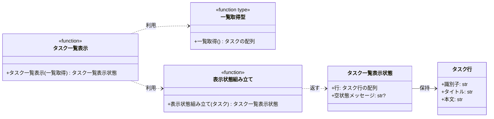

# モジュール構成: フロントエンド / タスク

`タスク` ドメイン（フロントエンド側）に属する構成要素詳細。
本サイクルの担当範囲は、保存後の戻り先となるタスク一覧画面の表示までで、一覧から編集画面への遷移導線は持たない。

## 一覧

| ユースケース | 役割 | コンテナ | 種別 | 名前 | 概要 | 補足 |
| --- | --- | --- | --- | --- | --- | --- |
| 共通 | 表示モデル | `src/screens/types.py` | データモデル | [`TaskRow`](#タスク行) | 一覧の 1 行が持つ表示値 | #1079（PR #1083）の同名モデルに本文を足したもの |
| 共通 | 表示モデル | `src/screens/types.py` | データモデル | [`TaskListView`](#タスク一覧表示状態) | タスク一覧画面の表示状態 | 遷移導線を持たないため未検出メッセージは定義しない |
| 共通 | 依存の型（DI） | `src/screens/types.py` | 関数型 | [`ListTasks`](#一覧取得型) | タスク一覧取得のシグネチャ | 実装はバックエンドの `list_tasks`。#1079（PR #1083）と同一定義 |
| タスク一覧画面の表示 | 定数 | `src/screens/task_list.py` | 定数 | `EMPTY_MESSAGE` | 空状態メッセージ（`"タスクがありません"`） | 単純即値のため詳細セクションなし。#1079（PR #1083）と同一定義 |
| タスク一覧画面の表示 | 表示の組み立て | `src/screens/task_list.py` | 関数 | [`_build_view`](#表示状態組み立て) | 取得したタスクから表示状態を組み立てる | - |
| タスク一覧画面の表示 | 画面 | `src/screens/task_list.py` | 関数 | [`render_task_list`](#タスク一覧表示) | 一覧を取得して表示状態を返す | - |

## ディレクトリ構成

```
src/screens/
├── __init__.py     # 公開シンボルの再エクスポート
├── types.py        # TaskRow / TaskListView / 一覧取得の関数型
└── task_list.py    # render_task_list / _build_view / 空状態メッセージの定数
```

`src/screens/types.py` は [タスク編集](./タスク編集.py.md) と共有する。

## 構成図



## タスク行
> 物理名: `TaskRow`<br>
> 種別: データモデル<br>
> コンテナ: `src/screens/types.py`

タスク一覧の 1 行が持つ表示値。

### プロパティ

| 論理名 | プロパティ名 | 型 | 可視性 | デフォルト | 説明 | 例 | 補足 |
| --- | --- | --- | --- | --- | --- | --- | --- |
| 識別子 | `id` | `str` | 公開 | - | タスクの識別子 | `"t2"` | 一覧取得の戻り値をそのまま持つ |
| タイトル | `title` | `str` | 公開 | - | タスクのタイトル | `"週次レポートの提出"` | - |
| 本文 | `content` | `str` | 公開 | - | タスクの本文 | `"今週の進捗をまとめる"` | 本文が未設定のタスクは空文字 |

### メソッド

なし

### 単体テスト

なし

### 補足

- `@dataclass(frozen=True, slots=True, kw_only=True)` で定義する
- 本文は保存した内容の反映を一覧の行で確認するために持つ（[タスク一覧画面](../../画面構成/タスク一覧画面.py.md) の ※1）
- #1079（PR #1083）の同名モデルは本文を持たない。
  master へ集約する際に本文を残すかは epic レイヤーの判断が要る

## タスク一覧表示状態
> 物理名: `TaskListView`<br>
> 種別: データモデル<br>
> コンテナ: `src/screens/types.py`

タスク一覧画面が表示している内容。

### プロパティ

| 論理名 | プロパティ名 | 型 | 可視性 | デフォルト | 説明 | 例 | 補足 |
| --- | --- | --- | --- | --- | --- | --- | --- |
| 行 | `rows` | [`list[TaskRow]`](#タスク行) | 公開 | - | 表示するタスク行 | `[TaskRow(id="t1", title="買い物リストの作成", content="")]` | 取得結果の順（識別子の昇順）のまま |
| 空状態メッセージ | `empty_message` | `str \| None` | 公開 | `None` | 登録が 0 件であることを示す文言 | `"タスクがありません"` | 行が 0 件のときだけ値が入る |

### メソッド

なし

### 単体テスト

なし

### 補足

- `@dataclass(frozen=True, slots=True, kw_only=True)` で定義する
- メッセージを表示しない状態を `None` で表すため、画面側は値の有無だけを見て出し分ける
- #1079（PR #1083）の同名モデルが持つ未検出メッセージのフィールドは、本サブシステムが行の選択を持たないため定義しない（master へ集約する際は両者のフィールドの和集合になる）

## `src/screens/types.py`
> 種別: ファイル

画面層の表示モデルと、バックエンドへの依存を表す関数型を置くファイル。
データモデルの詳細は上のデータモデルごとのセクションを参照する。

### 一覧取得型
> 物理名: `ListTasks`<br>
> 種別: 関数型

タスク一覧を取得する関数のシグネチャ。
画面層がバックエンドの実装に直接依存しないための注入点。

| 項目 | 内容 |
| --- | --- |
| 引数 | なし |
| 戻り値 | タスクの配列（識別子の昇順。登録が 0 件なら空の配列） |
| 送出する例外 | なし |

補足:

- `Callable[[], list[Task]]` 相当の型エイリアスとして定義する
- 実装はバックエンドの `list_tasks` を保管先で束縛したもの。テストでは差し替えた関数を注入する
- #1079（PR #1083）の同名の関数型と同一定義にする

## `src/screens/task_list.py`
> 種別: ファイル

タスク一覧画面の表示を担う関数ファイル。
バックエンドへの呼び出しは引数で受け取った関数を通じて行い、モジュールレベルの状態は持たない。

### 表示状態組み立て
> 物理名: `_build_view`<br>
> 種別: 関数

取得したタスクからタスク一覧画面の表示状態を組み立てる。

#### 引数

| 論理名 | 引数名 | 型 | 必須 | デフォルト | 説明 | 補足 |
| --- | --- | --- | --- | --- | --- | --- |
| タスク | `tasks` | `list[Task]` | ✅ | - | 一覧取得で得たタスク | 並び順を変えずに行へ移す |

引数例:

```python
_build_view([Task(id="t1", title="買い物リストの作成", content="")])
```

#### 戻り値

| 型 | 説明 | 補足 |
| --- | --- | --- |
| [`TaskListView`](#タスク一覧表示状態) | タスク一覧画面の表示状態 | - |

戻り値例:

```python
TaskListView(
    rows=[TaskRow(id="t1", title="買い物リストの作成", content="")],
    empty_message=None,
)
```

#### 処理

1. タスクを識別子・タイトル・本文を持つタスク行へ移す
2. 空状態メッセージを決める
   - 行が 0 件の場合、`EMPTY_MESSAGE` を入れる
   - 行が 1 件以上の場合、`None` を入れる
3. 行と空状態メッセージから表示状態を組み立てて返す

#### 例外

なし

#### 単体テスト

| テスト名 | 正常/異常 | 概要 | 条件 | Mock | 期待値 | 補足 |
| --- | --- | --- | --- | --- | --- | --- |
| `test_build_view` | 正常 | タスクを行に移す | タスク 2 件を渡す | なし | 2 行の表示状態を返し、`empty_message` が `None` | 並び順が渡した順のままであること・各行が本文を持つことも確認する |
| `test_build_view_when_tasks_empty` | 正常 | 登録が 0 件 | 空の配列を渡す | なし | 行が 0 件で `empty_message` が `"タスクがありません"` | 分岐（行が 0 件）に対応 |
| `test_build_view_when_content_empty` | 正常 | 本文が未設定のタスク | 本文が空文字のタスクを渡す | なし | 行の本文が空文字になる | 本文列が空でも行が成立することを固定する |

### タスク一覧表示
> 物理名: `render_task_list`<br>
> 種別: 関数

タスク一覧を取得して表示状態を返す。

#### 引数

| 論理名 | 引数名 | 型 | 必須 | デフォルト | 説明 | 補足 |
| --- | --- | --- | --- | --- | --- | --- |
| 一覧取得 | `list_tasks` | [`ListTasks`](#一覧取得型) | ✅ | - | タスク一覧を取得する関数 | キーワード引数で注入する |

引数例:

```python
render_task_list(list_tasks=partial(list_tasks, store))
```

#### 戻り値

| 型 | 説明 | 補足 |
| --- | --- | --- |
| [`TaskListView`](#タスク一覧表示状態) | タスク一覧画面の表示状態 | - |

戻り値例:

```python
TaskListView(
    rows=[
        TaskRow(id="t1", title="買い物リストの作成", content=""),
        TaskRow(id="t2", title="週次レポートの提出", content="今週の進捗をまとめる"),
    ],
    empty_message=None,
)
```

#### 処理

1. 一覧取得を呼んでタスクを得る
2. 得たタスクから表示状態を組み立てて返す（[表示状態組み立て](#表示状態組み立て)）

#### 例外

なし

#### 単体テスト

| テスト名 | 正常/異常 | 概要 | 条件 | Mock | 期待値 | 補足 |
| --- | --- | --- | --- | --- | --- | --- |
| `test_render_task_list` | 正常 | 一覧取得の結果を表示状態にする | タスク 2 件を返す一覧取得を注入 | `list_tasks` | 2 行の表示状態を返し、一覧取得が 1 回呼ばれる | 分岐を持たないため 1 ケース（0 件の分岐は [表示状態組み立て](#表示状態組み立て) 側で確認する） |

### 補足

- 画面を開くたびに一覧取得を呼び、取得結果を画面をまたいで保持しない（保存後に戻ったとき最新の内容になることを担保する）
- 一覧取得は例外を送出しないため、本ファイルに異常系の分岐を持たない
- 一覧から編集画面への遷移導線（行の選択・遷移先の決定・URL 変換・未検出メッセージ）は #1079（PR #1083）の担当範囲のため定義しない
