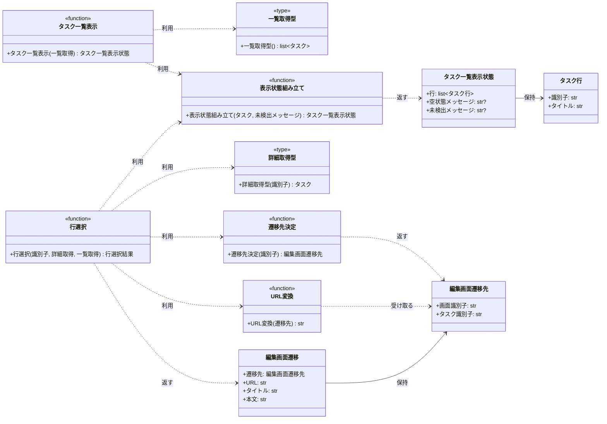

# モジュール構成: フロントエンド / タスク

`タスク` ドメイン（フロントエンド側）に属する構成要素詳細。
本サイクルの担当範囲はタスク一覧画面の表示と、編集画面への遷移先の決定までで、編集画面本体は持たない。

## 一覧

| ユースケース | 役割 | コンテナ | 種別 | 名前 | 概要 | 補足 |
| --- | --- | --- | --- | --- | --- | --- |
| 共通 | 表示モデル | `src/screens/types.py` | データモデル | [`TaskRow`](#タスク行) | 一覧の 1 行が持つ表示値 | - |
| 共通 | 表示モデル | `src/screens/types.py` | データモデル | [`TaskListView`](#タスク一覧表示状態) | タスク一覧画面の表示状態 | - |
| 共通 | 遷移モデル | `src/screens/types.py` | データモデル | [`EditDestination`](#編集画面遷移先) | 編集画面の遷移先（画面識別子 + タスク識別子） | - |
| 共通 | 遷移モデル | `src/screens/types.py` | データモデル | [`EditNavigation`](#編集画面遷移) | 遷移先と編集画面の初期表示値 | - |
| 共通 | 戻り値の型 | `src/screens/types.py` | 関数型 | `RowSelectionResult` | 行選択の結果（遷移 or 一覧の再表示） | `EditNavigation \| TaskListView` の型エイリアス。単純な別名のため詳細セクションなし |
| 共通 | 依存の型（DI） | `src/screens/types.py` | 関数型 | [`ListTasks`](#一覧取得型) | タスク一覧取得のシグネチャ | 実装はバックエンドの `list_tasks` |
| 共通 | 依存の型（DI） | `src/screens/types.py` | 関数型 | [`GetTask`](#詳細取得型) | タスク詳細取得のシグネチャ | 実装はバックエンドの `get_task` |
| 共通 | 定数 | `src/screens/navigation.py` | 定数 | `TASK_EDIT_SCREEN_ID` | 編集画面の画面識別子（`"task-edit"`） | 単純即値のため詳細セクションなし |
| 共通 | 定数 | `src/screens/task_list.py` | 定数 | `EMPTY_MESSAGE` | 空状態メッセージ（`"タスクがありません"`） | 単純即値のため詳細セクションなし |
| 共通 | 定数 | `src/screens/task_list.py` | 定数 | `NOT_FOUND_MESSAGE` | 未検出メッセージ（`"タスクが見つかりません"`） | 単純即値のため詳細セクションなし |
| 編集画面への遷移 | 遷移先の決定 | `src/screens/navigation.py` | 関数 | [`resolve_edit_destination`](#遷移先決定) | タスクの識別子から編集画面の遷移先を決める | - |
| 編集画面への遷移 | URL 変換 | `src/screens/navigation.py` | 関数 | [`to_url`](#url変換) | 遷移先を URL 文字列に変換する | URL 形式の集約点 |
| タスク一覧画面の表示 | 表示の組み立て | `src/screens/task_list.py` | 関数 | [`_build_view`](#表示状態組み立て) | 取得したタスクから表示状態を組み立てる | - |
| タスク一覧画面の表示 | 画面 | `src/screens/task_list.py` | 関数 | [`render_task_list`](#タスク一覧表示) | 一覧を取得して表示状態を返す | - |
| 編集画面への遷移 | 画面 | `src/screens/task_list.py` | 関数 | [`select_task_row`](#行選択) | 行の選択を処理し、遷移先か一覧の再表示を返す | - |

## ディレクトリ構成

```
src/screens/
├── __init__.py     # 公開シンボルの再エクスポート
├── types.py        # TaskRow / TaskListView / EditDestination / EditNavigation / 依存の関数型
├── navigation.py   # resolve_edit_destination / to_url / 画面識別子の定数
└── task_list.py    # render_task_list / select_task_row / _build_view / メッセージの定数
```

## 構成図



## タスク行
> 物理名: `TaskRow`<br>
> 種別: データモデル<br>
> コンテナ: `src/screens/types.py`

タスク一覧の 1 行が持つ表示値。

### プロパティ

| 論理名 | プロパティ名 | 型 | 可視性 | デフォルト | 説明 | 例 | 補足 |
| --- | --- | --- | --- | --- | --- | --- | --- |
| 識別子 | `id` | `str` | 公開 | - | タスクの識別子 | `"t2"` | 行を選択したときに遷移先へ引き渡す値 |
| タイトル | `title` | `str` | 公開 | - | タスクのタイトル | `"週次レポートの提出"` | - |

### メソッド

なし

### 単体テスト

なし

### 補足

- `@dataclass(frozen=True, slots=True, kw_only=True)` で定義する
- 本文（`content`）は一覧に表示しないため持たない（[タスク一覧画面](../../画面構成/タスク一覧画面.py.md) の要素一覧に対応）

## タスク一覧表示状態
> 物理名: `TaskListView`<br>
> 種別: データモデル<br>
> コンテナ: `src/screens/types.py`

タスク一覧画面が表示している内容。

### プロパティ

| 論理名 | プロパティ名 | 型 | 可視性 | デフォルト | 説明 | 例 | 補足 |
| --- | --- | --- | --- | --- | --- | --- | --- |
| 行 | `rows` | [`list[TaskRow]`](#タスク行) | 公開 | - | 表示するタスク行 | `[TaskRow(id="t1", title="買い物リストの作成")]` | 取得結果の順（識別子の昇順）のまま |
| 空状態メッセージ | `empty_message` | `str \| None` | 公開 | `None` | 登録が 0 件であることを示す文言 | `"タスクがありません"` | 行が 0 件のときだけ値が入る |
| 未検出メッセージ | `not_found_message` | `str \| None` | 公開 | `None` | 直前の行選択で詳細を取得できなかったことを示す文言 | `"タスクが見つかりません"` | 行選択が失敗したときだけ値が入る |

### メソッド

なし

### 単体テスト

なし

### 補足

- `@dataclass(frozen=True, slots=True, kw_only=True)` で定義する
- メッセージを表示しない状態を `None` で表すため、画面側は値の有無だけを見て出し分ける

## 編集画面遷移先
> 物理名: `EditDestination`<br>
> 種別: データモデル<br>
> コンテナ: `src/screens/types.py`

編集画面の遷移先を、URL 文字列にする前の形で表したもの。

### プロパティ

| 論理名 | プロパティ名 | 型 | 可視性 | デフォルト | 説明 | 例 | 補足 |
| --- | --- | --- | --- | --- | --- | --- | --- |
| 画面識別子 | `screen_id` | `str` | 公開 | - | 遷移先の画面を表す識別子 | `"task-edit"` | 値は `TASK_EDIT_SCREEN_ID` |
| タスク識別子 | `task_id` | `str` | 公開 | - | 編集対象のタスクの識別子 | `"t2"` | 選択した行の識別子をそのまま持つ |

### メソッド

なし

### 単体テスト

なし

### 補足

- `@dataclass(frozen=True, slots=True, kw_only=True)` で定義する
- URL 文字列は持たない（変換は [URL変換](#url変換) に集約し、編集画面の URL 形式が epic #1069 で確定したときの変更箇所を 1 点に留める）

## 編集画面遷移
> 物理名: `EditNavigation`<br>
> 種別: データモデル<br>
> コンテナ: `src/screens/types.py`

編集画面へ遷移するときに引き渡す一式（遷移先 + 初期表示値）。

### プロパティ

| 論理名 | プロパティ名 | 型 | 可視性 | デフォルト | 説明 | 例 | 補足 |
| --- | --- | --- | --- | --- | --- | --- | --- |
| 遷移先 | `destination` | [`EditDestination`](#編集画面遷移先) | 公開 | - | 遷移先の画面とタスクの組 | `EditDestination(screen_id="task-edit", task_id="t2")` | - |
| URL | `url` | `str` | 公開 | - | 遷移先を URL 文字列にしたもの | `"/task-edit/t2"` | [URL変換](#url変換) の戻り値 |
| タイトル | `title` | `str` | 公開 | - | 編集画面のタイトルの初期表示値 | `"週次レポートの提出"` | 詳細取得の結果をそのまま持つ |
| 本文 | `content` | `str` | 公開 | - | 編集画面の本文の初期表示値 | `"今週の進捗をまとめる"` | 本文が未設定のタスクは空文字 |

### メソッド

なし

### 単体テスト

なし

### 補足

- `@dataclass(frozen=True, slots=True, kw_only=True)` で定義する
- 編集画面本体（フォーム・保存・中止）は epic #1069 の担当のため、本モデルは引き渡す値だけを持つ

## `src/screens/types.py`
> 種別: ファイル

画面層の表示モデル・遷移モデルと、バックエンドへの依存を表す関数型を置くファイル。
データモデルの詳細は上のデータモデルごとのセクションを参照する。

---

### 一覧取得型
> 物理名: `ListTasks`<br>
> 種別: 関数型

タスク一覧を取得する関数のシグネチャ。
画面層がバックエンドの実装に直接依存しないための注入点。

#### 引数

なし

#### 戻り値

| 型 | 説明 | 補足 |
| --- | --- | --- |
| `list[Task]` | 登録されているタスク | 識別子の昇順。登録が 0 件なら空の配列 |

#### 実装

| 実装 | 補足 |
| --- | --- |
| バックエンドの `list_tasks` | 保管先を束ねた形（`partial(list_tasks, store)`）で注入する |

---

### 詳細取得型
> 物理名: `GetTask`<br>
> 種別: 関数型

タスク 1 件の詳細を取得する関数のシグネチャ。

#### 引数

| 論理名 | 引数名 | 型 | 必須 | デフォルト | 説明 | 補足 |
| --- | --- | --- | --- | --- | --- | --- |
| タスク識別子 | `task_id` | `str` | ✅ | - | 取得対象のタスクの識別子 | - |

#### 戻り値

| 型 | 説明 | 補足 |
| --- | --- | --- |
| `Task` | 指定した識別子のタスク | 見つからない場合は `TaskNotFoundError`、形式が不正な場合は `ValidationError` を送出する |

#### 実装

| 実装 | 補足 |
| --- | --- |
| バックエンドの `get_task` | 保管先を束ねた形（`partial(get_task, store)`）で注入する |

---

### 補足

- バックエンドの例外型（`TaskNotFoundError` / `ValidationError`）は抽象化せず `src/tasks/errors.py` から直接 import する（送出される例外の型を関数型で表現する手段がなく、抽象化しても実装側の型を知る必要が残るため）

## `src/screens/navigation.py`
> 種別: ファイル

編集画面への遷移先を決める関数ファイル。
URL 形式に依存するのは [URL変換](#url変換) だけで、他の関数は画面識別子とタスク識別子の組だけを扱う。

---

### 遷移先決定
> 物理名: `resolve_edit_destination`<br>
> 種別: 関数

タスクの識別子から編集画面の遷移先を決める。

#### 引数

| 論理名 | 引数名 | 型 | 必須 | デフォルト | 説明 | 補足 |
| --- | --- | --- | --- | --- | --- | --- |
| タスク識別子 | `task_id` | `str` | ✅ | - | 編集対象のタスクの識別子 | 選択した行の識別子をそのまま渡す |

引数例:

```python
resolve_edit_destination("t2")
```

#### 戻り値

| 型 | 説明 | 補足 |
| --- | --- | --- |
| [`EditDestination`](#編集画面遷移先) | 編集画面の遷移先 | - |

戻り値例:

```python
EditDestination(screen_id="task-edit", task_id="t2")
```

#### 処理

1. 画面識別子に `TASK_EDIT_SCREEN_ID` を、タスク識別子に受け取った値を入れた遷移先を組み立てて返す

#### 例外

なし

#### 単体テスト

| テスト名 | 正常/異常 | 概要 | 条件 | Mock | 期待値 | 補足 |
| --- | --- | --- | --- | --- | --- | --- |
| `test_resolve_edit_destination` | 正常 | 識別子から遷移先を組み立てる | `t2` を渡す | なし | `screen_id` が `task-edit`、`task_id` が `t2` の遷移先を返す | 分岐がないため 1 ケース |

---

### URL変換
> 物理名: `to_url`<br>
> 種別: 関数

遷移先を URL 文字列に変換する。

#### 引数

| 論理名 | 引数名 | 型 | 必須 | デフォルト | 説明 | 補足 |
| --- | --- | --- | --- | --- | --- | --- |
| 遷移先 | `destination` | [`EditDestination`](#編集画面遷移先) | ✅ | - | 変換対象の遷移先 | - |

引数例:

```python
to_url(EditDestination(screen_id="task-edit", task_id="t2"))
```

#### 戻り値

| 型 | 説明 | 補足 |
| --- | --- | --- |
| `str` | 遷移先の URL 文字列 | `/{画面識別子}/{タスク識別子}` |

戻り値例:

```python
"/task-edit/t2"
```

#### 処理

1. 画面識別子とタスク識別子を `/{画面識別子}/{タスク識別子}` の形に組み立てて返す

#### 例外

なし

#### 単体テスト

| テスト名 | 正常/異常 | 概要 | 条件 | Mock | 期待値 | 補足 |
| --- | --- | --- | --- | --- | --- | --- |
| `test_to_url` | 正常 | 遷移先を URL 文字列にする | `screen_id=task-edit` / `task_id=t2` の遷移先を渡す | なし | `/task-edit/t2` を返す | URL 形式の集約点を固定する |

## `src/screens/task_list.py`
> 種別: ファイル

タスク一覧画面の表示と行の選択を担う関数ファイル。
バックエンドの呼び出しは全て引数で受け取った関数（[一覧取得型](#一覧取得型) / [詳細取得型](#詳細取得型)）を通し、モジュールレベルの状態は持たない。

---

### 表示状態組み立て
> 物理名: `_build_view`<br>
> 種別: 関数

取得したタスクからタスク一覧画面の表示状態を組み立てる。

#### 引数

| 論理名 | 引数名 | 型 | 必須 | デフォルト | 説明 | 補足 |
| --- | --- | --- | --- | --- | --- | --- |
| タスク | `tasks` | `list[Task]` | ✅ | - | 一覧取得で得たタスク | 並び順を変えずに行へ移す |
| 未検出メッセージ | `not_found_message` | `str \| None` | ✅ | - | 直前の行選択が失敗したときの文言 | 失敗していない場合は `None` |

引数例:

```python
_build_view([Task(id="t1", title="買い物リストの作成")], not_found_message=None)
```

#### 戻り値

| 型 | 説明 | 補足 |
| --- | --- | --- |
| [`TaskListView`](#タスク一覧表示状態) | タスク一覧画面の表示状態 | - |

戻り値例:

```python
TaskListView(
    rows=[TaskRow(id="t1", title="買い物リストの作成")],
    empty_message=None,
    not_found_message=None,
)
```

#### 処理

1. タスクを識別子とタイトルだけのタスク行へ移す
2. 空状態メッセージを決める
   - 行が 0 件の場合、`EMPTY_MESSAGE` を入れる
   - 行が 1 件以上の場合、`None` を入れる
3. 行・空状態メッセージ・受け取った未検出メッセージから表示状態を組み立てて返す

#### 例外

なし

#### 単体テスト

| テスト名 | 正常/異常 | 概要 | 条件 | Mock | 期待値 | 補足 |
| --- | --- | --- | --- | --- | --- | --- |
| `test_build_view` | 正常 | タスクを行に移す | タスク 2 件と `not_found_message=None` を渡す | なし | 2 行の表示状態を返し、`empty_message` が `None` | 並び順が渡した順のままであることも確認する |
| `test_build_view_when_tasks_empty` | 正常 | 登録が 0 件 | 空の配列を渡す | なし | 行が 0 件で `empty_message` が `"タスクがありません"` | 分岐（行が 0 件）に対応 |
| `test_build_view_when_not_found_message_given` | 正常 | 未検出メッセージを引き継ぐ | `not_found_message` に文言を渡す | なし | `not_found_message` に渡した文言が入る | - |

---

### タスク一覧表示
> 物理名: `render_task_list`<br>
> 種別: 関数

タスク一覧を取得して表示状態を返す。

#### 引数

| 論理名 | 引数名 | 型 | 必須 | デフォルト | 説明 | 補足 |
| --- | --- | --- | --- | --- | --- | --- |
| 一覧取得 | `list_tasks` | [`ListTasks`](#一覧取得型) | ✅ | - | タスク一覧を取得する関数 | キーワード引数で注入する |

引数例:

```python
render_task_list(list_tasks=partial(list_tasks, store))
```

#### 戻り値

| 型 | 説明 | 補足 |
| --- | --- | --- |
| [`TaskListView`](#タスク一覧表示状態) | タスク一覧画面の表示状態 | 未検出メッセージは常に `None` |

戻り値例:

```python
TaskListView(
    rows=[
        TaskRow(id="t1", title="買い物リストの作成"),
        TaskRow(id="t2", title="週次レポートの提出"),
    ],
    empty_message=None,
    not_found_message=None,
)
```

#### 処理

1. 一覧取得を呼んでタスクを得る
2. 得たタスクから表示状態を組み立てて返す（[表示状態組み立て](#表示状態組み立て)）

#### 例外

なし

#### 単体テスト

| テスト名 | 正常/異常 | 概要 | 条件 | Mock | 期待値 | 補足 |
| --- | --- | --- | --- | --- | --- | --- |
| `test_render_task_list` | 正常 | 一覧取得の結果を表示状態にする | タスク 2 件を返す一覧取得を注入 | `list_tasks` | 2 行の表示状態を返し、一覧取得が 1 回呼ばれる | 分岐を持たないため 1 ケース（0 件の分岐は [表示状態組み立て](#表示状態組み立て) 側で確認する） |

---

### 行選択
> 物理名: `select_task_row`<br>
> 種別: 関数

タスク行の選択を処理し、編集画面への遷移か一覧の再表示を返す。

#### 引数

| 論理名 | 引数名 | 型 | 必須 | デフォルト | 説明 | 補足 |
| --- | --- | --- | --- | --- | --- | --- |
| タスク識別子 | `task_id` | `str` | ✅ | - | 選択した行の識別子 | 加工せずそのまま詳細取得へ渡す |
| 詳細取得 | `get_task` | [`GetTask`](#詳細取得型) | ✅ | - | タスク詳細を取得する関数 | キーワード引数で注入する |
| 一覧取得 | `list_tasks` | [`ListTasks`](#一覧取得型) | ✅ | - | 詳細取得が失敗したときの再取得に使う | キーワード引数で注入する |

引数例:

```python
select_task_row("t2", get_task=partial(get_task, store), list_tasks=partial(list_tasks, store))
```

#### 戻り値

| 型 | 説明 | 補足 |
| --- | --- | --- |
| `RowSelectionResult` | 遷移する場合は [`EditNavigation`](#編集画面遷移)、遷移しない場合は [`TaskListView`](#タスク一覧表示状態) | 呼び出し側は型で遷移の有無を判定する |

戻り値例:

```python
EditNavigation(
    destination=EditDestination(screen_id="task-edit", task_id="t2"),
    url="/task-edit/t2",
    title="週次レポートの提出",
    content="今週の進捗をまとめる",
)
```

#### 処理

1. 識別子から遷移先を決める（[遷移先決定](#遷移先決定)）
2. 詳細取得を呼んで対象タスクを得る
   - `TaskNotFoundError` または `ValidationError` が送出された場合、一覧を取得し直して未検出メッセージ付きの表示状態を返す（[表示状態組み立て](#表示状態組み立て)）
     - `[WARNING]` 選択したタスクの詳細を取得できなかった（`task_id`）
3. 遷移先を URL 文字列に変換する（[URL変換](#url変換)）
4. 遷移先・URL・取得したタイトル・本文から編集画面遷移を組み立てて返す

#### 例外

なし（詳細取得が送出する `TaskNotFoundError` / `ValidationError` は本関数で捕まえ、未検出メッセージ付きの表示状態に置き換える）

#### 単体テスト

| テスト名 | 正常/異常 | 概要 | 条件 | Mock | 期待値 | 補足 |
| --- | --- | --- | --- | --- | --- | --- |
| `test_select_task_row` | 正常 | 詳細取得に成功して遷移先を返す | `t2` のタスクを返す詳細取得を注入 | `get_task` / `list_tasks` | `EditNavigation` を返し、`url` が `/task-edit/t2`、初期表示値が `t2` の値。詳細取得に `t2` が渡る | 一覧取得が呼ばれないことも確認する |
| `test_select_task_row_when_task_not_found` | 異常 | 対象タスクが見つからない | `TaskNotFoundError` を送出する詳細取得を注入 | `get_task` / `list_tasks` | 未検出メッセージ付きの `TaskListView` を返し、一覧取得が 1 回呼ばれる | 分岐（見つからない）に対応 |
| `test_select_task_row_when_task_id_invalid` | 異常 | 識別子の形式が不正 | `ValidationError` を送出する詳細取得を注入 | `get_task` / `list_tasks` | 見つからない場合と同じ未検出メッセージ付きの `TaskListView` を返す | 分岐（入力不正）に対応 |

---

### 補足

- バックエンドの呼び出しは関数型で受け取るため、テストでは辞書で作った保管先を束ねた関数を注入する（Mock ライブラリを使わない）
- 画面は取得結果を跨ぎで保持しない（[タスク一覧画面の表示](../../フロントエンド結合/タスク一覧画面の表示.py.md) の制約に対応）
