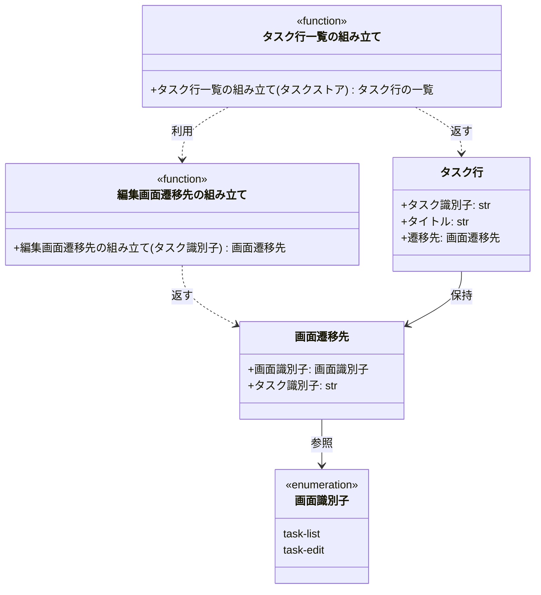

# モジュール構成: フロントエンド / タスク

`タスク` ドメイン（フロントエンド側）に属する構成要素詳細。
タスク一覧画面の画面層（一覧行の組み立てと、行選択時の遷移先の組み立て）を担う。

## 一覧

| ユースケース | 役割 | コンテナ | 種別 | 名前 | 概要 | 補足 |
| --- | --- | --- | --- | --- | --- | --- |
| 共通 | 列挙 | `tasks/screens.py` | Enum | [`ScreenId`](#画面識別子) | 画面を一意に指す識別子 | - |
| 共通 | DTO | `tasks/screens.py` | データモデル | [`ScreenTarget`](#画面遷移先) | 遷移先の画面と引き継ぐ識別子の組 | - |
| タスク一覧から編集画面へ遷移 | DTO | `tasks/screens.py` | データモデル | [`TaskRow`](#タスク行) | 一覧に並べる 1 行分の表示データと遷移先 | - |
| タスク一覧から編集画面へ遷移 | プレゼンター | `tasks/screens.py` | 関数 | [`build_task_rows`](#タスク行一覧の組み立て) | 登録済みタスクを一覧行に変換する | - |
| タスク一覧から編集画面へ遷移 | 遷移先ファクトリ | `tasks/screens.py` | 関数 | [`edit_screen_target`](#編集画面遷移先の組み立て) | タスク識別子から編集画面の遷移先を作る | 遷移先定義の集約点 |

## ディレクトリ構成

```
src/tasks/
└── screens.py    # ScreenId / ScreenTarget / TaskRow と画面層の関数
```

## 構成図



## 画面識別子
> 物理名: `ScreenId`<br>
> 種別: Enum<br>
> コンテナ: `tasks/screens.py`

画面を一意に指す識別子。
`Literal` で取りうる値を列挙する。

### 値一覧

| 値 | 論理名 | 説明 | 補足 |
| --- | --- | --- | --- |
| `task-list` | タスク一覧画面 | 登録済みタスクを ID 順に並べる画面 | 本 subsystem の担当画面 |
| `task-edit` | タスク編集画面 | 選択したタスクを編集する画面 | 兄弟 epic #970 の担当画面 |

### メソッド

なし

### 単体テスト

なし

## 画面遷移先
> 物理名: `ScreenTarget`<br>
> 種別: データモデル<br>
> コンテナ: `tasks/screens.py`

遷移先の画面と、そこへ引き継ぐタスク識別子の組。
遷移先を URL 文字列ではなく画面識別子で保持することで、URL が未確定のうちから遷移導線を確定・検証できる。

### プロパティ

| 論理名 | プロパティ名 | 型 | 可視性 | デフォルト | 説明 | 例 | 補足 |
| --- | --- | --- | --- | --- | --- | --- | --- |
| 画面識別子 | `screen` | [`ScreenId`](#画面識別子) | 公開 | - | 遷移先の画面 | `"task-edit"` | - |
| タスク識別子 | `task_id` | `str` | 公開 | - | 遷移先へ引き継ぐタスクの識別子 | `"t1"` | `Task.id` をそのまま持つ |

### メソッド

なし

### 単体テスト

なし

### 補足

- URL 文字列への変換は本ファイルに関数を 1 つ足して行う。
  変換先の URL / 画面識別子の実値が兄弟 epic #970 で確定するまでは追加しない（非機能要件「遷移先 URL / 画面識別子の定義を 1 箇所に集約する」）。

## タスク行
> 物理名: `TaskRow`<br>
> 種別: データモデル<br>
> コンテナ: `tasks/screens.py`

タスク一覧に並べる 1 行分の表示データと、その行を選択したときの遷移先。

### プロパティ

| 論理名 | プロパティ名 | 型 | 可視性 | デフォルト | 説明 | 例 | 補足 |
| --- | --- | --- | --- | --- | --- | --- | --- |
| タスク識別子 | `id` | `str` | 公開 | - | 行が示すタスクの識別子 | `"t1"` | - |
| タイトル | `title` | `str` | 公開 | - | 行に表示するタイトル | `"買い物に行く"` | 行内の表示項目はタイトルのみ |
| 遷移先 | `target` | [`画面遷移先`](#画面遷移先) | 公開 | - | 行を選択したときの遷移先 | `ScreenTarget(screen="task-edit", task_id="t1")` | 行全体が導線のため 1 行につき 1 つだけ持つ |

### メソッド

なし

### 単体テスト

なし

## `tasks/screens.py`
> 種別: ファイル

タスク一覧画面の画面層。
登録済みタスクを一覧行へ変換し、行選択時の遷移先を組み立てる。

---

### タスク行一覧の組み立て
> 物理名: `build_task_rows`<br>
> 種別: 関数

登録済みのタスクを、一覧に並べる行データへ変換する。

#### 引数

| 論理名 | 引数名 | 型 | 必須 | デフォルト | 説明 | 補足 |
| --- | --- | --- | --- | --- | --- | --- |
| タスクストア | `store` | `dict[str, Task]` | ✅ | - | タスクの保管先 | 既存のサービス層と同じ受け渡し方に揃える |

引数例:

```python
build_task_rows({"t2": Task(id="t2", title="掃除する"), "t1": Task(id="t1", title="買い物に行く")})
```

#### 戻り値

| 型 | 説明 | 補足 |
| --- | --- | --- |
| [`list[TaskRow]`](#タスク行) | ID 昇順に並んだ一覧行 | タスクが 0 件なら空リスト |

戻り値例:

```python
[
    TaskRow(id="t1", title="買い物に行く", target=ScreenTarget(screen="task-edit", task_id="t1")),
    TaskRow(id="t2", title="掃除する", target=ScreenTarget(screen="task-edit", task_id="t2")),
]
```

#### 処理

1. 登録済みのタスクを ID 昇順で取得する（`list_tasks`）
2. タスク 1 件ごとに、識別子・タイトルと編集画面の遷移先を持つ行へ変換する（[編集画面遷移先の組み立て](#編集画面遷移先の組み立て)）
3. 変換した行を取得した順のまま返す

#### 例外

なし

#### 単体テスト

| テスト名 | 正常/異常 | 概要 | 条件 | Mock | 期待値 | 補足 |
| --- | --- | --- | --- | --- | --- | --- |
| `test_build_task_rows` | 正常 | 登録済みタスクを ID 昇順の行へ変換する | ID の昇順と異なる挿入順で 2 件登録済み | なし（`list_tasks` は純粋関数のため実物を通す） | ID 昇順の 2 行を返し、各行に識別子・タイトル・編集画面の遷移先が入る | - |
| `test_build_task_rows_when_no_tasks` | 正常 | タスクが 1 件も登録されていない | 空のタスクストア | なし（`list_tasks` は純粋関数のため実物を通す） | 空リストを返す | 画面構成の空状態メッセージの表示条件に対応 |

---

### 編集画面遷移先の組み立て
> 物理名: `edit_screen_target`<br>
> 種別: 関数

タスク識別子から、タスク編集画面への遷移先を組み立てる。
遷移先の定義をこの関数 1 箇所に閉じることで、兄弟 epic #970 で URL / 画面識別子が確定したときの修正箇所を 1 つに保つ。

#### 引数

| 論理名 | 引数名 | 型 | 必須 | デフォルト | 説明 | 補足 |
| --- | --- | --- | --- | --- | --- | --- |
| タスク識別子 | `task_id` | `str` | ✅ | - | 遷移先へ引き継ぐタスクの識別子 | `Task.id` をそのまま渡す |

引数例:

```python
edit_screen_target("t1")
```

#### 戻り値

| 型 | 説明 | 補足 |
| --- | --- | --- |
| [`ScreenTarget`](#画面遷移先) | タスク編集画面への遷移先 | - |

戻り値例:

```python
ScreenTarget(screen="task-edit", task_id="t1")
```

#### 処理

1. 画面識別子にタスク編集画面を指定し、渡されたタスク識別子と組にした遷移先を返す

#### 例外

なし

#### 単体テスト

| テスト名 | 正常/異常 | 概要 | 条件 | Mock | 期待値 | 補足 |
| --- | --- | --- | --- | --- | --- | --- |
| `test_edit_screen_target` | 正常 | タスク識別子から編集画面の遷移先を作る | 任意のタスク識別子 | なし | 画面識別子が `task-edit`、タスク識別子が引数と一致する遷移先を返す | 条件分岐がないため 1 ケース |

### 補足

- 遷移先を URL 文字列で持たないため、兄弟 epic #970 の確定を待たずに導線の実装と単体テストが成立する。
- ホバー・フォーカスの表現とキーボード操作は描画の担当で、本ファイルには現れない。
  仕様は [タスク一覧画面](../../画面構成/タスク一覧画面.py.md) の要素一覧が持つ。
