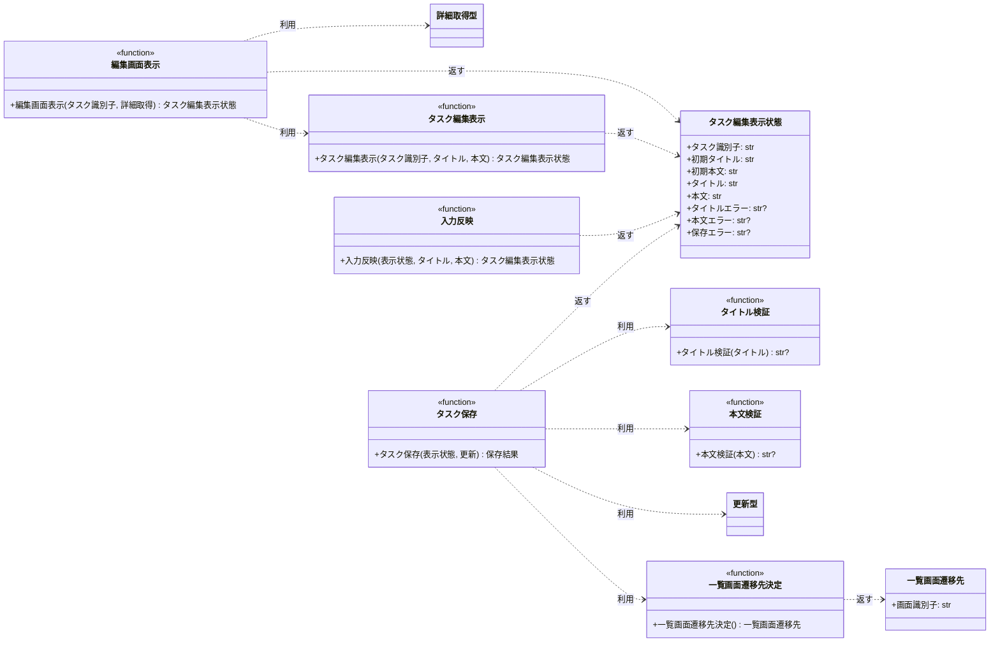

# モジュール構成: フロントエンド / タスク編集

`タスク編集` ドメイン（フロントエンド側）に属する構成要素詳細。
本サイクルの担当範囲はタスク編集画面の表示状態と、入力チェックを通した保存・保存後の遷移先の決定までで、編集の中止は持たない。

## 一覧

| ユースケース | 役割 | コンテナ | 種別 | 名前 | 概要 | 補足 |
| --- | --- | --- | --- | --- | --- | --- |
| 共通 | 表示モデル | `src/screens/types.py` | データモデル | [`TaskEditView`](#タスク編集表示状態) | タスク編集画面の表示状態 | 骨格のフィールドは #1081（PR #1084）と同一定義 |
| 共通 | 遷移モデル | `src/screens/types.py` | データモデル | [`ListNavigation`](#一覧画面遷移先) | タスク一覧画面への遷移先 | #1081（PR #1084）と同一定義 |
| 共通 | 戻り値の型 | `src/screens/types.py` | 関数型 | `SaveResult` | 保存操作の結果（一覧への遷移 or 編集画面の表示状態） | `ListNavigation \| TaskEditView` の型エイリアス。単純な別名のため詳細セクションなし |
| 共通 | 依存の型（DI） | `src/screens/types.py` | 関数型 | [`GetTask`](#詳細取得型) | タスク詳細取得のシグネチャ | 実装はバックエンドの `get_task` |
| 共通 | 依存の型（DI） | `src/screens/types.py` | 関数型 | [`UpdateTask`](#更新型) | タスク更新のシグネチャ | 実装はバックエンドの `update_task` |
| 共通 | 定数 | `src/screens/navigation.py` | 定数 | `TASK_LIST_SCREEN_ID` | 一覧画面の画面識別子（`"task-list"`） | 単純即値のため詳細セクションなし。#1081（PR #1084）と同一定義 |
| タスクの保存 | 定数 | `src/screens/task_edit.py` | 定数 | `TITLE_MIN_LENGTH` | タイトルの最小長（`1`） | 単純即値のため詳細セクションなし |
| タスクの保存 | 定数 | `src/screens/task_edit.py` | 定数 | `TITLE_MAX_LENGTH` | タイトルの最大長（`100`） | 単純即値のため詳細セクションなし |
| タスクの保存 | 定数 | `src/screens/task_edit.py` | 定数 | `CONTENT_MAX_LENGTH` | 本文の最大長（`1000`） | 単純即値のため詳細セクションなし |
| タスクの保存 | 定数 | `src/screens/task_edit.py` | 定数 | `TITLE_REQUIRED_MESSAGE` | タイトル未入力の文言（`"タイトルを入力してください。"`） | 単純即値のため詳細セクションなし |
| タスクの保存 | 定数 | `src/screens/task_edit.py` | 定数 | `TITLE_MAX_LENGTH_MESSAGE` | タイトル上限超過の文言 | `TITLE_MAX_LENGTH` から組み立てる。単純即値のため詳細セクションなし |
| タスクの保存 | 定数 | `src/screens/task_edit.py` | 定数 | `CONTENT_MAX_LENGTH_MESSAGE` | 本文上限超過の文言 | `CONTENT_MAX_LENGTH` から組み立てる。単純即値のため詳細セクションなし |
| タスクの保存 | 定数 | `src/screens/task_edit.py` | 定数 | `SAVE_VALIDATION_FAILED_MESSAGE` | 保存が入力不正で失敗した文言（`"保存できませんでした。入力内容を確認してください。"`） | 単純即値のため詳細セクションなし |
| タスクの保存 | 定数 | `src/screens/task_edit.py` | 定数 | `TASK_NOT_FOUND_MESSAGE` | 保存でタスクが見つからない文言（`"タスクが見つかりません"`） | 単純即値のため詳細セクションなし。#1079（PR #1083）の未検出メッセージと同一文言 |
| 共通 | 定数 | `src/screens/task_edit.py` | 定数 | `CONTENT_NOTE` | 本文欄の補助文言（`"本文は空のままでも保存できます。"`） | 単純即値のため詳細セクションなし |
| タスク編集画面の表示 | 画面 | `src/screens/task_edit.py` | 関数 | [`open_task_edit`](#編集画面表示) | 識別子からタスク詳細取得を呼び、編集画面の表示状態を作る | 本サブシステム固有 |
| 共通 | 画面 | `src/screens/task_edit.py` | 関数 | [`render_task_edit`](#タスク編集表示) | 引き渡された初期表示値から編集画面の表示状態を作る | #1081（PR #1084）と同一定義 |
| 共通 | 入力の反映 | `src/screens/task_edit.py` | 関数 | [`apply_input`](#入力反映) | 入力欄の書き換えを表示状態へ反映する | #1081（PR #1084）と同一定義 |
| タスクの保存 | バリデータ | `src/screens/task_edit.py` | 関数 | [`_validate_title`](#タイトル検証) | タイトルの入力チェックの結果を返す | - |
| タスクの保存 | バリデータ | `src/screens/task_edit.py` | 関数 | [`_validate_content`](#本文検証) | 本文の入力チェックの結果を返す | - |
| タスクの保存 | 保存導線 | `src/screens/task_edit.py` | 関数 | [`save_task`](#タスク保存) | 入力チェックを行い、通過したらタスク更新を呼んで遷移先を返す | - |
| タスクの保存 | 遷移先の決定 | `src/screens/navigation.py` | 関数 | [`resolve_task_list_destination`](#一覧画面遷移先決定) | タスク一覧画面の遷移先を作る | 遷移先の決定の集約点 |

## ディレクトリ構成

```
src/screens/
├── __init__.py     # 公開シンボルの再エクスポート
├── types.py        # TaskEditView / ListNavigation / SaveResult / 依存の関数型
├── navigation.py   # resolve_task_list_destination / 画面識別子の定数
└── task_edit.py    # open_task_edit / render_task_edit / apply_input / _validate_title / _validate_content / save_task / 判定値とメッセージの定数
```

## 構成図



## タスク編集表示状態
> 物理名: `TaskEditView`<br>
> 種別: データモデル<br>
> コンテナ: `src/screens/types.py`

タスク編集画面が表示している内容。
初期表示値を保持し続けることで、いつでも現在の入力値と比較できる。

### プロパティ

| 論理名 | プロパティ名 | 型 | 可視性 | デフォルト | 説明 | 例 | 補足 |
| --- | --- | --- | --- | --- | --- | --- | --- |
| タスク識別子 | `task_id` | `str` | 公開 | - | 編集対象のタスクの識別子 | `"t2"` | 引き渡された値をそのまま持つ |
| 初期タイトル | `initial_title` | `str` | 公開 | - | 画面を開いた時点のタイトル | `"週次レポートの提出"` | 画面上では書き換わらない |
| 初期本文 | `initial_content` | `str` | 公開 | - | 画面を開いた時点の本文 | `"今週の進捗をまとめる"` | 画面上では書き換わらない |
| タイトル | `title` | `str` | 公開 | - | タイトル入力欄の現在の値 | `"週次レポートの提出（改訂）"` | 画面を開いた直後は初期タイトルと同じ |
| 本文 | `content` | `str` | 公開 | - | 本文入力欄の現在の値 | `"来週の予定もまとめる"` | 画面を開いた直後は初期本文と同じ |
| タイトルエラー | `title_error` | `str \| None` | 公開 | `None` | タイトル欄の直下に出す文言 | `"タイトルを入力してください。"` | 表示しないときは `None` |
| 本文エラー | `content_error` | `str \| None` | 公開 | `None` | 本文欄の直下に出す文言 | `"本文は 1000 文字以内で入力してください。"` | 表示しないときは `None` |
| 保存エラー | `save_error` | `str \| None` | 公開 | `None` | フォーム本体上部に出す文言 | `"タスクが見つかりません"` | 表示しないときは `None` |

### メソッド

なし

### 単体テスト

なし

### 補足

- `@dataclass(frozen=True, slots=True, kw_only=True)` で定義する（関数間で受け渡す不変 DTO）
- 表示しないメッセージを `None` で表すため、画面側は値の有無だけを見て出し分ける（[タスク編集画面](../../画面構成/タスク編集画面.py.md) の要素一覧に対応）
- `task_id` / `initial_title` / `initial_content` / `title` / `content` の 5 つは #1081（PR #1084）の同名モデルと同一定義にする
- #1081 側が持つ破棄確認メッセージのフィールドは、本サブシステムが中止導線を持たないため定義しない（master へ集約する際は両者のフィールドの和集合になる）

## 一覧画面遷移先
> 物理名: `ListNavigation`<br>
> 種別: データモデル<br>
> コンテナ: `src/screens/types.py`

保存が成功したときの遷移先。

### プロパティ

| 論理名 | プロパティ名 | 型 | 可視性 | デフォルト | 説明 | 例 | 補足 |
| --- | --- | --- | --- | --- | --- | --- | --- |
| 画面識別子 | `screen_id` | `str` | 公開 | - | 遷移先の画面を表す識別子 | `"task-list"` | 値は `TASK_LIST_SCREEN_ID` |

### メソッド

なし

### 単体テスト

なし

### 補足

- `@dataclass(frozen=True, slots=True, kw_only=True)` で定義する
- 一覧画面へ引き渡す値を持たない（一覧画面は自身で一覧を取得し直すため）
- URL 文字列は持たない（一覧画面の URL 形式が確定していないため、変換は確定後に `src/screens/navigation.py` へ 1 箇所で足す）
- #1081（PR #1084）の同名モデルと同一定義にする

## `src/screens/types.py`
> 種別: ファイル

画面層の表示モデル・遷移モデルと、バックエンドへの依存を表す関数型を置くファイル。
データモデルの詳細は上のデータモデルごとのセクションを参照する。

### 詳細取得型
> 物理名: `GetTask`<br>
> 種別: 関数型

タスク詳細取得のシグネチャ。

| 項目 | 内容 |
| --- | --- |
| 引数 | タスクの識別子（`str`） |
| 戻り値 | タスク 1 件（識別子・タイトル・本文を持つ） |
| 送出する例外 | 入力不正 / タスク未検出 |

補足:

- `Callable[[str], Task]` 相当の型エイリアスとして定義する
- 実装はバックエンドの `get_task` を保管先で束縛したもの。テストでは差し替えた関数を注入する
- #1079（PR #1083）の同名の関数型と同一定義にする

### 更新型
> 物理名: `UpdateTask`<br>
> 種別: 関数型

タスク更新のシグネチャ。

| 項目 | 内容 |
| --- | --- |
| 引数 | タスクの識別子（`str`）/ タイトル（`str`）/ 本文（`str`） |
| 戻り値 | 更新後のタスク 1 件 |
| 送出する例外 | 入力不正 / タスク未検出 |

補足:

- `Callable[[str, str, str], Task]` 相当の型エイリアスとして定義する
- タイトル・本文の両方を必ず渡す形にして、部分更新を型の上で作れないようにする
- 実装はバックエンドの `update_task` を保管先で束縛したもの。テストでは差し替えた関数を注入する

## `src/screens/navigation.py`
> 種別: ファイル

画面識別子の定数と、遷移先を作る関数を束ねる関数ファイル。
遷移先の決定をここに集約し、URL 形式が確定したときの変更箇所を 1 点に留める。

### 一覧画面遷移先決定
> 物理名: `resolve_task_list_destination`<br>
> 種別: 関数

タスク一覧画面の遷移先を作る。

#### 引数

なし

引数例:

```python
resolve_task_list_destination()
```

#### 戻り値

| 型 | 説明 | 補足 |
| --- | --- | --- |
| [`ListNavigation`](#一覧画面遷移先) | タスク一覧画面への遷移先 | 引き渡す値は持たない |

戻り値例:

```python
ListNavigation(screen_id="task-list")
```

#### 処理

1. 画面識別子に `TASK_LIST_SCREEN_ID` を入れた遷移先を作って返す

#### 例外

なし

#### 単体テスト

| テスト名 | 正常/異常 | 概要 | 条件 | Mock | 期待値 | 補足 |
| --- | --- | --- | --- | --- | --- | --- |
| `test_resolve_task_list_destination` | 正常 | 一覧画面の遷移先を作る | 引数なしで呼ぶ | なし | 画面識別子が `task-list` の遷移先を返す | 分岐がないため 1 ケース。遷移先の決定を固定する |

## `src/screens/task_edit.py`
> 種別: ファイル

タスク編集画面の表示と保存導線を担う関数ファイル。
バックエンドへの呼び出しは引数で受け取った関数を通じて行い、モジュールレベルの状態は持たない。

### 編集画面表示
> 物理名: `open_task_edit`<br>
> 種別: 関数

編集対象の識別子からタスク詳細取得を呼び、編集画面の表示状態を作る。

#### 引数

| 論理名 | 引数名 | 型 | 必須 | デフォルト | 説明 | 補足 |
| --- | --- | --- | --- | --- | --- | --- |
| タスク識別子 | `task_id` | `str` | ✅ | - | 編集対象のタスクの識別子 | 画面側で加工せずそのまま渡す |
| 詳細取得 | `get_task` | [`GetTask`](#詳細取得型) | ✅ | - | タスク詳細取得の関数 | キーワード引数で注入する |

引数例:

```python
open_task_edit("t2", get_task=get_task)
```

#### 戻り値

| 型 | 説明 | 補足 |
| --- | --- | --- |
| [`TaskEditView`](#タスク編集表示状態) | タスク編集画面の表示状態 | エラー表示のフィールドはいずれも `None` |

戻り値例:

```python
TaskEditView(
    task_id="t2",
    initial_title="週次レポートの提出",
    initial_content="今週の進捗をまとめる",
    title="週次レポートの提出",
    content="今週の進捗をまとめる",
    title_error=None,
    content_error=None,
    save_error=None,
)
```

#### 処理

1. 受け取った識別子で詳細取得を呼ぶ
2. 返ったタスクのタイトル・本文を [タスク編集表示](#タスク編集表示) に渡して表示状態を作って返す

#### 例外

| 例外名 | 発生条件 | メッセージ | 補足 |
| --- | --- | --- | --- |
| `ValidationError` | 詳細取得が識別子の形式不正で送出した | 詳細取得のメッセージをそのまま | 捕捉せず伝播させる |
| `TaskNotFoundError` | 詳細取得が対象を見つけられなかった | 詳細取得のメッセージをそのまま | 捕捉せず伝播させる |

#### 単体テスト

| テスト名 | 正常/異常 | 概要 | 条件 | Mock | 期待値 | 補足 |
| --- | --- | --- | --- | --- | --- | --- |
| `test_open_task_edit` | 正常 | 取得値で表示状態を作る | 識別子 `t2` を渡す | 詳細取得が `t2` のタスクを返す | 初期表示値と現在の入力値が取得値と一致し、エラー表示がいずれも `None` | 渡した識別子が加工されていないことも確認する |
| `test_open_task_edit_when_task_not_found` | 異常 | 対象が見つからない | 未登録の識別子を渡す | 詳細取得が `TaskNotFoundError` を送出 | `TaskNotFoundError` がそのまま伝播する | 例外表「詳細取得が対象を見つけられなかった」に対応 |
| `test_open_task_edit_when_id_invalid` | 異常 | 識別子の形式が不正 | 空文字の識別子を渡す | 詳細取得が `ValidationError` を送出 | `ValidationError` がそのまま伝播する | 例外表「詳細取得が識別子の形式不正で送出した」に対応 |

### タスク編集表示
> 物理名: `render_task_edit`<br>
> 種別: 関数

引き渡された初期表示値からタスク編集画面の表示状態を作る。

#### 引数

| 論理名 | 引数名 | 型 | 必須 | デフォルト | 説明 | 補足 |
| --- | --- | --- | --- | --- | --- | --- |
| タスク識別子 | `task_id` | `str` | ✅ | - | 編集対象のタスクの識別子 | - |
| タイトル | `title` | `str` | ✅ | - | 保管済みのタイトル | - |
| 本文 | `content` | `str` | ✅ | - | 保管済みの本文 | 本文が未設定のタスクは空文字 |

引数例:

```python
render_task_edit(task_id="t2", title="週次レポートの提出", content="今週の進捗をまとめる")
```

#### 戻り値

| 型 | 説明 | 補足 |
| --- | --- | --- |
| [`TaskEditView`](#タスク編集表示状態) | タスク編集画面の表示状態 | エラー表示のフィールドはいずれも `None` |

戻り値例:

```python
TaskEditView(
    task_id="t2",
    initial_title="週次レポートの提出",
    initial_content="今週の進捗をまとめる",
    title="週次レポートの提出",
    content="今週の進捗をまとめる",
    title_error=None,
    content_error=None,
    save_error=None,
)
```

#### 処理

1. 受け取ったタイトル・本文を初期表示値と現在の入力値の両方に入れた表示状態を組み立てて返す

#### 例外

なし

#### 単体テスト

| テスト名 | 正常/異常 | 概要 | 条件 | Mock | 期待値 | 補足 |
| --- | --- | --- | --- | --- | --- | --- |
| `test_render_task_edit` | 正常 | 引き渡された値で表示状態を作る | `t2` のタイトル・本文を渡す | なし | 初期表示値と現在の入力値が同じ値になり、エラー表示がいずれも `None` | 分岐がないため 1 ケース |

### 入力反映
> 物理名: `apply_input`<br>
> 種別: 関数

入力欄の書き換えを表示状態へ反映する。

#### 引数

| 論理名 | 引数名 | 型 | 必須 | デフォルト | 説明 | 補足 |
| --- | --- | --- | --- | --- | --- | --- |
| 表示状態 | `view` | [`TaskEditView`](#タスク編集表示状態) | ✅ | - | 反映前の表示状態 | - |
| タイトル | `title` | `str \| None` | - | `None` | 書き換え後のタイトル | `None` のときは現在の値を保つ |
| 本文 | `content` | `str \| None` | - | `None` | 書き換え後の本文 | `None` のときは現在の値を保つ |

引数例:

```python
apply_input(view, title="週次レポートの提出（改訂）")
```

#### 戻り値

| 型 | 説明 | 補足 |
| --- | --- | --- |
| [`TaskEditView`](#タスク編集表示状態) | 反映後の表示状態 | 初期表示値とエラー表示は変えない |

戻り値例:

```python
TaskEditView(
    task_id="t2",
    initial_title="週次レポートの提出",
    initial_content="今週の進捗をまとめる",
    title="週次レポートの提出（改訂）",
    content="今週の進捗をまとめる",
    title_error=None,
    content_error=None,
    save_error=None,
)
```

#### 処理

1. 反映後のタイトルを決める
   - タイトルが渡された場合、その値を使う
   - タイトルが渡されなかった場合、現在の値を保つ
2. 反映後の本文を決める
   - 本文が渡された場合、その値を使う
   - 本文が渡されなかった場合、現在の値を保つ
3. 初期表示値とエラー表示はそのままに、タイトル・本文だけを差し替えた表示状態を返す

#### 例外

なし

#### 単体テスト

| テスト名 | 正常/異常 | 概要 | 条件 | Mock | 期待値 | 補足 |
| --- | --- | --- | --- | --- | --- | --- |
| `test_apply_input` | 正常 | タイトルと本文の両方を反映する | 両方に値を渡す | なし | タイトル・本文が渡した値になり、初期表示値が変わらない | - |
| `test_apply_input_when_title_omitted` | 正常 | タイトルを省略する | 本文だけ渡す | なし | タイトルが元の値のまま、本文だけ変わる | 分岐（タイトル未指定）に対応 |
| `test_apply_input_when_content_omitted` | 正常 | 本文を省略する | タイトルだけ渡す | なし | 本文が元の値のまま、タイトルだけ変わる | 分岐（本文未指定）に対応 |
| `test_apply_input_when_error_shown` | 正常 | エラー表示中に入力する | エラー表示を持つ表示状態にタイトルを渡す | なし | エラー表示が反映前のまま保たれる | エラーを消さない扱いを固定する |

### タイトル検証
> 物理名: `_validate_title`<br>
> 種別: 関数

タイトルの入力チェックの結果を返す。

#### 引数

| 論理名 | 引数名 | 型 | 必須 | デフォルト | 説明 | 補足 |
| --- | --- | --- | --- | --- | --- | --- |
| タイトル | `title` | `str` | ✅ | - | 検証対象のタイトル | 入力欄の現在の値をそのまま渡す |

引数例:

```python
_validate_title("週次レポートの提出")
```

#### 戻り値

| 型 | 説明 | 補足 |
| --- | --- | --- |
| `str \| None` | 違反時はエラーメッセージ、通過時は `None` | 例外を送出せずメッセージで返す |

戻り値例:

```python
None
```

#### 処理

1. 前後の空白を除いた文字数を求める
2. 文字数が `TITLE_MIN_LENGTH` 未満なら `TITLE_REQUIRED_MESSAGE` を返す
3. 文字数が `TITLE_MAX_LENGTH` 超なら `TITLE_MAX_LENGTH_MESSAGE` を返す
4. いずれにも該当しなければ `None` を返す

#### 例外

なし

#### 単体テスト

| テスト名 | 正常/異常 | 概要 | 条件 | Mock | 期待値 | 補足 |
| --- | --- | --- | --- | --- | --- | --- |
| `test_validate_title_when_min_length` | 正常 | 下限ちょうど | 1 文字のタイトルを渡す | なし | `None` を返す | 境界値 |
| `test_validate_title_when_max_length` | 正常 | 上限ちょうど | 100 文字のタイトルを渡す | なし | `None` を返す | 境界値 |
| `test_validate_title_when_padded_max_length` | 正常 | 前後に空白を付けた上限ちょうど | 100 文字の前後に空白を付けて渡す | なし | `None` を返す | 前後の空白を除いてから数えていることを固定する |
| `test_validate_title_when_empty` | 異常 | 下限未満（空文字） | 空文字を渡す | なし | `TITLE_REQUIRED_MESSAGE` を返す | 境界値。下限判定の欠落がバックエンドで 6 世代連続して再発している箇所 |
| `test_validate_title_when_blank` | 異常 | 下限未満（空白のみ） | 空白だけの文字列を渡す | なし | `TITLE_REQUIRED_MESSAGE` を返す | 画面側だけが持つ判定 |
| `test_validate_title_when_over_max_length` | 異常 | 上限超過 | 101 文字のタイトルを渡す | なし | `TITLE_MAX_LENGTH_MESSAGE` を返す | 境界値。メッセージに上限の値が含まれることも確認する |

### 本文検証
> 物理名: `_validate_content`<br>
> 種別: 関数

本文の入力チェックの結果を返す。

#### 引数

| 論理名 | 引数名 | 型 | 必須 | デフォルト | 説明 | 補足 |
| --- | --- | --- | --- | --- | --- | --- |
| 本文 | `content` | `str` | ✅ | - | 検証対象の本文 | 入力欄の現在の値をそのまま渡す |

引数例:

```python
_validate_content("今週の進捗をまとめる")
```

#### 戻り値

| 型 | 説明 | 補足 |
| --- | --- | --- |
| `str \| None` | 違反時はエラーメッセージ、通過時は `None` | 例外を送出せずメッセージで返す |

戻り値例:

```python
None
```

#### 処理

1. 入力値そのままの文字数が `CONTENT_MAX_LENGTH` 超なら `CONTENT_MAX_LENGTH_MESSAGE` を返す
2. 該当しなければ `None` を返す

#### 例外

なし

#### 単体テスト

| テスト名 | 正常/異常 | 概要 | 条件 | Mock | 期待値 | 補足 |
| --- | --- | --- | --- | --- | --- | --- |
| `test_validate_content_when_empty` | 正常 | 下限（空文字） | 空文字を渡す | なし | `None` を返す | 境界値。本文に下限は設けない |
| `test_validate_content_when_max_length` | 正常 | 上限ちょうど | 1000 文字の本文を渡す | なし | `None` を返す | 境界値 |
| `test_validate_content_when_over_max_length` | 異常 | 上限超過 | 1001 文字の本文を渡す | なし | `CONTENT_MAX_LENGTH_MESSAGE` を返す | 境界値。メッセージに上限の値が含まれることも確認する |

### タスク保存
> 物理名: `save_task`<br>
> 種別: 関数

入力チェックを行い、通過したらタスク更新を呼んで一覧画面への遷移先を返す。

#### 引数

| 論理名 | 引数名 | 型 | 必須 | デフォルト | 説明 | 補足 |
| --- | --- | --- | --- | --- | --- | --- |
| 表示状態 | `view` | [`TaskEditView`](#タスク編集表示状態) | ✅ | - | 保存操作を受けた時点の表示状態 | - |
| 更新 | `update_task` | [`UpdateTask`](#更新型) | ✅ | - | タスク更新の関数 | キーワード引数で注入する |

引数例:

```python
save_task(view, update_task=update_task)
```

#### 戻り値

| 型 | 説明 | 補足 |
| --- | --- | --- |
| `SaveResult` | 保存成功なら一覧画面への遷移先、失敗なら編集画面の表示状態 | `ListNavigation \| TaskEditView` |

戻り値例:

```python
ListNavigation(screen_id="task-list")
```

#### 処理

1. タイトルを検証する（[タイトル検証](#タイトル検証)）
   - 違反した場合、タイトルエラーだけを入れた表示状態を返して終わる（更新を呼ばない）
2. 本文を検証する（[本文検証](#本文検証)）
   - 違反した場合、本文エラーだけを入れた表示状態を返して終わる（更新を呼ばない）
3. 前後の空白を除いたタイトルと、入力値そのままの本文で更新を呼ぶ
   - 入力不正の例外が返った場合、保存エラーに `SAVE_VALIDATION_FAILED_MESSAGE` を入れた表示状態を返す
   - タスク未検出の例外が返った場合、保存エラーに `TASK_NOT_FOUND_MESSAGE` を入れた表示状態を返す
4. 一覧画面の遷移先を作って返す（[一覧画面遷移先決定](#一覧画面遷移先決定)）

#### 例外

なし（更新が送出する入力不正・タスク未検出は捕捉して表示状態に変換する）

#### 単体テスト

| テスト名 | 正常/異常 | 概要 | 条件 | Mock | 期待値 | 補足 |
| --- | --- | --- | --- | --- | --- | --- |
| `test_save_task` | 正常 | タイトル・本文を書き換えて保存する | 両方を書き換えた表示状態を渡す | 更新が更新後のタスクを返す | 一覧画面への遷移先を返し、更新に渡した値が入力値と一致する | 更新の呼び出しが 1 回であることも確認する |
| `test_save_task_when_content_empty` | 正常 | 本文を空にして保存する | 本文が空文字の表示状態を渡す | 更新が更新後のタスクを返す | 更新に渡した本文が空文字 | 本文の下限がないことを固定する |
| `test_save_task_when_title_padded` | 正常 | タイトルの前後に空白がある | 前後に空白を付けたタイトルの表示状態を渡す | 更新が更新後のタスクを返す | 更新に渡したタイトルが前後の空白を除いた値 | 判定した値と送る値が一致することを固定する |
| `test_save_task_when_title_invalid` | 異常 | タイトルが入力チェックに違反 | タイトルが空文字の表示状態を渡す | 更新（呼び出し回数を数える） | タイトルエラーを持つ表示状態を返し、更新が 1 回も呼ばれない | 分岐（タイトル違反）に対応 |
| `test_save_task_when_content_invalid` | 異常 | 本文が入力チェックに違反 | 本文が 1001 文字の表示状態を渡す | 更新（呼び出し回数を数える） | 本文エラーを持つ表示状態を返し、更新が 1 回も呼ばれない | 分岐（本文違反）に対応。タイトルエラーが `None` であることも確認する |
| `test_save_task_when_update_validation_error` | 異常 | 更新が入力不正を返す | 入力チェックを通る表示状態を渡す | 更新が `ValidationError` を送出 | 保存エラーが `SAVE_VALIDATION_FAILED_MESSAGE` の表示状態を返す | 分岐（更新の入力不正）に対応。入力値が保持されることも確認する |
| `test_save_task_when_update_task_not_found` | 異常 | 更新がタスク未検出を返す | 入力チェックを通る表示状態を渡す | 更新が `TaskNotFoundError` を送出 | 保存エラーが `TASK_NOT_FOUND_MESSAGE` の表示状態を返す | 分岐（更新の未検出）に対応 |

### 補足

- 入力チェックは例外ではなくメッセージを返す形にする（画面に出すのが目的で、処理を中断させるのが目的ではないため）
- 同名の `_validate_title` / `_validate_content` がバックエンド側（`src/tasks/service.py`）にもあるが、あちらは違反時に例外を送出する。
  画面側とバックエンド側で同じ判定を二重に持ち、バックエンドを最終防衛線とする方針に沿った意図的な重複
- 判定値の定数とメッセージの定数を同じファイルに置き、上限のメッセージは判定値から組み立てる（判定条件とメッセージの食い違いを防ぐ）
- `open_task_edit` / `save_task` はバックエンドの関数を引数で受け取るため、テストでは差し替えた関数を注入できる
