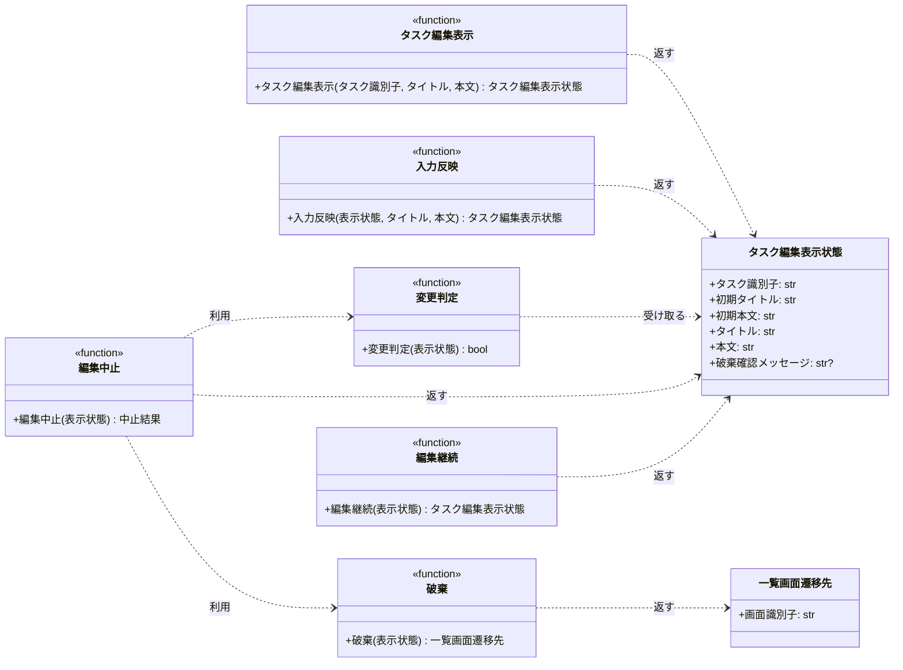

# モジュール構成: フロントエンド / タスク編集

`タスク編集` ドメイン（フロントエンド側）に属する構成要素詳細。
本サイクルの担当範囲はタスク編集画面の表示状態と、編集を中止して一覧画面へ戻る導線までで、保存の処理は持たない。

## 一覧

| ユースケース | 役割 | コンテナ | 種別 | 名前 | 概要 | 補足 |
| --- | --- | --- | --- | --- | --- | --- |
| 共通 | 表示モデル | `src/screens/types.py` | データモデル | [`TaskEditView`](#タスク編集表示状態) | タスク編集画面の表示状態 | 初期表示値と現在の入力値の両方を持つ |
| 共通 | 遷移モデル | `src/screens/types.py` | データモデル | [`ListNavigation`](#一覧画面遷移先) | タスク一覧画面への遷移先 | - |
| 共通 | 戻り値の型 | `src/screens/types.py` | 関数型 | `CancelResult` | 中止操作の結果（一覧への遷移 or 編集画面の表示状態） | `ListNavigation \| TaskEditView` の型エイリアス。単純な別名のため詳細セクションなし |
| 共通 | 定数 | `src/screens/navigation.py` | 定数 | `TASK_LIST_SCREEN_ID` | 一覧画面の画面識別子（`"task-list"`） | 単純即値のため詳細セクションなし |
| 共通 | 定数 | `src/screens/task_edit.py` | 定数 | `DISCARD_CONFIRM_MESSAGE` | 破棄確認の文言（`"編集内容を破棄してタスク一覧へ戻りますか？"`） | 単純即値のため詳細セクションなし |
| タスク編集の中止 | 画面 | `src/screens/task_edit.py` | 関数 | [`render_task_edit`](#タスク編集表示) | 引き渡された初期表示値から編集画面の表示状態を作る | - |
| タスク編集の中止 | 入力の反映 | `src/screens/task_edit.py` | 関数 | [`apply_input`](#入力反映) | 入力欄の書き換えを表示状態へ反映する | - |
| タスク編集の中止 | 変更の判定 | `src/screens/task_edit.py` | 関数 | [`_has_changes`](#変更判定) | 初期表示値と現在の入力値を比較する | - |
| タスク編集の中止 | 中止導線 | `src/screens/task_edit.py` | 関数 | [`cancel_edit`](#編集中止) | 中止ボタンの押下を処理し、確認表示か遷移を返す | - |
| タスク編集の中止 | 中止導線 | `src/screens/task_edit.py` | 関数 | [`discard_edit`](#破棄) | 入力を破棄して一覧画面への遷移先を返す | 確認の「戻る」と、変更なしの中止の共通処理 |
| タスク編集の中止 | 中止導線 | `src/screens/task_edit.py` | 関数 | [`continue_edit`](#編集継続) | 確認を閉じて編集画面に留まる | - |

## ディレクトリ構成

```
src/screens/
├── __init__.py     # 公開シンボルの再エクスポート
├── types.py        # TaskEditView / ListNavigation / CancelResult
├── navigation.py   # 画面識別子の定数
└── task_edit.py    # render_task_edit / apply_input / _has_changes / cancel_edit / discard_edit / continue_edit / 破棄確認の文言
```

## 構成図



## タスク編集表示状態
> 物理名: `TaskEditView`<br>
> 種別: データモデル<br>
> コンテナ: `src/screens/types.py`

タスク編集画面が表示している内容。
初期表示値を保持し続けることで、いつでも現在の入力値と比較して変更の有無を判定できる。

### プロパティ

| 論理名 | プロパティ名 | 型 | 可視性 | デフォルト | 説明 | 例 | 補足 |
| --- | --- | --- | --- | --- | --- | --- | --- |
| タスク識別子 | `task_id` | `str` | 公開 | - | 編集対象のタスクの識別子 | `"t2"` | 引き渡された値をそのまま持つ |
| 初期タイトル | `initial_title` | `str` | 公開 | - | 画面を開いた時点のタイトル | `"週次レポートの提出"` | 変更判定の基準。画面上では書き換わらない |
| 初期本文 | `initial_content` | `str` | 公開 | - | 画面を開いた時点の本文 | `"今週の進捗をまとめる"` | 変更判定の基準。画面上では書き換わらない |
| タイトル | `title` | `str` | 公開 | - | タイトル入力欄の現在の値 | `"週次レポートの提出（改訂）"` | 画面を開いた直後は初期タイトルと同じ |
| 本文 | `content` | `str` | 公開 | - | 本文入力欄の現在の値 | `"来週の予定もまとめる"` | 画面を開いた直後は初期本文と同じ |
| 破棄確認メッセージ | `confirm_message` | `str \| None` | 公開 | `None` | 破棄確認ダイアログに出す文言 | `"編集内容を破棄してタスク一覧へ戻りますか？"` | 確認を表示するときだけ値が入る |

### メソッド

なし

### 単体テスト

なし

### 補足

- `@dataclass(frozen=True, slots=True, kw_only=True)` で定義する
- 破棄確認ダイアログを表示しない状態を `None` で表すため、画面側は値の有無だけを見て出し分ける（[タスク編集画面](../../画面構成/タスク編集画面.py.md) の要素一覧に対応）
- 入力内容を画面の外へ書き出さないため、本モデルの寿命が編集画面の寿命と一致する

## 一覧画面遷移先
> 物理名: `ListNavigation`<br>
> 種別: データモデル<br>
> コンテナ: `src/screens/types.py`

編集を中止したときの遷移先。

### プロパティ

| 論理名 | プロパティ名 | 型 | 可視性 | デフォルト | 説明 | 例 | 補足 |
| --- | --- | --- | --- | --- | --- | --- | --- |
| 画面識別子 | `screen_id` | `str` | 公開 | - | 遷移先の画面を表す識別子 | `"task-list"` | 値は `TASK_LIST_SCREEN_ID` |

### メソッド

なし

### 単体テスト

なし

### 補足

- `@dataclass(frozen=True, slots=True, kw_only=True)` で定義する
- 一覧画面へ引き渡す値を持たない（一覧画面は自身で一覧を取得し直すため）
- URL 文字列は持たない（一覧画面の URL 形式が確定していないため、変換は確定後に `src/screens/navigation.py` へ 1 箇所で足す）

## `src/screens/types.py`
> 種別: ファイル

画面層の表示モデル・遷移モデルを置くファイル。
データモデルの詳細は上のデータモデルごとのセクションを参照する。

## `src/screens/task_edit.py`
> 種別: ファイル

タスク編集画面の表示と中止導線を担う関数ファイル。
バックエンドの呼び出しを一切持たず、受け取った表示状態から次の表示状態か遷移先を返すだけの純粋な関数で構成する。

---

### タスク編集表示
> 物理名: `render_task_edit`<br>
> 種別: 関数

引き渡された初期表示値からタスク編集画面の表示状態を作る。

#### 引数

| 論理名 | 引数名 | 型 | 必須 | デフォルト | 説明 | 補足 |
| --- | --- | --- | --- | --- | --- | --- |
| タスク識別子 | `task_id` | `str` | ✅ | - | 編集対象のタスクの識別子 | 一覧画面から引き渡された値 |
| タイトル | `title` | `str` | ✅ | - | 保管済みのタイトル | 一覧画面から引き渡された値 |
| 本文 | `content` | `str` | ✅ | - | 保管済みの本文 | 本文が未設定のタスクは空文字 |

引数例:

```python
render_task_edit(task_id="t2", title="週次レポートの提出", content="今週の進捗をまとめる")
```

#### 戻り値

| 型 | 説明 | 補足 |
| --- | --- | --- |
| [`TaskEditView`](#タスク編集表示状態) | タスク編集画面の表示状態 | 破棄確認メッセージは `None` |

戻り値例:

```python
TaskEditView(
    task_id="t2",
    initial_title="週次レポートの提出",
    initial_content="今週の進捗をまとめる",
    title="週次レポートの提出",
    content="今週の進捗をまとめる",
    confirm_message=None,
)
```

#### 処理

1. 受け取ったタイトル・本文を初期表示値と現在の入力値の両方に入れた表示状態を組み立てて返す

#### 例外

なし

#### 単体テスト

| テスト名 | 正常/異常 | 概要 | 条件 | Mock | 期待値 | 補足 |
| --- | --- | --- | --- | --- | --- | --- |
| `test_render_task_edit` | 正常 | 引き渡された値で表示状態を作る | `t2` のタイトル・本文を渡す | なし | 初期表示値と現在の入力値が同じ値になり、`confirm_message` が `None` | 分岐がないため 1 ケース |

---

### 入力反映
> 物理名: `apply_input`<br>
> 種別: 関数

入力欄の書き換えを表示状態へ反映する。

#### 引数

| 論理名 | 引数名 | 型 | 必須 | デフォルト | 説明 | 補足 |
| --- | --- | --- | --- | --- | --- | --- |
| 表示状態 | `view` | [`TaskEditView`](#タスク編集表示状態) | ✅ | - | 反映前の表示状態 | - |
| タイトル | `title` | `str \| None` | - | `None` | 書き換え後のタイトル | `None` のときは現在の値を保つ |
| 本文 | `content` | `str \| None` | - | `None` | 書き換え後の本文 | `None` のときは現在の値を保つ |

引数例:

```python
apply_input(view, title="週次レポートの提出（改訂）")
```

#### 戻り値

| 型 | 説明 | 補足 |
| --- | --- | --- |
| [`TaskEditView`](#タスク編集表示状態) | 反映後の表示状態 | 初期表示値は変えない |

戻り値例:

```python
TaskEditView(
    task_id="t2",
    initial_title="週次レポートの提出",
    initial_content="今週の進捗をまとめる",
    title="週次レポートの提出（改訂）",
    content="今週の進捗をまとめる",
    confirm_message=None,
)
```

#### 処理

1. 反映後のタイトルを決める
   - タイトルが渡された場合、その値を使う
   - タイトルが渡されなかった場合、現在の値を保つ
2. 反映後の本文を決める
   - 本文が渡された場合、その値を使う
   - 本文が渡されなかった場合、現在の値を保つ
3. 初期表示値と破棄確認メッセージはそのままに、タイトル・本文だけを差し替えた表示状態を返す

#### 例外

なし

#### 単体テスト

| テスト名 | 正常/異常 | 概要 | 条件 | Mock | 期待値 | 補足 |
| --- | --- | --- | --- | --- | --- | --- |
| `test_apply_input` | 正常 | タイトルと本文の両方を反映する | 両方に値を渡す | なし | タイトル・本文が渡した値になり、初期表示値が変わらない | - |
| `test_apply_input_when_title_omitted` | 正常 | タイトルを省略する | 本文だけ渡す | なし | タイトルが元の値のまま、本文だけ変わる | 分岐（タイトル未指定）に対応 |
| `test_apply_input_when_content_omitted` | 正常 | 本文を省略する | タイトルだけ渡す | なし | 本文が元の値のまま、タイトルだけ変わる | 分岐（本文未指定）に対応 |

---

### 変更判定
> 物理名: `_has_changes`<br>
> 種別: 関数

初期表示値と現在の入力値を比較して、変更があるかを返す。

#### 引数

| 論理名 | 引数名 | 型 | 必須 | デフォルト | 説明 | 補足 |
| --- | --- | --- | --- | --- | --- | --- |
| 表示状態 | `view` | [`TaskEditView`](#タスク編集表示状態) | ✅ | - | 判定対象の表示状態 | - |

引数例:

```python
_has_changes(view)
```

#### 戻り値

| 型 | 説明 | 補足 |
| --- | --- | --- |
| `bool` | 変更があれば `True` | タイトル・本文のいずれか 1 つでも異なれば `True` |

戻り値例:

```python
True
```

#### 処理

1. タイトルと本文をそれぞれ初期表示値と文字列として比較し、いずれかが異なれば `True` を返す

#### 例外

なし

#### 単体テスト

| テスト名 | 正常/異常 | 概要 | 条件 | Mock | 期待値 | 補足 |
| --- | --- | --- | --- | --- | --- | --- |
| `test_has_changes` | 正常 | 変更がない | タイトル・本文とも初期表示値と同じ | なし | `False` を返す | - |
| `test_has_changes_when_title_differs` | 正常 | タイトルだけ違う | タイトルを書き換えた表示状態 | なし | `True` を返す | 分岐（タイトルの差分）に対応 |
| `test_has_changes_when_content_differs` | 正常 | 本文だけ違う | 本文を書き換えた表示状態 | なし | `True` を返す | 分岐（本文の差分）に対応 |
| `test_has_changes_when_only_whitespace_differs` | 正常 | 前後の空白だけ違う | タイトルの末尾に空白を足した表示状態 | なし | `True` を返す | 正規化しない仕様を固定する |

---

### 編集中止
> 物理名: `cancel_edit`<br>
> 種別: 関数

中止ボタンの押下を処理し、破棄確認の表示か一覧画面への遷移を返す。

#### 引数

| 論理名 | 引数名 | 型 | 必須 | デフォルト | 説明 | 補足 |
| --- | --- | --- | --- | --- | --- | --- |
| 表示状態 | `view` | [`TaskEditView`](#タスク編集表示状態) | ✅ | - | 中止ボタンを押した時点の表示状態 | - |

引数例:

```python
cancel_edit(view)
```

#### 戻り値

| 型 | 説明 | 補足 |
| --- | --- | --- |
| `CancelResult` | 変更ありなら [`TaskEditView`](#タスク編集表示状態)、変更なしなら [`ListNavigation`](#一覧画面遷移先) | 呼び出し側は型で遷移の有無を判定する |

戻り値例:

```python
TaskEditView(
    task_id="t2",
    initial_title="週次レポートの提出",
    initial_content="今週の進捗をまとめる",
    title="週次レポートの提出（改訂）",
    content="今週の進捗をまとめる",
    confirm_message="編集内容を破棄してタスク一覧へ戻りますか？",
)
```

#### 処理

1. 変更の有無を判定する（[変更判定](#変更判定)）
2. 判定結果で返すものを決める
   - 変更ありの場合、破棄確認メッセージに `DISCARD_CONFIRM_MESSAGE` を入れた表示状態を返す
   - 変更なしの場合、入力を破棄して一覧画面への遷移先を返す（[破棄](#破棄)）

#### 例外

なし

#### 単体テスト

| テスト名 | 正常/異常 | 概要 | 条件 | Mock | 期待値 | 補足 |
| --- | --- | --- | --- | --- | --- | --- |
| `test_cancel_edit` | 正常 | 変更ありで確認を出す | タイトルを書き換えた表示状態 | なし | `TaskEditView` を返し、`confirm_message` に破棄確認の文言が入る。タイトル・本文が保持される | 分岐（変更あり）に対応 |
| `test_cancel_edit_when_no_changes` | 正常 | 変更なしで遷移する | 入力を書き換えていない表示状態 | なし | `ListNavigation` を返し、`screen_id` が `task-list` | 分岐（変更なし）に対応 |

---

### 破棄
> 物理名: `discard_edit`<br>
> 種別: 関数

入力内容を破棄して、一覧画面への遷移先を返す。

#### 引数

| 論理名 | 引数名 | 型 | 必須 | デフォルト | 説明 | 補足 |
| --- | --- | --- | --- | --- | --- | --- |
| 表示状態 | `view` | [`TaskEditView`](#タスク編集表示状態) | ✅ | - | 破棄対象の表示状態 | 戻り値に持ち越さないことを明示するために受け取る |

引数例:

```python
discard_edit(view)
```

#### 戻り値

| 型 | 説明 | 補足 |
| --- | --- | --- |
| [`ListNavigation`](#一覧画面遷移先) | タスク一覧画面への遷移先 | 画面識別子は `TASK_LIST_SCREEN_ID` |

戻り値例:

```python
ListNavigation(screen_id="task-list")
```

#### 処理

1. 表示状態の値を引き継がず、画面識別子だけを持つ一覧画面への遷移先を返す

#### 例外

なし

#### 単体テスト

| テスト名 | 正常/異常 | 概要 | 条件 | Mock | 期待値 | 補足 |
| --- | --- | --- | --- | --- | --- | --- |
| `test_discard_edit` | 正常 | 一覧画面への遷移先を返す | 書き換え済みの表示状態を渡す | なし | `screen_id` が `task-list` の遷移先を返し、入力値を含むプロパティを持たない | 分岐がないため 1 ケース |

---

### 編集継続
> 物理名: `continue_edit`<br>
> 種別: 関数

破棄確認を閉じて、入力内容を保持したまま編集画面に留まる。

#### 引数

| 論理名 | 引数名 | 型 | 必須 | デフォルト | 説明 | 補足 |
| --- | --- | --- | --- | --- | --- | --- |
| 表示状態 | `view` | [`TaskEditView`](#タスク編集表示状態) | ✅ | - | 破棄確認を表示している表示状態 | - |

引数例:

```python
continue_edit(view)
```

#### 戻り値

| 型 | 説明 | 補足 |
| --- | --- | --- |
| [`TaskEditView`](#タスク編集表示状態) | 破棄確認を閉じた表示状態 | タイトル・本文はそのまま |

戻り値例:

```python
TaskEditView(
    task_id="t2",
    initial_title="週次レポートの提出",
    initial_content="今週の進捗をまとめる",
    title="週次レポートの提出（改訂）",
    content="今週の進捗をまとめる",
    confirm_message=None,
)
```

#### 処理

1. 破棄確認メッセージだけを `None` に差し替えた表示状態を返す

#### 例外

なし

#### 単体テスト

| テスト名 | 正常/異常 | 概要 | 条件 | Mock | 期待値 | 補足 |
| --- | --- | --- | --- | --- | --- | --- |
| `test_continue_edit` | 正常 | 確認を閉じて入力を保持する | 破棄確認メッセージ付きの表示状態を渡す | なし | `confirm_message` が `None` になり、タイトル・本文が変わらない | 分岐がないため 1 ケース |

---

### 補足

- 保存ボタンは画面の要素として置くが、押下時の処理を持たないため本ファイルに関数を持たない（[タスク編集画面](../../画面構成/タスク編集画面.py.md) の ※1 に対応）
- モジュールレベルの状態を持たず、入力内容の保存先も持たない（[タスク編集の中止](../../フロントエンド結合/タスク編集の中止.py.md) の制約に対応）
- 全ての関数がバックエンドの呼び出しを持たないため、単体テストに差し替える依存がない
