# モジュール構成: モニター / GitHub連携

`GitHub連携` ドメイン（モニター側）に属する構成要素詳細。
モニターが GitHub API（githubkit）を呼ぶ薄い連携層で、取得結果は[イシュー](./エージェント管理.md#イシュー) / [プルリクエスト](./エージェント管理.md#プルリクエスト)（別分類のドメインモデル）に変換して返す。

## 一覧

| ユースケース | 役割 | コンテナ | 種別 | 名前 | 概要 | 補足 |
| --- | --- | --- | --- | --- | --- | --- |
| 共通 | クライアント生成 | `integrations/github/client.py` | 関数 | [`get_client`](#クライアント生成) | 設定の `github_token` から githubkit クライアントを生成・共有 | - |
| 共通 | 対象列挙 | `integrations/github/search.py` | 関数 | [`list_open_targets`](#オープン対象一覧) | open の Issue / PR を全件取得して変換 | ポーリング 1 周期 1 回 |
| 共通 | 内部処理 | `integrations/github/search.py` | 関数 | [`_parse_linked_issue_numbers`](#紐づく-issue-解析) | PR 本文の `## 紐づく Issue` から Issue 番号を抽出 | - |
| 共通 | ラベル操作 | `integrations/github/labels.py` | 関数 | [`add_label`](#ラベル付与) | ラベルを 1 つ付与 | 処理中ラベルの付与に使用 |
| 共通 | ラベル操作 | `integrations/github/labels.py` | 関数 | [`remove_label`](#ラベル除去) | ラベルを 1 つ除去（未付与は無視） | 処理中ラベルの除去に使用 |
| 共通 | クローズ | `integrations/github/issues.py` | 関数 | [`close_issue`](#issue-クローズ) | Issue を completed でクローズ | intake 自動クローズに使用 |
| 共通 | 単体取得 | `integrations/github/issues.py` | 関数 | [`get_issue`](#issue-単体取得) | Issue / PR を 1 件取得して変換 | クローズ確認に使用 |
| 共通 | 親取得 | `integrations/github/issues.py` | 関数 | [`get_parent_number`](#親-issue-番号取得) | Sub-issue リンクの親 Issue 番号を取得 | 親なしは `None` |
| 共通 | 子取得 | `integrations/github/issues.py` | 関数 | [`list_sub_issue_numbers`](#sub-issue-番号一覧) | Sub-issue の子 Issue 番号一覧を取得 | 1 段のみ（再帰はクリーンアップ側） |

## ディレクトリ構成

```
src/ai_monitor/integrations/github/
├── client.py    # get_client（githubkit クライアントの生成・共有）
├── search.py    # list_open_targets / _parse_linked_issue_numbers
├── labels.py    # add_label / remove_label
└── issues.py    # close_issue / get_issue / get_parent_number / list_sub_issue_numbers
```

## 構成図

```mermaid
classDiagram
  オープン対象一覧 ..> クライアント生成 : 利用
  オープン対象一覧 ..> 紐づくIssue解析 : PR 本文解析
  ラベル付与 ..> クライアント生成 : 利用
  ラベル除去 ..> クライアント生成 : 利用
  Issueクローズ ..> クライアント生成 : 利用
  Issue単体取得 ..> クライアント生成 : 利用
  親Issue番号取得 ..> クライアント生成 : 利用
  SubIssue番号一覧 ..> クライアント生成 : 利用

  class クライアント生成 {
    <<function>>
    +クライアント生成(全体設定) GitHub
  }
  class オープン対象一覧 {
    <<function>>
    +オープン対象一覧(プロジェクト) list~監視対象~
  }
  class 紐づくIssue解析 {
    <<function>>
    +紐づくIssue解析(本文) list~int~
  }
  class ラベル付与 {
    <<function>>
    +ラベル付与(プロジェクト, 番号, ラベル) None
  }
  class ラベル除去 {
    <<function>>
    +ラベル除去(プロジェクト, 番号, ラベル) None
  }
  class Issueクローズ {
    <<function>>
    +Issueクローズ(プロジェクト, 番号) None
  }
  class Issue単体取得 {
    <<function>>
    +Issue単体取得(プロジェクト, 番号) イシュー
  }
  class 親Issue番号取得 {
    <<function>>
    +親Issue番号取得(プロジェクト, 番号) int | None
  }
  class SubIssue番号一覧 {
    <<function>>
    +SubIssue番号一覧(プロジェクト, 番号) list~int~
  }

  click クライアント生成 href "#クライアント生成"
  click オープン対象一覧 href "#オープン対象一覧"
  click 紐づくIssue解析 href "#紐づく-issue-解析"
  click ラベル付与 href "#ラベル付与"
  click ラベル除去 href "#ラベル除去"
  click Issueクローズ href "#issue-クローズ"
  click Issue単体取得 href "#issue-単体取得"
  click 親Issue番号取得 href "#親-issue-番号取得"
  click SubIssue番号一覧 href "#sub-issue-番号一覧"
```



## `integrations/github/client.py`
> 種別: ファイル

githubkit クライアントの生成・共有を担うファイル。

---

### クライアント生成
> 物理名: `get_client`<br>
> 種別: 関数

githubkit クライアントを生成してモジュール内で共有する。

#### 引数

| 論理名 | 引数名 | 型 | 必須 | デフォルト | 説明 | 補足 |
| --- | --- | --- | --- | --- | --- | --- |
| 全体設定 | `settings` | [`Settings`](./エージェント管理.md#全体設定) | ✅ | - | `github_token` の出所 | - |

引数例:

```python
get_client(settings)
```

#### 戻り値

| 型 | 説明 | 補足 |
| --- | --- | --- |
| `GitHub` | githubkit クライアント | 2 回目以降は同一インスタンス |

戻り値例:

```python
GitHub(auth="github_pat_...")
```

#### 処理

1. 初回呼び出し時に `settings.github_token` で `GitHub` クライアントを生成してモジュール内に保持する
2. 2 回目以降は保持済みの同一インスタンスを返す

#### 例外

なし

#### 単体テスト

| テスト名 | 正常/異常 | 概要 | 条件 | Mock | 期待値 | 補足 |
| --- | --- | --- | --- | --- | --- | --- |
| `test_get_client` | 正常 | インスタンスの共有 | 2 回呼び出し | なし | 同一インスタンスが返る | - |

## `integrations/github/search.py`
> 種別: ファイル

open 対象の列挙と PR 本文の解析を担うファイル。
GitHub API を呼ぶ関数は[クライアント生成](#クライアント生成)を共通で通る。

---

### オープン対象一覧
> 物理名: `list_open_targets`<br>
> 種別: 関数

open の Issue / PR を全件取得してドメインモデルで返す（ポーリング 1 周期につき 1 回呼び、全エージェントで共有する）。

#### 引数

| 論理名 | 引数名 | 型 | 必須 | デフォルト | 説明 | 補足 |
| --- | --- | --- | --- | --- | --- | --- |
| プロジェクト | `project` | [`MonitoredProject`](./エージェント管理.md#監視対象プロジェクト) | ✅ | - | 取得対象のプロジェクト | - |

引数例:

```python
list_open_targets(project)
```

#### 戻り値

| 型 | 説明 | 補足 |
| --- | --- | --- |
| [`list[MonitorTarget]`](./エージェント管理.md#監視対象) | open の全 Issue / PR | ラベル・assignee・本文込み |

戻り値例:

```python
[Issue(number=35, state="open", labels=["layer:epic", "確認:epic-conductor"], assignees=[]), PullRequest(number=52, state="open", labels=["確認:tester"], assignees=[], linked_issue_numbers=[50])]
```

#### 処理

1. `state=open` の Issue / PR 一覧をページネーションで全件取得する（`rest.issues.list`。PR も Issue として返る）
2. 各要素をドメインモデルに変換して返す
   - `pull_request` キーを持つ場合、本文から `linked_issue_numbers` を抽出して[プルリクエスト](./エージェント管理.md#プルリクエスト)にする（[紐づく Issue 解析](#紐づく-issue-解析)）
   - 持たない場合、[イシュー](./エージェント管理.md#イシュー)にする（応答の `sub_issues_summary` の件数も変換する）

#### 例外

| 例外名 | 発生条件 | メッセージ | 補足 |
| --- | --- | --- | --- |
| `RequestFailed` | API 応答が 4xx / 5xx | HTTP ステータスと本文 | githubkit から伝播 |

#### 単体テスト

| テスト名 | 正常/異常 | 概要 | 条件 | Mock | 期待値 | 補足 |
| --- | --- | --- | --- | --- | --- | --- |
| `test_list_open_targets_when_multi_page` | 正常 | ページ跨ぎの全件取得 | 2 ページ分の open 応答 | githubkit | `state=open` で照会され、ページを跨いだ全件が返る | - |
| `test_list_open_targets_when_pr_mixed` | 正常 | Issue / PR の判別変換 | `pull_request` キーの有無が混在する応答 | githubkit | PR は `PullRequest`（`linked_issue_numbers` 解決済み）・それ以外は `Issue` になる | - |
| `test_list_open_targets_when_sub_issues_summary` | 正常 | Sub-issue 件数の変換 | `sub_issues_summary`（total=2, completed=1）付きの Issue 応答 | githubkit | `Issue` の `sub_issues_total=2` / `sub_issues_completed=1` になる | - |

---

### 紐づく Issue 解析
> 物理名: `_parse_linked_issue_numbers`<br>
> 種別: 関数

PR 本文の `## 紐づく Issue` セクションから Issue 番号を抽出する。

#### 引数

| 論理名 | 引数名 | 型 | 必須 | デフォルト | 説明 | 補足 |
| --- | --- | --- | --- | --- | --- | --- |
| 本文 | `body` | `str` | ✅ | - | PR 本文（Markdown） | - |

引数例:

```python
_parse_linked_issue_numbers("## 紐づく Issue\n\n- #50")
```

#### 戻り値

| 型 | 説明 | 補足 |
| --- | --- | --- |
| `list[int]` | 抽出した Issue 番号（出現順） | セクションなしは `[]` |

戻り値例:

```python
[50]
```

#### 処理

1. 本文から `## 紐づく Issue` セクションを取り出す（無い場合は空リストを返す）
2. セクション内の `#N` 参照から Issue 番号を重複なし・出現順で抽出して返す

#### 例外

なし

#### 単体テスト

| テスト名 | 正常/異常 | 概要 | 条件 | Mock | 期待値 | 補足 |
| --- | --- | --- | --- | --- | --- | --- |
| `test_parse_linked_issue_numbers` | 正常 | 番号の抽出 | セクション内に `#50` `#51` | なし | `[50, 51]` | - |
| `test_parse_linked_issue_numbers_when_section_missing` | 正常 | セクションなしは空 | `## 紐づく Issue` の無い本文 | なし | `[]` | - |
| `test_parse_linked_issue_numbers_when_duplicated` | 正常 | 重複の排除 | 同一番号が 2 回現れる本文 | なし | 1 件に畳まれる | - |

## `integrations/github/labels.py`
> 種別: ファイル

処理中ラベルの付け外しを担うファイル。
GitHub 系の全関数は[クライアント生成](#クライアント生成)を共通で通る。

---

### ラベル付与
> 物理名: `add_label`<br>
> 種別: 関数

対象へラベルを 1 つ付与する。

#### 引数

| 論理名 | 引数名 | 型 | 必須 | デフォルト | 説明 | 補足 |
| --- | --- | --- | --- | --- | --- | --- |
| プロジェクト | `project` | [`MonitoredProject`](./エージェント管理.md#監視対象プロジェクト) | ✅ | - | 対象のプロジェクト | - |
| 番号 | `number` | `int` | ✅ | - | 対象の Issue / PR 番号 | - |
| ラベル | `label` | [`LabelName`](./エージェント管理.md#ラベル名) | ✅ | - | 付与するラベル名 | 未定義のラベルは GitHub 側で自動作成されるため、`LabelSettings` 由来のラベルのみ使う（`LabelName` 型で直書きを検出） |

引数例:

```python
add_label(project, 52, "処理中:architect")
```

#### 戻り値

| 型 | 説明 | 補足 |
| --- | --- | --- |
| `None` | なし | - |

#### 処理

1. REST でラベルを付与する（Issue / PR 共通エンドポイント）

#### 例外

| 例外名 | 発生条件 | メッセージ | 補足 |
| --- | --- | --- | --- |
| `RequestFailed` | API 応答が 4xx / 5xx | HTTP ステータスと本文 | githubkit から伝播 |

#### 単体テスト

| テスト名 | 正常/異常 | 概要 | 条件 | Mock | 期待値 | 補足 |
| --- | --- | --- | --- | --- | --- | --- |
| `test_add_label` | 正常 | 付与 API の実行 | ラベル 1 つ | githubkit | 付与 API に `label` が渡る | - |

---

### ラベル除去
> 物理名: `remove_label`<br>
> 種別: 関数

対象からラベルを 1 つ除去する（未付与は無視する冪等操作）。

#### 引数

| 論理名 | 引数名 | 型 | 必須 | デフォルト | 説明 | 補足 |
| --- | --- | --- | --- | --- | --- | --- |
| プロジェクト | `project` | [`MonitoredProject`](./エージェント管理.md#監視対象プロジェクト) | ✅ | - | 対象のプロジェクト | - |
| 番号 | `number` | `int` | ✅ | - | 対象の Issue / PR 番号 | - |
| ラベル | `label` | [`LabelName`](./エージェント管理.md#ラベル名) | ✅ | - | 除去するラベル名 | - |

引数例:

```python
remove_label(project, 52, "処理中:architect")
```

#### 戻り値

| 型 | 説明 | 補足 |
| --- | --- | --- |
| `None` | なし | - |

#### 処理

1. REST でラベルを除去する
2. 未付与による 404 は無視する（作業完了報告の再送でも壊れない冪等操作にする）

#### 例外

| 例外名 | 発生条件 | メッセージ | 補足 |
| --- | --- | --- | --- |
| `RequestFailed` | API 応答が 404 以外の 4xx / 5xx | HTTP ステータスと本文 | githubkit から伝播 |

#### 単体テスト

| テスト名 | 正常/異常 | 概要 | 条件 | Mock | 期待値 | 補足 |
| --- | --- | --- | --- | --- | --- | --- |
| `test_remove_label` | 正常 | 除去 API の実行 | 付与済みラベル | githubkit | 除去 API に `label` が渡る | - |
| `test_remove_label_when_not_attached` | 正常 | 未付与の 404 は無視 | REST が 404 を返す | githubkit | 例外を投げない | 例外表「404 以外」に対応する握り分岐 |

## `integrations/github/issues.py`
> 種別: ファイル

Issue の状態更新を担うファイル。
GitHub 系の全関数は[クライアント生成](#クライアント生成)を共通で通る。

---

### Issue クローズ
> 物理名: `close_issue`<br>
> 種別: 関数

Issue を completed でクローズする。

#### 引数

| 論理名 | 引数名 | 型 | 必須 | デフォルト | 説明 | 補足 |
| --- | --- | --- | --- | --- | --- | --- |
| プロジェクト | `project` | [`MonitoredProject`](./エージェント管理.md#監視対象プロジェクト) | ✅ | - | 対象のプロジェクト | - |
| 番号 | `number` | `int` | ✅ | - | 対象の Issue 番号 | - |

引数例:

```python
close_issue(project, 34)
```

#### 戻り値

| 型 | 説明 | 補足 |
| --- | --- | --- |
| `None` | なし | - |

#### 処理

1. REST の更新で `state=closed` + `state_reason=completed` にする

#### 例外

| 例外名 | 発生条件 | メッセージ | 補足 |
| --- | --- | --- | --- |
| `RequestFailed` | API 応答が 4xx / 5xx | HTTP ステータスと本文 | githubkit から伝播 |

#### 単体テスト

| テスト名 | 正常/異常 | 概要 | 条件 | Mock | 期待値 | 補足 |
| --- | --- | --- | --- | --- | --- | --- |
| `test_close_issue` | 正常 | completed クローズ | open の Issue 番号 | githubkit | `state=closed` + `state_reason=completed` で更新 API が呼ばれる | - |

---

### Issue 単体取得
> 物理名: `get_issue`<br>
> 種別: 関数

Issue / PR を 1 件取得してドメインモデルで返す（クローズ状態の確認に使う）。

#### 引数

| 論理名 | 引数名 | 型 | 必須 | デフォルト | 説明 | 補足 |
| --- | --- | --- | --- | --- | --- | --- |
| プロジェクト | `project` | [`MonitoredProject`](./エージェント管理.md#監視対象プロジェクト) | ✅ | - | 対象のプロジェクト | - |
| 番号 | `number` | `int` | ✅ | - | 対象の Issue / PR 番号 | - |

引数例:

```python
get_issue(project, 35)
```

#### 戻り値

| 型 | 説明 | 補足 |
| --- | --- | --- |
| [`Issue`](./エージェント管理.md#イシュー) | 取得した対象 | PR も Issues エンドポイントで取得する（merged は `closed` になる） |

戻り値例:

```python
Issue(number=35, state="closed", labels=["layer:epic"], assignees=[])
```

#### 処理

1. REST で 1 件取得する（Issues エンドポイント。PR も Issue として取れる）
2. [イシュー](./エージェント管理.md#イシュー)に変換して返す（`sub_issues_summary` の件数も変換する）

#### 例外

| 例外名 | 発生条件 | メッセージ | 補足 |
| --- | --- | --- | --- |
| `RequestFailed` | API 応答が 4xx / 5xx | HTTP ステータスと本文 | githubkit から伝播 |

#### 単体テスト

| テスト名 | 正常/異常 | 概要 | 条件 | Mock | 期待値 | 補足 |
| --- | --- | --- | --- | --- | --- | --- |
| `test_get_issue` | 正常 | closed 状態の変換 | closed の Issue 応答 | githubkit | `state="closed"` の `Issue` が返る | - |

---

### 親 Issue 番号取得
> 物理名: `get_parent_number`<br>
> 種別: 関数

Sub-issue リンクの親 Issue 番号を取得する（親なしは `None`）。

#### 引数

| 論理名 | 引数名 | 型 | 必須 | デフォルト | 説明 | 補足 |
| --- | --- | --- | --- | --- | --- | --- |
| プロジェクト | `project` | [`MonitoredProject`](./エージェント管理.md#監視対象プロジェクト) | ✅ | - | 対象のプロジェクト | - |
| 番号 | `number` | `int` | ✅ | - | 子 Issue の番号 | - |

引数例:

```python
get_parent_number(project, 35)
```

#### 戻り値

| 型 | 説明 | 補足 |
| --- | --- | --- |
| `int \| None` | 親 Issue の番号 | 親リンクなしは `None` |

戻り値例:

```python
30
```

#### 処理

1. REST で親 Issue を取得する（`GET .../parent`）
2. 親の番号を返す（親なしの 404 は `None` を返す）

#### 例外

| 例外名 | 発生条件 | メッセージ | 補足 |
| --- | --- | --- | --- |
| `RequestFailed` | API 応答が 404 以外の 4xx / 5xx | HTTP ステータスと本文 | githubkit から伝播 |

#### 単体テスト

| テスト名 | 正常/異常 | 概要 | 条件 | Mock | 期待値 | 補足 |
| --- | --- | --- | --- | --- | --- | --- |
| `test_get_parent_number` | 正常 | 親番号の取得 | 親 Issue 付きの応答 | githubkit | 親の番号が返る | - |
| `test_get_parent_number_when_no_parent` | 正常 | 親なしは None | REST が 404 を返す | githubkit | `None`（例外を投げない） | 例外表「404 以外」に対応する握り分岐 |

---

### Sub-issue 番号一覧
> 物理名: `list_sub_issue_numbers`<br>
> 種別: 関数

Sub-issue リンクの子 Issue 番号一覧を取得する（1 段のみ。再帰はクリーンアップ側で行う）。

#### 引数

| 論理名 | 引数名 | 型 | 必須 | デフォルト | 説明 | 補足 |
| --- | --- | --- | --- | --- | --- | --- |
| プロジェクト | `project` | [`MonitoredProject`](./エージェント管理.md#監視対象プロジェクト) | ✅ | - | 対象のプロジェクト | - |
| 番号 | `number` | `int` | ✅ | - | 親 Issue の番号 | - |

引数例:

```python
list_sub_issue_numbers(project, 35)
```

#### 戻り値

| 型 | 説明 | 補足 |
| --- | --- | --- |
| `list[int]` | 子 Issue の番号一覧 | 子なしは `[]` |

戻り値例:

```python
[40, 41]
```

#### 処理

1. REST で子 Issue 一覧をページネーションで全件取得する（`GET .../sub_issues`）
2. 番号の一覧にして返す

#### 例外

| 例外名 | 発生条件 | メッセージ | 補足 |
| --- | --- | --- | --- |
| `RequestFailed` | API 応答が 4xx / 5xx | HTTP ステータスと本文 | githubkit から伝播 |

#### 単体テスト

| テスト名 | 正常/異常 | 概要 | 条件 | Mock | 期待値 | 補足 |
| --- | --- | --- | --- | --- | --- | --- |
| `test_list_sub_issue_numbers` | 正常 | 子番号の取得 | 子 2 件の応答 | githubkit | `[40, 41]` | - |
| `test_list_sub_issue_numbers_when_no_children` | 正常 | 子なしは空リスト | 空の応答 | githubkit | `[]` | - |
