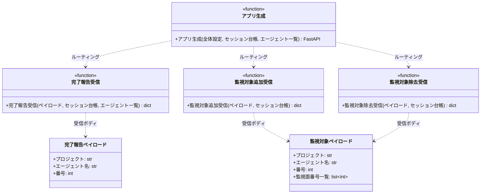

# モジュール構成: モニター / HTTP受信

`HTTP受信` ドメイン（モニター側）に属する構成要素詳細。
モニター本体は FastAPI アプリとして構築し、MCP ツール（作業完了報告・監視対象追加 / 除去）からの localhost HTTP の受信と、ポーリングループの駆動（lifespan のバックグラウンドスレッド）を 1 プロセスで担う。

## 一覧

| ユースケース | 役割 | コンテナ | 種別 | 名前 | 概要 | 補足 |
| --- | --- | --- | --- | --- | --- | --- |
| 共通 | アプリ生成 | `server/app.py` | 関数 | [`create_app`](#アプリ生成) | FastAPI アプリの生成（ルーティング + lifespan） | - |
| 共通 | 受信 DTO | `server/app.py` | データモデル | [`CompletionPayload`](#完了報告ペイロード) / [`WatchPayload`](#監視対象ペイロード) | 受信ボディの型 | Pydantic `BaseModel` |
| 作業完了報告 | 受信 | `server/app.py` | 関数 | [`handle_completion`](#完了報告受信) | `処理中:*` 除去 + 生存更新 | - |
| 監視対象追加 | 受信 | `server/app.py` | 関数 | [`handle_add_watch`](#監視対象追加受信) | 監視面へ番号を追加 | - |
| 監視対象除去 | 受信 | `server/app.py` | 関数 | [`handle_remove_watch`](#監視対象除去受信) | 監視面から番号を除去 | - |

## ディレクトリ構成

```
src/ai_monitor/server/
└── app.py    # create_app / CompletionPayload / WatchPayload / handle_completion / handle_add_watch / handle_remove_watch
```

## 構成図



## `server/app.py`
> 種別: ファイル

FastAPI アプリの生成と 3 エンドポイントの受信を担うファイル。
起動は `main()` が `uvicorn.run`（`127.0.0.1:{settings.port}`）で行う。

---

### アプリ生成
> 物理名: `create_app`<br>
> 種別: 関数

FastAPI アプリを生成し、ルーティングと lifespan（ポーリングループの起動）を配線する。

#### 引数

| 論理名 | 引数名 | 型 | 必須 | デフォルト | 説明 | 補足 |
| --- | --- | --- | --- | --- | --- | --- |
| 全体設定 | `settings` | [`Settings`](./エージェント管理.md#全体設定) | ✅ | - | 周期・閾値の出所 | - |
| セッション台帳 | `registry` | [`SessionRegistry`](./エージェント管理.md#セッション台帳) | ✅ | - | 受信関数へ引き渡す台帳 | キーワード引数 |
| エージェント一覧 | `agents` | [`list[Agent]`](./エージェント管理.md#エージェント定義) | ✅ | - | 処理中ラベルの解決・ポーリングに使う | キーワード引数 |

引数例:

```python
create_app(settings, registry=registry, agents=agents)
```

#### 戻り値

| 型 | 説明 | 補足 |
| --- | --- | --- |
| `FastAPI` | 生成したアプリ | `main()` が `uvicorn.run` に渡す |

#### 処理

1. FastAPI アプリを生成し、`POST /completions` → [完了報告受信](#完了報告受信) / `POST /watch-targets` → [監視対象追加受信](#監視対象追加受信) / `DELETE /watch-targets` → [監視対象除去受信](#監視対象除去受信) を登録する
2. lifespan でポーリングループをバックグラウンドスレッドとして起動する（[周期駆動](./エージェント管理.md#周期駆動)を `poll_interval_sec` 間隔で繰り返し、アプリ終了時にスレッドを停止する）

#### 例外

なし

#### 単体テスト

| テスト名 | 正常/異常 | 概要 | 条件 | Mock | 期待値 | 補足 |
| --- | --- | --- | --- | --- | --- | --- |
| `test_create_app` | 正常 | ルーティング登録 | TestClient で 3 エンドポイントへリクエスト | GitHub API | 各受信関数の結果が JSON 応答される | lifespan 外で検証（ループは起動しない） |
| `test_create_app_when_unknown_path` | 正常 | 未知パスの 404 | 未定義のパスへリクエスト | GitHub API | `404` が返る | - |

---

### 完了報告ペイロード
> 物理名: `CompletionPayload`<br>
> 種別: データモデル

`POST /completions` の受信ボディ（Pydantic `BaseModel`）。

#### プロパティ

| 論理名 | プロパティ名 | 型 | 可視性 | デフォルト | 説明 | 例 | 補足 |
| --- | --- | --- | --- | --- | --- | --- | --- |
| プロジェクト | `project` | `str` | 公開 | - | 監視対象プロジェクト名 | `"sandbox"` | - |
| エージェント名 | `agent_name` | `str` | 公開 | - | 報告するエージェント名 | `"architect"` | - |
| 番号 | `number` | `int` | 公開 | - | セッションの主番号 | `52` | - |

#### メソッド

なし

#### 単体テスト

なし

---

### 監視対象ペイロード
> 物理名: `WatchPayload`<br>
> 種別: データモデル

`POST /watch-targets` / `DELETE /watch-targets` の受信ボディ（Pydantic `BaseModel`）。

#### プロパティ

| 論理名 | プロパティ名 | 型 | 可視性 | デフォルト | 説明 | 例 | 補足 |
| --- | --- | --- | --- | --- | --- | --- | --- |
| プロジェクト | `project` | `str` | 公開 | - | 監視対象プロジェクト名 | `"sandbox"` | - |
| エージェント名 | `agent_name` | `str` | 公開 | - | 対象セッションのエージェント名 | `"architect"` | - |
| 番号 | `number` | `int` | 公開 | - | 対象セッションの主番号 | `52` | - |
| 監視面番号一覧 | `watch_numbers` | `list[int]` | 公開 | - | 追加 / 除去する Issue / PR 番号 | `[60, 61]` | - |

#### メソッド

なし

#### 単体テスト

なし

---

### 完了報告受信
> 物理名: `handle_completion`<br>
> 種別: 関数

作業完了報告を受けて `処理中:*` ラベルを外し、セッションの生存時刻を更新する。

#### 引数

| 論理名 | 引数名 | 型 | 必須 | デフォルト | 説明 | 補足 |
| --- | --- | --- | --- | --- | --- | --- |
| ペイロード | `payload` | [`CompletionPayload`](#完了報告ペイロード) | ✅ | - | 受信ボディ | MCP `report_completion` が送る |
| セッション台帳 | `registry` | [`SessionRegistry`](./エージェント管理.md#セッション台帳) | ✅ | - | セッションの検索・生存更新 | キーワード引数 |
| エージェント一覧 | `agents` | [`list[Agent]`](./エージェント管理.md#エージェント定義) | ✅ | - | `agent_name` → 処理中ラベルの解決 | キーワード引数 |
| プロジェクト一覧 | `projects` | [`list[MonitoredProject]`](./エージェント管理.md#監視対象プロジェクト) | ✅ | - | `payload.project` 名 → プロジェクト設定の解決 | キーワード引数（ラベル除去の対象リポジトリに使う） |

引数例:

```python
handle_completion(CompletionPayload(project="sandbox", agent_name="architect", number=52), registry=registry, agents=agents, projects=settings.projects)
```

#### 戻り値

| 型 | 説明 | 補足 |
| --- | --- | --- |
| `dict` | `{"ok": True}` | FastAPI が JSON 化する |

戻り値例:

```python
{"ok": True}
```

#### 処理

1. `project` / `agent_name` / `number` でセッションを検索し、`project` 名から監視対象プロジェクトを解決する（[検索](./エージェント管理.md#検索)。いずれも無ければ `HTTPException`（404）を投げる）
2. 対象から `処理中:{agent_name}` を除去する（[ラベル除去](./GitHub連携.md#ラベル除去)。未付与は無視される冪等操作）
3. セッションの生存時刻を更新し（[生存更新](./エージェント管理.md#生存更新)）、`{"ok": True}` を返す

#### 例外

| 例外名 | 発生条件 | メッセージ | 補足 |
| --- | --- | --- | --- |
| `HTTPException` | セッションが台帳にない | `404` | FastAPI が 404 応答に変換する |

#### 単体テスト

| テスト名 | 正常/異常 | 概要 | 条件 | Mock | 期待値 | 補足 |
| --- | --- | --- | --- | --- | --- | --- |
| `test_handle_completion` | 正常 | ラベル除去 + 生存更新 | 台帳に該当セッションあり | GitHub API | 処理中ラベルが除去され `last_seen_at` が更新され `{"ok": True}` | - |
| `test_handle_completion_when_session_missing` | 異常 | セッション不明 | 台帳に該当なし | GitHub API | `HTTPException`（404）・ラベル操作なし | - |

---

### 監視対象追加受信
> 物理名: `handle_add_watch`<br>
> 種別: 関数

派生 PR の番号をセッションの監視面へ追加する。

#### 引数

| 論理名 | 引数名 | 型 | 必須 | デフォルト | 説明 | 補足 |
| --- | --- | --- | --- | --- | --- | --- |
| ペイロード | `payload` | [`WatchPayload`](#監視対象ペイロード) | ✅ | - | 受信ボディ | MCP `add_watch_targets` が送る |
| セッション台帳 | `registry` | [`SessionRegistry`](./エージェント管理.md#セッション台帳) | ✅ | - | 監視面の追加先 | キーワード引数 |

引数例:

```python
handle_add_watch(WatchPayload(project="sandbox", agent_name="architect", number=52, watch_numbers=[60, 61]), registry=registry)
```

#### 戻り値

| 型 | 説明 | 補足 |
| --- | --- | --- |
| `dict` | `{"ok": True}` | FastAPI が JSON 化する |

#### 処理

1. 監視面へ番号を追加する（[監視面追加](./エージェント管理.md#監視面追加)。`KeyError` は `HTTPException`（404）に変換する）
2. `{"ok": True}` を返す

#### 例外

| 例外名 | 発生条件 | メッセージ | 補足 |
| --- | --- | --- | --- |
| `HTTPException` | セッションが台帳にない | `404` | FastAPI が 404 応答に変換する |

#### 単体テスト

| テスト名 | 正常/異常 | 概要 | 条件 | Mock | 期待値 | 補足 |
| --- | --- | --- | --- | --- | --- | --- |
| `test_handle_add_watch` | 正常 | 監視面の追加 | 台帳に該当セッションあり | なし | 監視面に追加され `{"ok": True}` | - |
| `test_handle_add_watch_when_session_missing` | 異常 | セッション不明 | 台帳に該当なし | なし | `HTTPException`（404） | `KeyError` の変換 |

---

### 監視対象除去受信
> 物理名: `handle_remove_watch`<br>
> 種別: 関数

セッションの監視面から番号を取り除く。

#### 引数

| 論理名 | 引数名 | 型 | 必須 | デフォルト | 説明 | 補足 |
| --- | --- | --- | --- | --- | --- | --- |
| ペイロード | `payload` | [`WatchPayload`](#監視対象ペイロード) | ✅ | - | 受信ボディ | MCP `remove_watch_targets` が送る |
| セッション台帳 | `registry` | [`SessionRegistry`](./エージェント管理.md#セッション台帳) | ✅ | - | 監視面の除去先 | キーワード引数 |

引数例:

```python
handle_remove_watch(WatchPayload(project="sandbox", agent_name="architect", number=52, watch_numbers=[60]), registry=registry)
```

#### 戻り値

| 型 | 説明 | 補足 |
| --- | --- | --- |
| `dict` | `{"ok": True}` | FastAPI が JSON 化する |

#### 処理

1. 監視面から番号を取り除く（[監視面除去](./エージェント管理.md#監視面除去)。`KeyError` は `HTTPException`（404）に変換する）
2. `{"ok": True}` を返す

#### 例外

| 例外名 | 発生条件 | メッセージ | 補足 |
| --- | --- | --- | --- |
| `HTTPException` | セッションが台帳にない | `404` | FastAPI が 404 応答に変換する |

#### 単体テスト

| テスト名 | 正常/異常 | 概要 | 条件 | Mock | 期待値 | 補足 |
| --- | --- | --- | --- | --- | --- | --- |
| `test_handle_remove_watch` | 正常 | 監視面の除去 | 監視面に番号あり | なし | 監視面から除去され `{"ok": True}` | - |
| `test_handle_remove_watch_when_session_missing` | 異常 | セッション不明 | 台帳に該当なし | なし | `HTTPException`（404） | `KeyError` の変換 |
