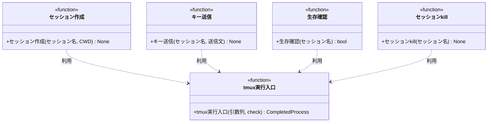

# モジュール構成: モニター / tmux連携

`tmux連携` ドメイン（モニター側）に属する構成要素詳細。
エージェントセッション（tmux）の実体操作（作成 / 送信 / 生存確認 / kill）を扱う薄い連携層。
台帳は[セッション台帳](./エージェント管理.md#セッション台帳)（別分類）が持つ。

## 一覧

| ユースケース | 役割 | コンテナ | 種別 | 名前 | 概要 | 補足 |
| --- | --- | --- | --- | --- | --- | --- |
| 共通 | セッション操作 | `integrations/tmux/ops.py` | 関数 | [`create_session`](#セッション作成) | tmux セッションを detached で作成 | - |
| 共通 | セッション操作 | `integrations/tmux/ops.py` | 関数 | [`send_keys`](#キー送信) | 既存セッションへ文字列を送信して実行 | - |
| 共通 | セッション操作 | `integrations/tmux/ops.py` | 関数 | [`has_session`](#生存確認) | セッションの存在確認 | heartbeat / 台帳修復に使用 |
| 共通 | セッション操作 | `integrations/tmux/ops.py` | 関数 | [`kill_session`](#セッション-kill) | セッションを kill | - |
| 共通 | 内部処理 | `integrations/tmux/ops.py` | 関数 | [`_run_tmux`](#tmux-実行入口) | tmux CLI 呼び出しの単一入口 | - |

## ディレクトリ構成

```
src/ai_monitor/integrations/tmux/
└── ops.py    # create_session / send_keys / has_session / kill_session
```

## 構成図



## `integrations/tmux/ops.py`
> 種別: ファイル

tmux セッションの実体操作を集約するファイル。
全関数は [tmux 実行入口](#tmux-実行入口)を共通で通る。

---

### セッション作成
> 物理名: `create_session`<br>
> 種別: 関数

tmux セッションを detached で作成する。

#### 引数

| 論理名 | 引数名 | 型 | 必須 | デフォルト | 説明 | 補足 |
| --- | --- | --- | --- | --- | --- | --- |
| セッション名 | `name` | `str` | ✅ | - | 作成するセッション名 | - |
| CWD | `cwd` | `str` | ✅ | - | セッションの作業ディレクトリ | worktree の絶対パス |

引数例:

```python
create_session("ai-monitor-myproj-35-epic-conductor", "/home/user/repo/myproj/.claude/worktrees/feat-epic-profile")
```

#### 戻り値

| 型 | 説明 | 補足 |
| --- | --- | --- |
| `None` | なし | - |

#### 処理

1. `tmux new-session -d -s {name} -c {cwd}` を実行する（[tmux 実行入口](#tmux-実行入口)）

#### 例外

| 例外名 | 発生条件 | メッセージ | 補足 |
| --- | --- | --- | --- |
| `CalledProcessError` | tmux が非 0 で終了（同名セッションが既に存在 等） | tmux の stderr | - |

#### 単体テスト

セットアップ:

| セットアップ | 説明 | 補足 |
| --- | --- | --- |
| 一時セッション名 | 衝突しないテスト用のセッション名を払い出し、テスト後に残っていれば kill する | fixture 名 `tmp_session_name` |

| テスト名 | 正常/異常 | 概要 | 条件 | Mock | 期待値 | 補足 |
| --- | --- | --- | --- | --- | --- | --- |
| `test_create_session` | 正常 | detached 作成 | 未使用のセッション名 + 一時フォルダの cwd | なし（実 tmux を操作） | 作成後に[生存確認](#生存確認)が `True` を返す | - |
| `test_create_session_when_duplicate_name` | 異常 | 同名セッションの重複作成 | 作成済みと同名で再作成 | なし（実 tmux を操作） | `CalledProcessError` | 例外表「同名セッションが既に存在」に対応 |

---

### キー送信
> 物理名: `send_keys`<br>
> 種別: 関数

既存セッションへ文字列を送信して実行させる。

#### 引数

| 論理名 | 引数名 | 型 | 必須 | デフォルト | 説明 | 補足 |
| --- | --- | --- | --- | --- | --- | --- |
| セッション名 | `name` | `str` | ✅ | - | 送信先のセッション名 | - |
| 送信文 | `text` | `str` | ✅ | - | 送信する文字列 | スキル起動文字列 / 再開の定型文 |

引数例:

```python
send_keys("ai-monitor-myproj-35-epic-conductor", "/ai-monitor:epic-conductor 35")
```

#### 戻り値

| 型 | 説明 | 補足 |
| --- | --- | --- |
| `None` | なし | - |

#### 処理

1. `tmux send-keys -t {name} {text} Enter` を実行する（[tmux 実行入口](#tmux-実行入口)）

#### 例外

| 例外名 | 発生条件 | メッセージ | 補足 |
| --- | --- | --- | --- |
| `CalledProcessError` | tmux が非 0 で終了（セッション不存在 等） | tmux の stderr | - |

#### 単体テスト

セットアップ:

| セットアップ | 説明 | 補足 |
| --- | --- | --- |
| 一時 tmux セッション | テスト用セッションを作成し、テスト後に残っていれば kill する | fixture 名 `tmp_tmux_session` |

| テスト名 | 正常/異常 | 概要 | 条件 | Mock | 期待値 | 補足 |
| --- | --- | --- | --- | --- | --- | --- |
| `test_send_keys` | 正常 | 文字列の送信と実行 | 作成済みセッションへ `echo` コマンドを送信 | なし（実 tmux を操作） | `capture-pane` の出力に実行結果が現れる | - |
| `test_send_keys_when_session_missing` | 異常 | セッション不存在 | 存在しないセッション名 | なし（実 tmux を操作） | `CalledProcessError` | 例外表「セッション不存在」に対応 |

---

### 生存確認
> 物理名: `has_session`<br>
> 種別: 関数

セッションの存在を確認する。

#### 引数

| 論理名 | 引数名 | 型 | 必須 | デフォルト | 説明 | 補足 |
| --- | --- | --- | --- | --- | --- | --- |
| セッション名 | `name` | `str` | ✅ | - | 確認するセッション名 | - |

引数例:

```python
has_session("ai-monitor-myproj-35-epic-conductor")
```

#### 戻り値

| 型 | 説明 | 補足 |
| --- | --- | --- |
| `bool` | セッションが存在するか | - |

戻り値例:

```python
True
```

#### 処理

1. `tmux has-session -t {name}` を `check=False` で実行する（[tmux 実行入口](#tmux-実行入口)）
2. 終了コードで結果を返す
   - 0 の場合、`True` を返す
   - 非 0 の場合、`False` を返す

#### 例外

なし

#### 単体テスト

セットアップ:

| セットアップ | 説明 | 補足 |
| --- | --- | --- |
| 一時 tmux セッション | テスト用セッションを作成し、テスト後に残っていれば kill する | fixture 名 `tmp_tmux_session` |

| テスト名 | 正常/異常 | 概要 | 条件 | Mock | 期待値 | 補足 |
| --- | --- | --- | --- | --- | --- | --- |
| `test_has_session` | 正常 | 存在するセッション | 作成済みのセッション名 | なし（実 tmux を操作） | `True` | - |
| `test_has_session_when_session_missing` | 正常 | 存在しないセッション | 未作成のセッション名 | なし（実 tmux を操作） | `False` | - |

---

### セッション kill
> 物理名: `kill_session`<br>
> 種別: 関数

セッションを kill する。

#### 引数

| 論理名 | 引数名 | 型 | 必須 | デフォルト | 説明 | 補足 |
| --- | --- | --- | --- | --- | --- | --- |
| セッション名 | `name` | `str` | ✅ | - | kill するセッション名 | - |

引数例:

```python
kill_session("ai-monitor-myproj-35-epic-conductor")
```

#### 戻り値

| 型 | 説明 | 補足 |
| --- | --- | --- |
| `None` | なし | - |

#### 処理

1. `tmux kill-session -t {name}` を実行する（[tmux 実行入口](#tmux-実行入口)）

#### 例外

| 例外名 | 発生条件 | メッセージ | 補足 |
| --- | --- | --- | --- |
| `CalledProcessError` | tmux が非 0 で終了（セッション不存在 等） | tmux の stderr | - |

#### 単体テスト

セットアップ:

| セットアップ | 説明 | 補足 |
| --- | --- | --- |
| 一時 tmux セッション | テスト用セッションを作成し、テスト後に残っていれば kill する | fixture 名 `tmp_tmux_session` |

| テスト名 | 正常/異常 | 概要 | 条件 | Mock | 期待値 | 補足 |
| --- | --- | --- | --- | --- | --- | --- |
| `test_kill_session` | 正常 | kill の実行 | 作成済みのセッション名 | なし（実 tmux を操作） | kill 後に[生存確認](#生存確認)が `False` を返す | - |
| `test_kill_session_when_session_missing` | 異常 | セッション不存在 | 存在しないセッション名 | なし（実 tmux を操作） | `CalledProcessError` | 例外表「セッション不存在」に対応 |

---

### tmux 実行入口
> 物理名: `_run_tmux`<br>
> 種別: 関数

tmux CLI 呼び出しの単一入口。

#### 引数

| 論理名 | 引数名 | 型 | 必須 | デフォルト | 説明 | 補足 |
| --- | --- | --- | --- | --- | --- | --- |
| 引数列 | `args` | `list[str]` | ✅ | - | tmux に渡す引数列 | - |
| check | `check` | `bool` | - | `True` | 非 0 終了を例外にするか | - |

引数例:

```python
_run_tmux(["kill-session", "-t", "ai-monitor-myproj-35-epic-conductor"])
```

#### 戻り値

| 型 | 説明 | 補足 |
| --- | --- | --- |
| `CompletedProcess[str]` | 実行結果 | - |

戻り値例:

```python
CompletedProcess(returncode=0, stdout="")
```

#### 処理

1. `tmux` をサブプロセスで実行し、`CompletedProcess` を返す
   - `check=True` の場合、非 0 終了で `CalledProcessError` を投げる
   - `check=False` の場合、非 0 終了でもそのまま返す

#### 例外

| 例外名 | 発生条件 | メッセージ | 補足 |
| --- | --- | --- | --- |
| `CalledProcessError` | `check=True` で tmux が非 0 終了 | tmux の stderr | - |

#### 単体テスト

| テスト名 | 正常/異常 | 概要 | 条件 | Mock | 期待値 | 補足 |
| --- | --- | --- | --- | --- | --- | --- |
| `test_run_tmux` | 正常 | tmux の実行 | バージョン表示（`-V`）を実行 | なし（実 tmux を操作） | 正常終了の `CompletedProcess` が返る | - |
| `test_run_tmux_when_check_false_nonzero` | 正常 | `check=False` の非 0 許容 | 存在しないセッションへの `has-session` | なし（実 tmux を操作） | 非 0 の `CompletedProcess` が返り例外にならない | - |
| `test_run_tmux_when_nonzero` | 異常 | `check=True` の非 0 終了 | 存在しないセッションへの `kill-session` | なし（実 tmux を操作） | `CalledProcessError` | 例外表「非 0 終了」に対応 |
