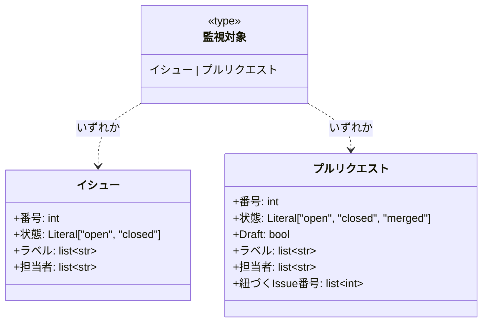
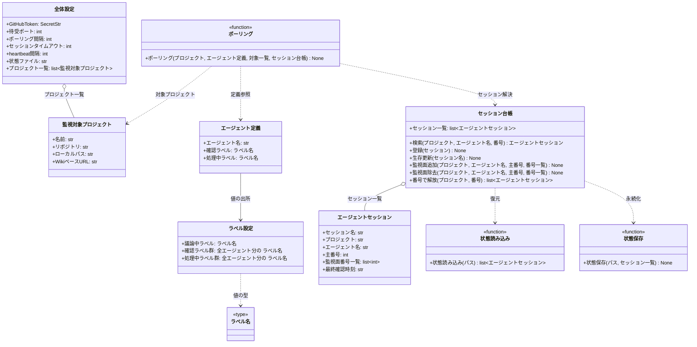

# モジュール構成: モニター / エージェント管理

`エージェント管理` ドメイン（モニター側）に属する構成要素詳細。
エージェント基盤・派生 PR を含む監視面の管理・エージェントセッションの状態管理を扱う。

関数ファースト設計: エージェントは「継承クラス」ではなく **`Agent`（DTO）+ 関数**で表現する。
全エージェントの差分はラベル・スキル名というデータのみで、worker / conductor はワークフロー側の概念としてだけ存在する（モニターは区別しない）。
クラスとして残すのは長期保持のランタイム状態（`SessionRegistry`）だけ。

## 一覧

| ユースケース | 役割 | コンテナ | 種別 | 名前 | 概要 | 補足 |
| --- | --- | --- | --- | --- | --- | --- |
| 共通 | ドメインモデル | `shared/types.py` | データモデル | [`Issue`](#イシュー) | GitHub Issue のスナップショット | frozen dataclass |
| 共通 | ドメインモデル | `shared/types.py` | データモデル | [`PullRequest`](#プルリクエスト) | GitHub PR のスナップショット | frozen dataclass |
| 共通 | 監視対象型 | `shared/types.py` | 型 | [`MonitorTarget`](#監視対象) | `Issue \| PullRequest` のユニオン型エイリアス | PEP 695 `type` |
| 共通 | ラベル名型 | `shared/types.py` | 型 | [`LabelName`](#ラベル名) | `LabelSettings` 由来のラベル文字列を表す `str` の NewType | ラベルの直書きを型エラーにする |
| 共通 | ラベル設定 | `shared/settings.py` | データモデル | [`LabelSettings`](#ラベル設定) | `constants.env` の `AI_MONITOR_LABEL_*` を型安全に読む | `pydantic_settings.BaseSettings` |
| 共通 | 全体設定 | `shared/settings.py` | データモデル | [`Settings`](#全体設定) | `~/.config/ai-monitor/settings.yaml` を型安全に読む | `pydantic_settings.BaseSettings` |
| 共通 | プロジェクト設定 | `shared/settings.py` | データモデル | [`MonitoredProject`](#監視対象プロジェクト) | 監視対象プロジェクト 1 件の設定 | `Settings.projects` の要素 |
| 共通 | エージェント定義 | `features/agents/types.py` | データモデル | [`Agent`](#エージェント定義) | 1 エージェントの静的定義 | frozen dataclass |
| 共通 | ポーリング | `features/agents/service.py` | 関数 | [`poll`](#ポーリング) | プロジェクト × エージェントの対ごとの 1 周期 | - |
| 共通 | スキル起動文字列 | `features/agents/service.py` | 関数 | [`build_skill_command`](#スキル起動文字列) | `/ai-monitor:{name} {number}` を組み立てる | - |
| 共通 | 内部処理 | `features/agents/service.py` | 関数 | [`_process_one`](#1-件処理) | 対象 1 件のセッション解決と送信 | - |
| 共通 | 内部処理 | `features/agents/service.py` | 関数 | [`_sort_key`](#ソートキー) | 優先度ソートのキーを求める | - |
| 共通 | スナップショット組み立て | `features/agents/service.py` | 関数 | [`build_context_snapshot`](#スナップショット組み立て) | 対象と紐づく open PR の状態をメモリから整形 | 送信ペイロードに毎回添付 |
| 共通 | セッション状態 | `features/sessions/types.py` | データモデル | [`AgentSession`](#エージェントセッション) | 起動中 tmux セッション 1 本の状態 | - |
| 共通 | セッション台帳 | `features/sessions/registry.py` | クラス | [`SessionRegistry`](#セッション台帳) | 起動中セッション一覧の保持・検索 | 長期保持のランタイム状態 |
| 共通 | 状態読み込み | `features/sessions/state_store.py` | 関数 | [`load_sessions`](#状態読み込み) | 設定の `state_path` からセッション一覧を復元 | - |
| 共通 | 状態保存 | `features/sessions/state_store.py` | 関数 | [`save_sessions`](#状態保存) | tmp → rename のアトミック書きで永続化 | - |
| 共通 | 配線 | `main.py` | 関数 | [`build_agents`](#エージェント組み立て) | 全エージェントの `Agent` を組み立てる | composition root |

## ディレクトリ構成

```
src/ai_monitor/
├── main.py                # composition root（build_agents）
├── shared/
│   ├── types.py           # Issue / PullRequest / MonitorTarget / LabelName
│   └── settings.py        # Settings / LabelSettings / MonitoredProject
└── features/
    ├── agents/
    │   ├── types.py       # Agent
    │   └── service.py     # poll / build_skill_command / build_context_snapshot
    └── sessions/
        ├── types.py       # AgentSession
        ├── registry.py    # SessionRegistry
        └── state_store.py # load_sessions / save_sessions
```

## 構成図

### ドメインモデル



---

### ポーリングとセッション管理



## イシュー
> 物理名: `Issue`<br>
> 種別: データモデル<br>
> コンテナ: `shared/types.py`

GitHub Issue のスナップショット。
polling 時点の状態を保持する読み取り専用のデータモデル（`@dataclass(frozen=True, slots=True, kw_only=True)`）。

### プロパティ

| 論理名 | プロパティ名 | 型 | 可視性 | デフォルト | 説明 | 例 | 補足 |
| --- | --- | --- | --- | --- | --- | --- | --- |
| 番号 | `number` | `int` | 公開 | - | Issue 番号 | `35` | - |
| 状態 | `state` | `Literal["open", "closed"]` | 公開 | `"open"` | Issue の開閉状態 | `"open"` | - |
| ラベル | `labels` | `list[str]` | 公開 | `[]` | 付与中のラベル名 | `["layer:epic", "確認:epic-conductor"]` | - |
| 担当者 | `assignees` | `list[str]` | 公開 | `[]` | assignee のログイン名 | `["shuhei1101"]` | 空 = エージェント起動可 |

### メソッド

なし

### 単体テスト

なし

### 補足

- githubkit からの取得・変換は [GitHub連携](./GitHub連携.md)（別分類）の責務。
  本モデルは変換結果の受け皿

## プルリクエスト
> 物理名: `PullRequest`<br>
> 種別: データモデル<br>
> コンテナ: `shared/types.py`

GitHub PR のスナップショット（frozen dataclass）。
本文 `## 紐づく Issue` から抽出した Issue 番号を持ち、PR → Issue の逆引きの材料になる。

### プロパティ

| 論理名 | プロパティ名 | 型 | 可視性 | デフォルト | 説明 | 例 | 補足 |
| --- | --- | --- | --- | --- | --- | --- | --- |
| 番号 | `number` | `int` | 公開 | - | PR 番号 | `40` | - |
| 状態 | `state` | `Literal["open", "closed", "merged"]` | 公開 | `"open"` | PR の開閉・マージ状態 | `"open"` | - |
| Draft | `draft` | `bool` | 公開 | `true` | Draft PR かどうか | `true` | - |
| ラベル | `labels` | `list[str]` | 公開 | `[]` | 付与中のラベル名 | `["確認:subsystem-conductor"]` | - |
| 担当者 | `assignees` | `list[str]` | 公開 | `[]` | assignee のログイン名 | `[]` | 空 = エージェント起動可 |
| 紐づく Issue 番号 | `linked_issue_numbers` | `list[int]` | 公開 | `[]` | 本文 `## 紐づく Issue` から抽出した Issue 番号 | `[50]` | 1 件のみ運用 |

### メソッド

なし

### 単体テスト

なし

## 監視対象
> 物理名: `MonitorTarget`<br>
> 種別: 型<br>
> コンテナ: `shared/types.py`

[`Issue`](#イシュー) | [`PullRequest`](#プルリクエスト) のユニオン型エイリアス（PEP 695 `type`）。
ポーリングが扱う監視対象 1 件を表す。

## ラベル名
> 物理名: `LabelName`<br>
> 種別: 型<br>
> コンテナ: `shared/types.py`

`str` の NewType（`LabelName = NewType("LabelName", str)`）。
[ラベル設定](#ラベル設定)が読み込んだラベル文字列であることを型で追跡し、関数へのラベル文字列の直書きを型チェッカーで検出する。
値の SoT は `constants.env` のまま（本型は出所の追跡のみを担う）。

## ラベル設定
> 物理名: `LabelSettings`<br>
> 種別: データモデル<br>
> コンテナ: `shared/settings.py`

`constants.env` の `AI_MONITOR_LABEL_*` を型安全に読む設定クラス（`pydantic_settings.BaseSettings`）。
ラベル値の SoT は `plugins/ai-monitor/constants.env` で、本クラスはその読み取り口。
`os.environ` の直読みはしない。

### プロパティ

| 論理名 | プロパティ名 | 型 | 可視性 | デフォルト | 説明 | 例 | 補足 |
| --- | --- | --- | --- | --- | --- | --- | --- |
| 議論中ラベル | `in_discussion` | [`LabelName`](#ラベル名) | 公開 | - | `AI_MONITOR_LABEL_IN_DISCUSSION` の値 | `"議論中"` | - |
| intake-issue-triager 確認ラベル | `confirm_intake_issue_triager` | [`LabelName`](#ラベル名) | 公開 | - | `AI_MONITOR_LABEL_CONFIRM_INTAKE_ISSUE_TRIAGER` の値 | `"確認:intake-issue-triager"` | - |
| epic-conductor 確認ラベル | `confirm_epic_conductor` | [`LabelName`](#ラベル名) | 公開 | - | `AI_MONITOR_LABEL_CONFIRM_EPIC_CONDUCTOR` の値 | `"確認:epic-conductor"` | - |
| epic-poc-runner 確認ラベル | `confirm_epic_poc_runner` | [`LabelName`](#ラベル名) | 公開 | - | `AI_MONITOR_LABEL_CONFIRM_EPIC_POC_RUNNER` の値 | `"確認:epic-poc-runner"` | - |
| mock-designer 確認ラベル | `confirm_mock_designer` | [`LabelName`](#ラベル名) | 公開 | - | `AI_MONITOR_LABEL_CONFIRM_MOCK_DESIGNER` の値 | `"確認:mock-designer"` | - |
| complex-scenario-writer 確認ラベル | `confirm_complex_scenario_writer` | [`LabelName`](#ラベル名) | 公開 | - | `AI_MONITOR_LABEL_CONFIRM_COMPLEX_SCENARIO_WRITER` の値 | `"確認:complex-scenario-writer"` | - |
| complex-scenario-tester 確認ラベル | `confirm_complex_scenario_tester` | [`LabelName`](#ラベル名) | 公開 | - | `AI_MONITOR_LABEL_CONFIRM_COMPLEX_SCENARIO_TESTER` の値 | `"確認:complex-scenario-tester"` | - |
| story-conductor 確認ラベル | `confirm_story_conductor` | [`LabelName`](#ラベル名) | 公開 | - | `AI_MONITOR_LABEL_CONFIRM_STORY_CONDUCTOR` の値 | `"確認:story-conductor"` | - |
| single-scenario-writer 確認ラベル | `confirm_single_scenario_writer` | [`LabelName`](#ラベル名) | 公開 | - | `AI_MONITOR_LABEL_CONFIRM_SINGLE_SCENARIO_WRITER` の値 | `"確認:single-scenario-writer"` | - |
| single-scenario-tester 確認ラベル | `confirm_single_scenario_tester` | [`LabelName`](#ラベル名) | 公開 | - | `AI_MONITOR_LABEL_CONFIRM_SINGLE_SCENARIO_TESTER` の値 | `"確認:single-scenario-tester"` | - |
| subsystem-conductor 確認ラベル | `confirm_subsystem_conductor` | [`LabelName`](#ラベル名) | 公開 | - | `AI_MONITOR_LABEL_CONFIRM_SUBSYSTEM_CONDUCTOR` の値 | `"確認:subsystem-conductor"` | - |
| architect 確認ラベル | `confirm_architect` | [`LabelName`](#ラベル名) | 公開 | - | `AI_MONITOR_LABEL_CONFIRM_ARCHITECT` の値 | `"確認:architect"` | - |
| library-poc-runner 確認ラベル | `confirm_library_poc_runner` | [`LabelName`](#ラベル名) | 公開 | - | `AI_MONITOR_LABEL_CONFIRM_LIBRARY_POC_RUNNER` の値 | `"確認:library-poc-runner"` | - |
| tester 確認ラベル | `confirm_tester` | [`LabelName`](#ラベル名) | 公開 | - | `AI_MONITOR_LABEL_CONFIRM_TESTER` の値 | `"確認:tester"` | - |
| implementer 確認ラベル | `confirm_implementer` | [`LabelName`](#ラベル名) | 公開 | - | `AI_MONITOR_LABEL_CONFIRM_IMPLEMENTER` の値 | `"確認:implementer"` | - |
| resetter 確認ラベル | `confirm_resetter` | [`LabelName`](#ラベル名) | 公開 | - | `AI_MONITOR_LABEL_CONFIRM_RESETTER` の値 | `"確認:resetter"` | - |
| quick-implementer 確認ラベル | `confirm_quick_implementer` | [`LabelName`](#ラベル名) | 公開 | - | `AI_MONITOR_LABEL_CONFIRM_QUICK_IMPLEMENTER` の値 | `"確認:quick-implementer"` | - |
| questioner 確認ラベル | `confirm_questioner` | [`LabelName`](#ラベル名) | 公開 | - | `AI_MONITOR_LABEL_CONFIRM_QUESTIONER` の値 | `"確認:questioner"` | - |
| intake-issue-triager 処理中ラベル | `processing_intake_issue_triager` | [`LabelName`](#ラベル名) | 公開 | - | `AI_MONITOR_LABEL_PROCESSING_INTAKE_ISSUE_TRIAGER` の値 | `"処理中:intake-issue-triager"` | - |
| epic-conductor 処理中ラベル | `processing_epic_conductor` | [`LabelName`](#ラベル名) | 公開 | - | `AI_MONITOR_LABEL_PROCESSING_EPIC_CONDUCTOR` の値 | `"処理中:epic-conductor"` | - |
| epic-poc-runner 処理中ラベル | `processing_epic_poc_runner` | [`LabelName`](#ラベル名) | 公開 | - | `AI_MONITOR_LABEL_PROCESSING_EPIC_POC_RUNNER` の値 | `"処理中:epic-poc-runner"` | - |
| mock-designer 処理中ラベル | `processing_mock_designer` | [`LabelName`](#ラベル名) | 公開 | - | `AI_MONITOR_LABEL_PROCESSING_MOCK_DESIGNER` の値 | `"処理中:mock-designer"` | - |
| complex-scenario-writer 処理中ラベル | `processing_complex_scenario_writer` | [`LabelName`](#ラベル名) | 公開 | - | `AI_MONITOR_LABEL_PROCESSING_COMPLEX_SCENARIO_WRITER` の値 | `"処理中:complex-scenario-writer"` | - |
| complex-scenario-tester 処理中ラベル | `processing_complex_scenario_tester` | [`LabelName`](#ラベル名) | 公開 | - | `AI_MONITOR_LABEL_PROCESSING_COMPLEX_SCENARIO_TESTER` の値 | `"処理中:complex-scenario-tester"` | - |
| story-conductor 処理中ラベル | `processing_story_conductor` | [`LabelName`](#ラベル名) | 公開 | - | `AI_MONITOR_LABEL_PROCESSING_STORY_CONDUCTOR` の値 | `"処理中:story-conductor"` | - |
| single-scenario-writer 処理中ラベル | `processing_single_scenario_writer` | [`LabelName`](#ラベル名) | 公開 | - | `AI_MONITOR_LABEL_PROCESSING_SINGLE_SCENARIO_WRITER` の値 | `"処理中:single-scenario-writer"` | - |
| single-scenario-tester 処理中ラベル | `processing_single_scenario_tester` | [`LabelName`](#ラベル名) | 公開 | - | `AI_MONITOR_LABEL_PROCESSING_SINGLE_SCENARIO_TESTER` の値 | `"処理中:single-scenario-tester"` | - |
| subsystem-conductor 処理中ラベル | `processing_subsystem_conductor` | [`LabelName`](#ラベル名) | 公開 | - | `AI_MONITOR_LABEL_PROCESSING_SUBSYSTEM_CONDUCTOR` の値 | `"処理中:subsystem-conductor"` | - |
| architect 処理中ラベル | `processing_architect` | [`LabelName`](#ラベル名) | 公開 | - | `AI_MONITOR_LABEL_PROCESSING_ARCHITECT` の値 | `"処理中:architect"` | - |
| library-poc-runner 処理中ラベル | `processing_library_poc_runner` | [`LabelName`](#ラベル名) | 公開 | - | `AI_MONITOR_LABEL_PROCESSING_LIBRARY_POC_RUNNER` の値 | `"処理中:library-poc-runner"` | - |
| tester 処理中ラベル | `processing_tester` | [`LabelName`](#ラベル名) | 公開 | - | `AI_MONITOR_LABEL_PROCESSING_TESTER` の値 | `"処理中:tester"` | - |
| implementer 処理中ラベル | `processing_implementer` | [`LabelName`](#ラベル名) | 公開 | - | `AI_MONITOR_LABEL_PROCESSING_IMPLEMENTER` の値 | `"処理中:implementer"` | - |
| resetter 処理中ラベル | `processing_resetter` | [`LabelName`](#ラベル名) | 公開 | - | `AI_MONITOR_LABEL_PROCESSING_RESETTER` の値 | `"処理中:resetter"` | - |
| quick-implementer 処理中ラベル | `processing_quick_implementer` | [`LabelName`](#ラベル名) | 公開 | - | `AI_MONITOR_LABEL_PROCESSING_QUICK_IMPLEMENTER` の値 | `"処理中:quick-implementer"` | - |
| questioner 処理中ラベル | `processing_questioner` | [`LabelName`](#ラベル名) | 公開 | - | `AI_MONITOR_LABEL_PROCESSING_QUESTIONER` の値 | `"処理中:questioner"` | - |

### メソッド

なし

### 単体テスト

なし

### 補足

- `SettingsConfigDict(env_file="plugins/ai-monitor/constants.env", env_prefix="AI_MONITOR_LABEL_", extra="ignore")` で読み込む。
  フィールド名 = env キーのプレフィックス以降を小文字化したもので、対応キーが欠落していると生成時にバリデーションエラーになる
- `main.py`（composition root）で 1 度だけインスタンス化し、`build_agents` に渡す（関数内で毎回作らない）

## 全体設定
> 物理名: `Settings`<br>
> 種別: データモデル<br>
> コンテナ: `shared/settings.py`

`~/.config/ai-monitor/settings.yaml` を型安全に読む設定クラス（`pydantic_settings.BaseSettings`）。
環境変数 `AI_MONITOR_ENV`（または起動引数 `--env`）で指定した環境の `settings.{環境}.yaml` を重ねる。
同名の環境変数があれば最後にさらに上書きする。

### プロパティ

| 論理名 | プロパティ名 | 型 | 可視性 | デフォルト | 説明 | 例 | 補足 |
| --- | --- | --- | --- | --- | --- | --- | --- |
| GitHub Token | `github_token` | `SecretStr` | 公開 | - | GitHub API（githubkit）の認証 PAT | - | 秘匿。欠落時は起動エラー |
| 待受ポート | `port` | `int` | 公開 | `8765` | `POST /completions` の待受ポート | `8765` | - |
| ポーリング間隔 | `poll_interval_sec` | `int` | 公開 | `15` | GitHub ポーリングの周期（秒） | `15` | - |
| セッションタイムアウト | `session_timeout_min` | `int` | 公開 | `30` | 処理中のまま超過したセッションを kill する閾値（分） | `30` | - |
| heartbeat 間隔 | `heartbeat_interval_sec` | `int` | 公開 | `60` | 生存確認の周期（秒） | `60` | - |
| 状態ファイル | `state_path` | `str` | 公開 | `data/state.yaml` | セッション台帳の永続化先 | `"data/state.yaml"` | - |
| プロジェクト一覧 | `projects` | [`list[MonitoredProject]`](#監視対象プロジェクト) | 公開 | `[]` | 監視対象プロジェクトの一覧 | - | - |

### メソッド

なし

### 単体テスト

| テスト名 | 正常/異常 | 概要 | 条件 | Mock | 期待値 | 補足 |
| --- | --- | --- | --- | --- | --- | --- |
| `test_settings` | 正常 | yaml からの読み込み | 全キーを書いた settings.yaml | なし | 各プロパティが対応する値になる | - |
| `test_settings_when_env_var_set` | 正常 | 同名環境変数の上書き | yaml の `port` + 同名の環境変数 | なし | 環境変数の値が優先される | - |
| `test_settings_when_env_file_given` | 正常 | 環境差分ファイルの上書き | `AI_MONITOR_ENV=e2e` + `settings.e2e.yaml` に同名キー | なし | 環境差分の値が共通より優先される | - |
| `test_settings_when_token_missing` | 異常 | `github_token` 未設定 | `github_token` を消した settings.yaml | なし | バリデーションエラー | - |

### 補足

- `main.py`（composition root）で 1 度だけインスタンス化し、各関数へ partial で配線する（関数内で毎回作らない）

## 監視対象プロジェクト
> 物理名: `MonitoredProject`<br>
> 種別: データモデル<br>
> コンテナ: `shared/settings.py`

監視対象プロジェクト 1 件分の設定（Pydantic `BaseModel`・`Settings.projects` の要素）。
モニターは ai-monitor のクローンから単一プロセスで起動し、`settings.yaml` に登録されたこの一覧の全プロジェクトを監視する。

### プロパティ

| 論理名 | プロパティ名 | 型 | 可視性 | デフォルト | 説明 | 例 | 補足 |
| --- | --- | --- | --- | --- | --- | --- | --- |
| 名前 | `name` | `str` | 公開 | - | tmux セッション名・台帳キーに使うプロジェクト名 | `"aituber"` | `ai-monitor-{name}-{番号}-{エージェント}` |
| リポジトリ | `repo` | `str` | 公開 | - | GitHub リポジトリ（`owner/name`） | `"shuhei1101/aituber"` | GitHub API 呼び出しの対象リポジトリ |
| ローカルパス | `local_path` | `str` | 公開 | - | クローンのルート絶対パス | `"/home/user/repo/aituber"` | tmux セッションの CWD（worktree）解決に使う |
| Wiki ベース URL | `wiki_base` | `str` | 公開 | - | 当該プロジェクトの Wiki raw URL のベース | `"https://raw.githubusercontent.com/shuhei1101/aituber/master/docs/wiki"` | スキルには SessionStart フックが `WIKI_BASE` として展開 |

### メソッド

なし

### 単体テスト

なし

## エージェント定義
> 物理名: `Agent`<br>
> 種別: データモデル<br>
> コンテナ: `features/agents/types.py`

1 エージェントの静的定義（`@dataclass(frozen=True, slots=True, kw_only=True)`）。
全エージェントの差分はこの DTO の値だけで表現し、エージェントごとのクラスは作らない。

### プロパティ

| 論理名 | プロパティ名 | 型 | 可視性 | デフォルト | 説明 | 例 | 補足 |
| --- | --- | --- | --- | --- | --- | --- | --- |
| エージェント名 | `name` | `str` | 公開 | - | エージェント名 = スキル名 = セッション名の一部 | `"epic-conductor"` | - |
| 確認ラベル | `confirm_label` | [`LabelName`](#ラベル名) | 公開 | - | 監視する確認ラベル | `"確認:epic-conductor"` | `LabelSettings` から注入 |
| 処理中ラベル | `processing_label` | [`LabelName`](#ラベル名) | 公開 | - | 処理中マークのラベル | `"処理中:epic-conductor"` | `LabelSettings` から注入 |

### メソッド

なし

### 単体テスト

なし

## エージェントセッション
> 物理名: `AgentSession`<br>
> 種別: データモデル<br>
> コンテナ: `features/sessions/types.py`

起動中 tmux セッション 1 本の状態（dataclass）。
イベント面 → セッションの解決は、主番号と監視面番号一覧に対する `target.number` の照合で行う。
派生 PR（PoC PR・Draft PR）はエージェント自身が監視対象追加でここに登録する。

### プロパティ

| 論理名 | プロパティ名 | 型 | 可視性 | デフォルト | 説明 | 例 | 補足 |
| --- | --- | --- | --- | --- | --- | --- | --- |
| セッション名 | `session_name` | `str` | 公開 | - | tmux セッション名 | `"ai-monitor-myproj-35-epic-conductor"` | `ai-monitor-{project}-{番号}-{エージェント}`（接頭辞 `ai-monitor-` は全セッション固定） |
| プロジェクト | `project` | `str` | 公開 | - | 監視対象プロジェクト名 | `"myproj"` | `MonitoredProject.name`。セッションキーの一部 |
| エージェント名 | `agent_name` | `str` | 公開 | - | 担当エージェント | `"epic-conductor"` | - |
| 主番号 | `primary_number` | `int` | 公開 | - | セッションキーの Issue / PR 番号 | `35` | セッション作成の契機になった対象の番号 |
| 監視面番号一覧 | `watch_numbers` | `list[int]` | 公開 | `[]` | 自セッションの監視面として登録された Issue / PR 番号 | `[40, 60]` | エージェントが作成した派生 PR（監視対象追加で登録） |
| 最終確認時刻 | `last_seen_at` | `str` | 公開 | 生成時刻 | heartbeat / タイムアウト起点（ISO 8601） | `"2026-07-12T17:00:00+09:00"` | - |

### メソッド

なし

### 単体テスト

なし

## セッション台帳
> 物理名: `SessionRegistry`<br>
> 種別: クラス<br>
> コンテナ: `features/sessions/registry.py`

起動中エージェントセッション一覧の台帳。
モニタープロセス内で 1 インスタンスを保持する長期ランタイム状態（クラスで持つ唯一の理由）。
変更のたび[状態保存](#状態保存)で永続化する。

### プロパティ

| 論理名 | プロパティ名 | 型 | 可視性 | デフォルト | 説明 | 例 | 補足 |
| --- | --- | --- | --- | --- | --- | --- | --- |
| セッション一覧 | `sessions` | [`list[AgentSession]`](#エージェントセッション) | 公開 | `[]` | 起動中の全セッション | - | 起動時に `load_sessions` で復元 |
| 保存先 | `_state_path` | `Path` | 内部 (_) | - | 永続化ファイルのパス | - | コンストラクタ注入（`main.py` が設定の `state_path` を渡す） |

---

### 検索
> 物理名: `find`<br>
> 種別: メソッド

プロジェクト + エージェント名 + 番号でセッションを検索する（番号は主番号または監視面番号一覧と照合する）。

#### 引数

| 論理名 | 引数名 | 型 | 必須 | デフォルト | 説明 | 補足 |
| --- | --- | --- | --- | --- | --- | --- |
| プロジェクト | `project` | `str` | ✅ | - | 監視対象プロジェクト名 | - |
| エージェント名 | `agent_name` | `str` | ✅ | - | 担当エージェント名 | - |
| 番号 | `number` | `int` | ✅ | - | 照合する Issue / PR 番号 | 主番号または監視面番号一覧との一致で解決 |

引数例:

```python
registry.find("aituber", "epic-conductor", 35)
```

#### 戻り値

| 型 | 説明 | 補足 |
| --- | --- | --- |
| `AgentSession \| None` | 一致するセッション。未登録は `None` | - |

戻り値例:

```python
AgentSession(session_name="ai-monitor-aituber-35-epic-conductor", project="aituber", agent_name="epic-conductor", primary_number=35, last_seen_at="2026-07-18T00:00:00+09:00")
```

#### 処理

1. `sessions` から `project` / `agent_name` が一致し、`number` が主番号または監視面番号一覧に含まれるセッションを探す
2. 検索結果を返す
   - 見つかった場合、そのセッションを返す
   - 見つからない場合、`None` を返す

#### 例外

なし

#### 単体テスト

セットアップ:

| セットアップ | 説明 | 補足 |
| --- | --- | --- |
| 一時 settings.yaml | 一時フォルダに settings.yaml を作成して読み込ませる | fixture 名 `tmp_settings` |

| テスト名 | 正常/異常 | 概要 | 条件 | Mock | 期待値 | 補足 |
| --- | --- | --- | --- | --- | --- | --- |
| `test_find` | 正常 | 主番号での検索 | 別プロジェクトの同番号を含む登録済み 3 件から検索 | なし | 一致する 1 件を返す | - |
| `test_find_when_watch_number` | 正常 | 監視面での検索 | 監視面に 60 を持つセッション + `number=60` | なし | 該当セッションを返す | - |
| `test_find_when_not_registered` | 正常 | 未登録は None | 空の台帳 | なし | `None` | - |

---

### 登録
> 物理名: `register`<br>
> 種別: メソッド

セッションを追加して永続化する。

#### 引数

| 論理名 | 引数名 | 型 | 必須 | デフォルト | 説明 | 補足 |
| --- | --- | --- | --- | --- | --- | --- |
| セッション | `session` | [`AgentSession`](#エージェントセッション) | ✅ | - | 追加するセッション | - |

引数例:

```python
registry.register(session)
```

#### 戻り値

| 型 | 説明 | 補足 |
| --- | --- | --- |
| `None` | なし | - |

#### 処理

1. `sessions` に `session` を追加する
2. 台帳を永続化する（[状態保存](#状態保存)）

#### 例外

なし

#### 単体テスト

| テスト名 | 正常/異常 | 概要 | 条件 | Mock | 期待値 | 補足 |
| --- | --- | --- | --- | --- | --- | --- |
| `test_register` | 正常 | 追加と永続化 | 新規セッション 1 件 | save_sessions | 一覧に追加され `save_sessions` が呼ばれる | - |

---

### 生存更新
> 物理名: `touch`<br>
> 種別: メソッド

`last_seen_at` を現在時刻に更新する（タイムアウト判定用）。

#### 引数

| 論理名 | 引数名 | 型 | 必須 | デフォルト | 説明 | 補足 |
| --- | --- | --- | --- | --- | --- | --- |
| セッション名 | `session_name` | `str` | ✅ | - | 対象の tmux セッション名 | - |

引数例:

```python
registry.touch("ai-monitor-aituber-35-epic-conductor")
```

#### 戻り値

| 型 | 説明 | 補足 |
| --- | --- | --- |
| `None` | なし | - |

#### 処理

1. `sessions` から `session_name` が一致するセッションを探す
2. `last_seen_at` を現在時刻へ更新して永続化する（[状態保存](#状態保存)）

#### 例外

なし

#### 単体テスト

| テスト名 | 正常/異常 | 概要 | 条件 | Mock | 期待値 | 補足 |
| --- | --- | --- | --- | --- | --- | --- |
| `test_touch` | 正常 | 生存時刻の更新 | 登録済みセッション | save_sessions | `last_seen_at` が更新され永続化される | - |

---

### 監視面追加
> 物理名: `add_watch`<br>
> 種別: メソッド

セッションの監視面番号一覧に番号を追加して永続化する（エージェントが作成した派生 PR の登録）。

#### 引数

| 論理名 | 引数名 | 型 | 必須 | デフォルト | 説明 | 補足 |
| --- | --- | --- | --- | --- | --- | --- |
| プロジェクト | `project` | `str` | ✅ | - | 監視対象プロジェクト名 | - |
| エージェント名 | `agent_name` | `str` | ✅ | - | 担当エージェント名 | - |
| 主番号 | `primary_number` | `int` | ✅ | - | 対象セッションの主番号 | - |
| 追加番号一覧 | `numbers` | `list[int]` | ✅ | - | 監視面に追加する Issue / PR 番号 | - |

引数例:

```python
registry.add_watch("aituber", "architect", 52, [60, 61])
```

#### 戻り値

| 型 | 説明 | 補足 |
| --- | --- | --- |
| `None` | なし | - |

#### 処理

1. 主番号でセッションを特定する
2. `numbers` のうち未登録の番号を監視面番号一覧に追加する（登録済みの番号は無視する冪等操作）
3. [状態保存](#状態保存)で台帳を永続化する

#### 例外

| 例外名 | 発生条件 | メッセージ | 補足 |
| --- | --- | --- | --- |
| `KeyError` | 主番号に一致するセッションが台帳にない | 対象のセッションキー | 呼び出し元（HTTP 側）が 404 に変換する |

#### 単体テスト

| テスト名 | 正常/異常 | 概要 | 条件 | Mock | 期待値 | 補足 |
| --- | --- | --- | --- | --- | --- | --- |
| `test_add_watch` | 正常 | 追加と永続化 | 登録済みセッション + 新規番号 2 件 | save_sessions | 監視面に追加され `save_sessions` が呼ばれる | - |
| `test_add_watch_when_duplicate_number` | 正常 | 登録済み番号の無視 | 既に監視面にある番号を追加 | save_sessions | 一覧が重複しない | - |
| `test_add_watch_when_session_missing` | 異常 | セッション不明 | 台帳に無い主番号 | save_sessions | `KeyError`・台帳は不変 | 例外表「セッションが台帳にない」に対応 |

---

### 監視面除去
> 物理名: `remove_watch`<br>
> 種別: メソッド

セッションの監視面番号一覧から番号を取り除いて永続化する。

#### 引数

| 論理名 | 引数名 | 型 | 必須 | デフォルト | 説明 | 補足 |
| --- | --- | --- | --- | --- | --- | --- |
| プロジェクト | `project` | `str` | ✅ | - | 監視対象プロジェクト名 | - |
| エージェント名 | `agent_name` | `str` | ✅ | - | 担当エージェント名 | - |
| 主番号 | `primary_number` | `int` | ✅ | - | 対象セッションの主番号 | - |
| 除去番号一覧 | `numbers` | `list[int]` | ✅ | - | 監視面から取り除く Issue / PR 番号 | - |

引数例:

```python
registry.remove_watch("aituber", "architect", 52, [60, 61])
```

#### 戻り値

| 型 | 説明 | 補足 |
| --- | --- | --- |
| `None` | なし | - |

#### 処理

1. 主番号でセッションを特定する
2. `numbers` を監視面番号一覧から取り除く（未登録の番号は無視する冪等操作）
3. [状態保存](#状態保存)で台帳を永続化する

#### 例外

| 例外名 | 発生条件 | メッセージ | 補足 |
| --- | --- | --- | --- |
| `KeyError` | 主番号に一致するセッションが台帳にない | 対象のセッションキー | 呼び出し元（HTTP 側）が 404 に変換する |

#### 単体テスト

| テスト名 | 正常/異常 | 概要 | 条件 | Mock | 期待値 | 補足 |
| --- | --- | --- | --- | --- | --- | --- |
| `test_remove_watch` | 正常 | 除去と永続化 | 監視面に 60, 61 を持つセッションから 60 を除去 | save_sessions | 監視面が `[61]` になり永続化される | - |
| `test_remove_watch_when_number_missing` | 正常 | 未登録番号の無視 | 監視面に無い番号を除去 | save_sessions | 一覧は不変（例外にしない） | - |

---

### 番号で解放
> 物理名: `release_by_number`<br>
> 種別: メソッド

プロジェクトと主番号が一致する全セッションを台帳から除去して返す（epic 単位の一括解放・PoC PR close 検知時の kill 対象列挙）。

#### 引数

| 論理名 | 引数名 | 型 | 必須 | デフォルト | 説明 | 補足 |
| --- | --- | --- | --- | --- | --- | --- |
| プロジェクト | `project` | `str` | ✅ | - | 監視対象プロジェクト名 | - |
| 主番号 | `number` | `int` | ✅ | - | 解放する主番号 | - |

引数例:

```python
registry.release_by_number("aituber", 35)
```

#### 戻り値

| 型 | 説明 | 補足 |
| --- | --- | --- |
| [`list[AgentSession]`](#エージェントセッション) | 台帳から除去したセッション群 | kill 対象の列挙に使う |

戻り値例:

```python
[AgentSession(session_name="ai-monitor-aituber-35-epic-conductor", ...)]
```

#### 処理

1. `sessions` から `project` と `primary_number` が一致するセッションを抽出して台帳から除去する
2. 永続化して除去したセッション群を返す（[状態保存](#状態保存)・一致なしは空リスト）

#### 例外

なし

#### 単体テスト

| テスト名 | 正常/異常 | 概要 | 条件 | Mock | 期待値 | 補足 |
| --- | --- | --- | --- | --- | --- | --- |
| `test_release_by_number` | 正常 | プロジェクト + 主番号一致の除去 | 別プロジェクトの同番号を含む台帳から主番号 35 で解放 | save_sessions | 対象プロジェクトの分だけ除去 + 除去分を返す + 永続化 | - |
| `test_release_by_number_when_no_match` | 正常 | 一致なしは空リスト | 主番号 99 で解放 | save_sessions | `[]`・台帳は不変 | - |

---

### 補足

- tmux セッションの実体操作（new-session / send-keys / kill）は [tmux連携](./tmux連携.md)（別分類）の責務。
  本クラスは状態の台帳のみ
- 実行中セッションの SoT は tmux 自体（`tmux ls`）。
  台帳との不整合は polling 時に tmux 側へ寄せて修復する

## `features/agents/service.py`
> 種別: ファイル

プロジェクト × エージェントの対ごとのポーリング 1 周期。
周期の open 対象一覧を受け取り、絞り込み → 優先度ソート → セッション解決 → 送信を行う。

---

### ポーリング
> 物理名: `poll`<br>
> 種別: 関数

対象の絞り込みから送信までのポーリング 1 周期を実行する。

#### 引数

| 論理名 | 引数名 | 型 | 必須 | デフォルト | 説明 | 補足 |
| --- | --- | --- | --- | --- | --- | --- |
| プロジェクト | `project` | [`MonitoredProject`](#監視対象プロジェクト) | ✅ | - | 監視対象プロジェクト | - |
| エージェント定義 | `agent` | [`Agent`](#エージェント定義) | ✅ | - | 対象エージェント | - |
| 対象一覧 | `targets` | [`list[MonitorTarget]`](#監視対象) | ✅ | - | 周期の open 対象一覧 | [オープン対象一覧](./GitHub連携.md#オープン対象一覧)の結果 |
| セッション台帳 | `registry` | [`SessionRegistry`](#セッション台帳) | ✅ | - | 起動中セッションの台帳 | キーワード引数 |

引数例:

```python
poll(project, agent, targets, registry=registry)
```

#### 戻り値

| 型 | 説明 | 補足 |
| --- | --- | --- |
| `None` | なし | - |

#### 処理

1. `targets` から `agent.confirm_label` 付き + assignee なしの対象を絞り込む
2. `agent.processing_label` が付いた対象を除外する（send-keys 済みで報告待ちのもの）
3. 優先度順へソートする（[ソートキー](#ソートキー)）
4. 対象を 1 件ずつ処理する（[1 件処理](#1-件処理)）

#### 例外

なし

#### 単体テスト

| テスト名 | 正常/異常 | 概要 | 条件 | Mock | 期待値 | 補足 |
| --- | --- | --- | --- | --- | --- | --- |
| `test_poll_when_mixed_targets` | 正常 | 確認ラベル + assignee なしの絞り込み | ラベル / assignee の有無が混在する `targets` | GitHub API / tmux | 条件一致の対象だけが処理される | - |
| `test_poll_when_new_target` | 正常 | 新規対象にセッション作成 + skill 起動 | 対象 1 件を含む `targets`・台帳に未登録 | GitHub API / tmux | tmux 新規作成 + 台帳に登録 + skill 起動文字列を送信 | - |
| `test_poll_when_existing_session` | 正常 | 既存セッションへ send-keys | 対象 1 件を含む `targets`・台帳に登録済み | GitHub API / tmux | 既存セッションへ送信・新規作成なし | - |
| `test_poll_when_processing_label` | 正常 | 処理中ラベル付きの対象を除外 | `targets` の対象に処理中ラベルあり | GitHub API / tmux | 送信・ラベル操作なし | - |
| `test_poll_when_priority_labels` | 正常 | 優先度ソート順に処理 | 優先度ラベルの異なる対象 2 件を含む `targets` | GitHub API / tmux | 高優先度 → 低優先度の順で `_process_one` | - |

---

### スキル起動文字列
> 物理名: `build_skill_command`<br>
> 種別: 関数

`/ai-monitor:{agent.name} {number}` を組み立てて返す。

#### 引数

| 論理名 | 引数名 | 型 | 必須 | デフォルト | 説明 | 補足 |
| --- | --- | --- | --- | --- | --- | --- |
| エージェント定義 | `agent` | [`Agent`](#エージェント定義) | ✅ | - | 対象エージェント | - |
| 主番号 | `number` | `int` | ✅ | - | スキルに渡す Issue / PR 番号 | - |

引数例:

```python
build_skill_command(agent, 52)
```

#### 戻り値

| 型 | 説明 | 補足 |
| --- | --- | --- |
| `str` | スキル起動文字列 | `"/ai-monitor:architect 52"` |

戻り値例:

```python
"/ai-monitor:architect 52"
```

#### 処理

1. `agent.name` と `number` を `/ai-monitor:{name} {number}` の形式に組み立てて返す

#### 例外

なし

#### 単体テスト

| テスト名 | 正常/異常 | 概要 | 条件 | Mock | 期待値 | 補足 |
| --- | --- | --- | --- | --- | --- | --- |
| `test_build_skill_command` | 正常 | 起動文字列の組み立て | `agent.name="architect"`・`number=52` | なし | `"/ai-monitor:architect 52"` | - |

---

### 1 件処理
> 物理名: `_process_one`<br>
> 種別: 関数

対象 1 件のセッション解決と send-keys 送信を行う。

#### 引数

| 論理名 | 引数名 | 型 | 必須 | デフォルト | 説明 | 補足 |
| --- | --- | --- | --- | --- | --- | --- |
| プロジェクト | `project` | [`MonitoredProject`](#監視対象プロジェクト) | ✅ | - | 監視対象プロジェクト | - |
| エージェント定義 | `agent` | [`Agent`](#エージェント定義) | ✅ | - | 対象エージェント | - |
| 監視対象 | `target` | [`MonitorTarget`](#監視対象) | ✅ | - | 処理する対象 1 件 | - |
| 対象一覧 | `open_targets` | [`list[MonitorTarget]`](#監視対象) | ✅ | - | 周期の open 対象一覧（スナップショットの PR ぶら下げに再利用） | キーワード引数 |
| セッション台帳 | `registry` | [`SessionRegistry`](#セッション台帳) | ✅ | - | 起動中セッションの台帳 | キーワード引数 |

引数例:

```python
_process_one(project, agent, target, open_targets=targets, registry=registry)
```

#### 戻り値

| 型 | 説明 | 補足 |
| --- | --- | --- |
| `None` | なし | - |

#### 処理

1. セッションを解決する（[検索](#検索)。主番号または監視面に `target.number` を含むセッション）
   - 既存がある場合、そのセッションを使う
   - 無い場合、`target.number` を主番号にして `project.local_path` 配下の worktree を CWD に tmux セッションを新規作成し、台帳へ登録する（[セッション作成](./tmux連携.md#セッション作成)・[登録](#登録)）
2. 対象に `agent.processing_label` を付与する（[ラベル付与](./GitHub連携.md#ラベル付与)。除去はモニターが作業完了報告を受信した時）
3. 送信文を組み立てて send-keys で送信する（[キー送信](./tmux連携.md#キー送信)。[スナップショット組み立て](#スナップショット組み立て)の出力を添付）
   - 新規セッションの場合、[スキル起動文字列](#スキル起動文字列)を送信文にする
   - 既存セッションの場合、再開の定型文を送信文にする

#### 例外

なし

#### 単体テスト

| テスト名 | 正常/異常 | 概要 | 条件 | Mock | 期待値 | 補足 |
| --- | --- | --- | --- | --- | --- | --- |
| `test_process_one` | 正常 | 送信前後の処理中ラベル付け外し | 対象 1 件 | GitHub API / tmux | 送信前に処理中ラベル付与・送信文 = 定型文 + スナップショット | - |

---

### ソートキー
> 物理名: `_sort_key`<br>
> 種別: 関数

`poll` の優先度ソート（`sorted(targets, key=_sort_key)`）に渡すソートキーを返す。

#### 引数

| 論理名 | 引数名 | 型 | 必須 | デフォルト | 説明 | 補足 |
| --- | --- | --- | --- | --- | --- | --- |
| 監視対象 | `target` | [`MonitorTarget`](#監視対象) | ✅ | - | ソート対象 | 優先度ラベル参照 |

引数例:

```python
_sort_key(target)
```

#### 戻り値

| 型 | 説明 | 補足 |
| --- | --- | --- |
| `tuple[int, int]` | （優先度ランク, 番号） | - |

戻り値例:

```python
(0, 35)
```

#### 処理

1. `target.labels` から優先度ラベルを探してランクに変換する（`優先度:急ぎ` = 0 / ラベルなし = 1 / `優先度:いつでも` = 2）
2. （ランク, `target.number`）のタプルを返す（タプルは辞書順比較されるため、ランク昇順 → 同ランクは番号昇順 = 古い起票順になる）

#### 例外

なし

#### 単体テスト

| テスト名 | 正常/異常 | 概要 | 条件 | Mock | 期待値 | 補足 |
| --- | --- | --- | --- | --- | --- | --- |
| `test_sort_key` | 正常 | 同ランクは番号昇順 | 同ランク・番号違いの対象 2 件 | なし | （ランク, 番号）のタプルで昇順 | - |

---

### スナップショット組み立て
> 物理名: `build_context_snapshot`<br>
> 種別: 関数

対象と、`open_targets` から対象に紐づく open PR を、state / ラベル / assignee 付きのツリー文字列に整形する。
メモリのみで組み立て、追加の API 取得はしない（親・子 Issue や本文はエージェントが MCP `get_issue_or_pr` でオンデマンド取得する）。
解釈・フェーズ判断は含めない。

#### 引数

| 論理名 | 引数名 | 型 | 必須 | デフォルト | 説明 | 補足 |
| --- | --- | --- | --- | --- | --- | --- |
| 監視対象 | `target` | [`MonitorTarget`](#監視対象) | ✅ | - | スナップショットの起点 | - |
| 対象一覧 | `open_targets` | [`list[MonitorTarget]`](#監視対象) | ✅ | - | 周期の open 対象一覧（唯一のデータ源） | - |

引数例:

```python
build_context_snapshot(target, open_targets)
```

#### 戻り値

| 型 | 説明 | 補足 |
| --- | --- | --- |
| `str` | 整形済みのコンテキストスナップショット | 送信ペイロードに毎回添付 |

戻り値例:

```python
"subsystem #50 [open] labels=[layer:subsystem] assignees=[]\n  └ PR #52 [open] labels=[確認:architect] assignees=[]"
```

#### 処理

1. 基準の Issue を確定する
   - Issue の場合、そのまま基準にする
   - PR の場合、`linked_issue_numbers`（本文 `## 紐づく Issue`）の Issue を `open_targets` から探して基準にする（open 一覧に無い場合は PR 自身を単独ノードにする）
2. `open_targets` の PR から、基準 Issue の番号を `linked_issue_numbers` に含むものを集めて基準 Issue の配下にぶら下げる（PoC PR もここで拾われる）
3. 各ノードに state / ラベル / assignee を付けたツリー文字列に整形して返す

#### 例外

なし

#### 単体テスト

| テスト名 | 正常/異常 | 概要 | 条件 | Mock | 期待値 | 補足 |
| --- | --- | --- | --- | --- | --- | --- |
| `test_build_context_snapshot` | 正常 | Issue 起点の PR ぶら下げ | `open_targets` に対象 Issue へ紐づく PR 2 本（Draft PR + PoC PR）と無関係の PR | なし | 対象 Issue の配下に紐づく 2 本だけが state / ラベル / assignee 付きで並ぶ | - |
| `test_build_context_snapshot_when_pr_target` | 正常 | PR 起点の基準解決 | subsystem PR を起点に、`open_targets` に紐づく Issue と兄弟 PR を含める | なし | 紐づく Issue を基準に Issue 起点と同じツリーになる | - |
| `test_build_context_snapshot_when_linked_issue_not_open` | 正常 | 紐づく Issue が open 一覧に無い | `linked_issue_numbers` の Issue が `open_targets` に不在の PR を起点にする | なし | PR 単独ノードのツリーになる | - |

---

### 補足

- GitHub・tmux 操作の実体は [GitHub連携](./GitHub連携.md) / [tmux連携](./tmux連携.md)（別分類）。
  本ファイルは編成のみ
- 対象一覧はポーリングループが 1 周期につき 1 回[オープン対象一覧](./GitHub連携.md#オープン対象一覧)で取得し、全エージェントの `poll` に共有する

## `features/sessions/state_store.py`
> 種別: ファイル

セッション台帳ファイル（設定の `state_path`）への読み書き関数。
tmp ファイル → rename のアトミック書きで永続化する。

---

### 状態読み込み
> 物理名: `load_sessions`<br>
> 種別: 関数

YAML からセッション一覧を復元する。
ファイルなしは空リスト。

#### 引数

| 論理名 | 引数名 | 型 | 必須 | デフォルト | 説明 | 補足 |
| --- | --- | --- | --- | --- | --- | --- |
| パス | `path` | `Path` | ✅ | - | 台帳ファイルのパス（設定の `state_path` を注入） | - |

引数例:

```python
load_sessions(Path(settings.state_path))
```

#### 戻り値

| 型 | 説明 | 補足 |
| --- | --- | --- |
| [`list[AgentSession]`](#エージェントセッション) | 復元したセッション一覧 | ファイルなしは `[]` |

戻り値例:

```python
[AgentSession(session_name="ai-monitor-aituber-35-epic-conductor", ...)]
```

#### 処理

1. `path` の YAML を読み込む（ファイルが無ければ空リストを返す）
2. 各エントリを `AgentSession` に変換して返す

#### 例外

なし

#### 単体テスト

セットアップ:

| セットアップ | 説明 | 補足 |
| --- | --- | --- |
| 一時フォルダ | 一時フォルダの `state.yaml` パスを渡す | fixture 名 `tmp_state_path` |

| テスト名 | 正常/異常 | 概要 | 条件 | Mock | 期待値 | 補足 |
| --- | --- | --- | --- | --- | --- | --- |
| `test_load_sessions` | 正常 | YAML からの復元 | 2 件保存済みの state.yaml | なし | `AgentSession` 2 件が復元される | - |
| `test_load_sessions_when_file_missing` | 正常 | ファイルなしは空リスト | パスが存在しない | なし | `[]` | - |

---

### 状態保存
> 物理名: `save_sessions`<br>
> 種別: 関数

tmp ファイルに書いて rename する（アトミック書き）。

#### 引数

| 論理名 | 引数名 | 型 | 必須 | デフォルト | 説明 | 補足 |
| --- | --- | --- | --- | --- | --- | --- |
| パス | `path` | `Path` | ✅ | - | 台帳ファイルのパス（設定の `state_path` を注入） | - |
| セッション一覧 | `sessions` | [`list[AgentSession]`](#エージェントセッション) | ✅ | - | 保存するセッション群 | - |

引数例:

```python
save_sessions(Path(settings.state_path), registry.sessions)
```

#### 戻り値

| 型 | 説明 | 補足 |
| --- | --- | --- |
| `None` | なし | - |

#### 処理

1. `sessions` を YAML にして同フォルダの tmp ファイルへ書き込む
2. tmp ファイルを `path` へ rename する（アトミック書き）

#### 例外

なし

#### 単体テスト

セットアップ:

| セットアップ | 説明 | 補足 |
| --- | --- | --- |
| 一時フォルダ | 一時フォルダの `state.yaml` パスを渡す | fixture 名 `tmp_state_path` |

| テスト名 | 正常/異常 | 概要 | 条件 | Mock | 期待値 | 補足 |
| --- | --- | --- | --- | --- | --- | --- |
| `test_save_sessions` | 正常 | 保存 → 読み込みの往復とアトミック書き | 2 件を保存 | なし | `load_sessions` で同一内容が復元される + tmp ファイルが残っていない | rename 方式の検証 |

### 補足

- 永続化するのはセッション台帳（heartbeat の `last_seen_at` 含む）のみ。
  ワークフロー状態の SoT は GitHub 側（ラベル / assignee / 本文）

## `main.py`
> 種別: ファイル

composition root。
設定の読み込みと関数の配線だけを行う。

---

### エージェント組み立て
> 物理名: `build_agents`<br>
> 種別: 関数

全エージェントの[エージェント定義](#エージェント定義)を[ラベル設定](#ラベル設定)の値から組み立てる。

#### 引数

| 論理名 | 引数名 | 型 | 必須 | デフォルト | 説明 | 補足 |
| --- | --- | --- | --- | --- | --- | --- |
| ラベル設定 | `labels` | [`LabelSettings`](#ラベル設定) | ✅ | - | 確認 / 処理中ラベルの値の出所 | - |

引数例:

```python
build_agents(labels)
```

#### 戻り値

| 型 | 説明 | 補足 |
| --- | --- | --- |
| [`list[Agent]`](#エージェント定義) | 全エージェントの定義 | - |

戻り値例:

```python
[Agent(name="epic-conductor", confirm_label="確認:epic-conductor", processing_label="処理中:epic-conductor"), ...]
```

#### 処理

1. 全エージェント分の確認 / 処理中ラベルを `labels` から取り出して `Agent` を組み立て、一覧で返す

#### 例外

なし

#### 単体テスト

セットアップ:

| セットアップ | 説明 | 補足 |
| --- | --- | --- |
| テスト用ラベル設定 | 全ラベル値を明示した `LabelSettings` を生成 | fixture 名 `label_settings`（フィールド追加時の修正を 1 箇所に集約） |

| テスト名 | 正常/異常 | 概要 | 条件 | Mock | 期待値 | 補足 |
| --- | --- | --- | --- | --- | --- | --- |
| `test_build_agents` | 正常 | 全エージェント分の Agent 生成 | `LabelSettings` の全値 | なし | エージェント数分の `Agent` が生成され、確認 / 処理中ラベルが対応する値になる | - |

---

### 補足

- `LabelSettings()` の生成は本ファイルで 1 度だけ。
  各プロジェクト × Agent の `poll` は `functools.partial` で worker / conductor の関数ペアと `SessionRegistry` を束ねてポーリングループに渡す
