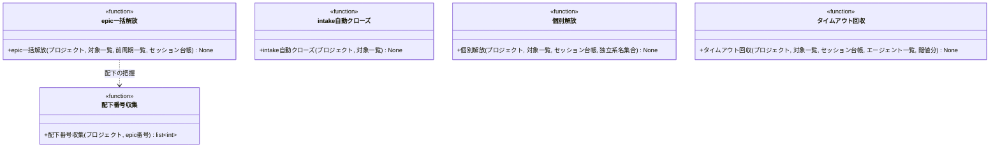

# モジュール構成: モニター / クリーンアップ

`クリーンアップ` ドメイン（モニター側）に属する構成要素詳細。
polling / heartbeat 周期の検知（intake 自動クローズ・epic 一括解放・個別解放・タイムアウト回収）を扱う。
エージェントの外側にある後片付けだけを担い、ラベルの付け替え・完了の伝播はエージェント側の責務のまま。

## 一覧

| ユースケース | 役割 | コンテナ | 種別 | 名前 | 概要 | 補足 |
| --- | --- | --- | --- | --- | --- | --- |
| intake自動クローズ | 検知 | `features/cleanup/service.py` | 関数 | [`close_completed_intakes`](#intake-自動クローズ) | 全 Sub-issue closed の intake をクローズする | - |
| epic一括解放 | 検知 | `features/cleanup/service.py` | 関数 | [`release_closed_epics`](#epic-一括解放) | epic close 検知で配下の全セッションを解放する | - |
| epic一括解放 | 内部処理 | `features/cleanup/service.py` | 関数 | [`_collect_family_numbers`](#配下番号収集) | epic 配下 + 親 intake の Issue 番号を再帰収集する | - |
| 個別解放 | 検知 | `features/cleanup/service.py` | 関数 | [`release_closed_standalone`](#個別解放) | 独立系セッションを担当面の close 検知で解放する | - |
| タイムアウト検知 | 検知 | `features/cleanup/service.py` | 関数 | [`reap_timed_out_sessions`](#タイムアウト回収) | 処理中のまま超過したセッションを kill + 台帳修復する | - |

## ディレクトリ構成

```
src/ai_monitor/features/cleanup/
└── service.py    # close_completed_intakes / release_closed_epics / release_closed_standalone / reap_timed_out_sessions
```

## 構成図



## `features/cleanup/service.py`
> 種別: ファイル

周期の検知 4 種を担うファイル。
GitHub・tmux 操作の実体は [GitHub連携](./GitHub連携.md) / [tmux連携](./tmux連携.md)、台帳操作は[セッション台帳](./エージェント管理.md#セッション台帳)（いずれも別分類）。

---

### intake 自動クローズ
> 物理名: `close_completed_intakes`<br>
> 種別: 関数

全 Sub-issue closed の intake Issue をクローズする。

#### 引数

| 論理名 | 引数名 | 型 | 必須 | デフォルト | 説明 | 補足 |
| --- | --- | --- | --- | --- | --- | --- |
| プロジェクト | `project` | [`MonitoredProject`](./エージェント管理.md#監視対象プロジェクト) | ✅ | - | 対象のプロジェクト | - |
| 対象一覧 | `targets` | [`list[MonitorTarget]`](./エージェント管理.md#監視対象) | ✅ | - | 周期の open 対象一覧 | - |

引数例:

```python
close_completed_intakes(project, targets)
```

#### 戻り値

| 型 | 説明 | 補足 |
| --- | --- | --- |
| `None` | なし | - |

#### 処理

1. `targets` から `layer:intake` ラベル付きの Issue を抽出する
2. `sub_issues_total > 0` かつ `sub_issues_completed == sub_issues_total` のものをクローズする（[Issue クローズ](./GitHub連携.md#issue-クローズ)）

#### 例外

なし（クローズ失敗の `RequestFailed` は呼び出し元の周期見送りに委ねる）

#### 単体テスト

| テスト名 | 正常/異常 | 概要 | 条件 | Mock | 期待値 | 補足 |
| --- | --- | --- | --- | --- | --- | --- |
| `test_close_completed_intakes` | 正常 | 全子 closed のクローズ | `total=2, completed=2` の intake + 対象外の Issue が混在 | GitHub API | 該当 intake だけがクローズされる | - |
| `test_close_completed_intakes_when_incomplete` | 正常 | 未完了の見送り | `total=2, completed=1` の intake | GitHub API | クローズが呼ばれない | - |
| `test_close_completed_intakes_when_no_children` | 正常 | Sub-issue なしの対象外 | `total=0` の intake | GitHub API | クローズが呼ばれない | - |

---

### epic 一括解放
> 物理名: `release_closed_epics`<br>
> 種別: 関数

前周期との差分で epic のクローズを検知し、配下の全セッション（intake 含む）を一括解放する。

#### 引数

| 論理名 | 引数名 | 型 | 必須 | デフォルト | 説明 | 補足 |
| --- | --- | --- | --- | --- | --- | --- |
| プロジェクト | `project` | [`MonitoredProject`](./エージェント管理.md#監視対象プロジェクト) | ✅ | - | 対象のプロジェクト | - |
| 対象一覧 | `targets` | [`list[MonitorTarget]`](./エージェント管理.md#監視対象) | ✅ | - | 今周期の open 対象一覧 | - |
| 前周期一覧 | `prev_targets` | [`list[MonitorTarget]`](./エージェント管理.md#監視対象) | ✅ | - | 前周期の open 対象一覧 | 初回は `[]`（差分なし扱い） |
| セッション台帳 | `registry` | [`SessionRegistry`](./エージェント管理.md#セッション台帳) | ✅ | - | 起動中セッションの台帳 | キーワード引数 |

引数例:

```python
release_closed_epics(project, targets, prev_targets, registry=registry)
```

#### 戻り値

| 型 | 説明 | 補足 |
| --- | --- | --- |
| `None` | なし | - |

#### 処理

1. `prev_targets` に居て `targets` に居ない `layer:epic` の Issue をクローズ候補にする
2. 候補を単体取得し、closed を確認する（[Issue 単体取得](./GitHub連携.md#issue-単体取得)。open ならスキップ）
3. 配下 + 親 intake の番号を収集する（[配下番号収集](#配下番号収集)）
4. `targets` のうち収集番号の Issue と、収集番号に紐づく PR（`linked_issue_numbers` 照合）に `確認:*` が残っていれば解放しない（次周期で再判定）
5. 収集番号ごとに台帳からセッションを解放し、tmux セッションを kill する（[番号で解放](./エージェント管理.md#番号で解放)・[セッション kill](./tmux連携.md#セッション-kill)）

#### 例外

なし（取得失敗の `RequestFailed` は呼び出し元の周期見送りに委ねる）

#### 単体テスト

| テスト名 | 正常/異常 | 概要 | 条件 | Mock | 期待値 | 補足 |
| --- | --- | --- | --- | --- | --- | --- |
| `test_release_closed_epics` | 正常 | 配下の一括解放 | 前周期に居た epic が今周期に無く、単体取得は closed・配下に `確認:*` なし | GitHub API / tmux | 配下 + intake の全セッションが解放され kill される | - |
| `test_release_closed_epics_when_confirm_remains` | 正常 | 確認ラベル残存の見送り | 配下の subsystem に `確認:*` が残存 | GitHub API / tmux | 解放・kill が発生しない | - |
| `test_release_closed_epics_when_still_open` | 正常 | open のままの見送り | 一覧から消えたが単体取得は open | GitHub API / tmux | 解放・kill が発生しない | 一覧の取りこぼし |
| `test_release_closed_epics_when_no_diff` | 正常 | 差分なしの見送り | 前周期と今周期が同一 | GitHub API / tmux | 単体取得も発生しない | - |

---

### 配下番号収集
> 物理名: `_collect_family_numbers`<br>
> 種別: 関数

epic 配下（Sub-issue ツリーの全子孫）と親 intake の Issue 番号を収集する。

#### 引数

| 論理名 | 引数名 | 型 | 必須 | デフォルト | 説明 | 補足 |
| --- | --- | --- | --- | --- | --- | --- |
| プロジェクト | `project` | [`MonitoredProject`](./エージェント管理.md#監視対象プロジェクト) | ✅ | - | 対象のプロジェクト | - |
| epic 番号 | `epic_number` | `int` | ✅ | - | 起点の epic Issue 番号 | - |

引数例:

```python
_collect_family_numbers(project, 35)
```

#### 戻り値

| 型 | 説明 | 補足 |
| --- | --- | --- |
| `list[int]` | epic 自身 + 全子孫 + 親 intake の番号 | 親なしは epic + 子孫のみ |

戻り値例:

```python
[35, 40, 50, 30]
```

#### 処理

1. epic 番号を起点に Sub-issue の子番号を再帰取得して集める（[Sub-issue 番号一覧](./GitHub連携.md#sub-issue-番号一覧)）
2. epic の親 Issue 番号（intake）を取得して加える（[親 Issue 番号取得](./GitHub連携.md#親-issue-番号取得)。`None` は加えない）
3. epic 自身を含めた番号一覧を返す

#### 例外

なし（取得失敗の `RequestFailed` は呼び出し元へ伝播する）

#### 単体テスト

| テスト名 | 正常/異常 | 概要 | 条件 | Mock | 期待値 | 補足 |
| --- | --- | --- | --- | --- | --- | --- |
| `test_collect_family_numbers` | 正常 | 2 段の再帰と親の合算 | epic → story → subsystem の 2 段 + 親 intake | GitHub API | 全番号が重複なしで返る | - |
| `test_collect_family_numbers_when_no_parent` | 正常 | 親なし epic | 親取得が `None` | GitHub API | epic + 子孫のみ返る | - |

---

### 個別解放
> 物理名: `release_closed_standalone`<br>
> 種別: 関数

独立系エージェントのセッションを、担当面の close / merge 検知で解放する。

#### 引数

| 論理名 | 引数名 | 型 | 必須 | デフォルト | 説明 | 補足 |
| --- | --- | --- | --- | --- | --- | --- |
| プロジェクト | `project` | [`MonitoredProject`](./エージェント管理.md#監視対象プロジェクト) | ✅ | - | 対象のプロジェクト | - |
| 対象一覧 | `targets` | [`list[MonitorTarget]`](./エージェント管理.md#監視対象) | ✅ | - | 今周期の open 対象一覧 | - |
| セッション台帳 | `registry` | [`SessionRegistry`](./エージェント管理.md#セッション台帳) | ✅ | - | 起動中セッションの台帳 | キーワード引数 |
| 独立系名集合 | `standalone_names` | `set[str]` | ✅ | - | 個別解放の対象エージェント名 | `Agent.standalone` が `True` の名前（`build_agents` 由来） |

引数例:

```python
release_closed_standalone(project, targets, registry=registry, standalone_names={"library-poc-runner", "questioner"})
```

#### 戻り値

| 型 | 説明 | 補足 |
| --- | --- | --- |
| `None` | なし | - |

#### 処理

1. 台帳から `standalone_names` に該当するプロジェクトのセッションを抽出する
2. 主番号が `targets` に無いセッションを候補にし、単体取得で closed を確認する（[Issue 単体取得](./GitHub連携.md#issue-単体取得)。open ならスキップ）
3. 該当セッションを台帳から除去し、tmux セッションを kill する（[除去](./エージェント管理.md#除去)・[セッション kill](./tmux連携.md#セッション-kill)）

#### 例外

なし（取得失敗の `RequestFailed` は呼び出し元の周期見送りに委ねる）

#### 単体テスト

| テスト名 | 正常/異常 | 概要 | 条件 | Mock | 期待値 | 補足 |
| --- | --- | --- | --- | --- | --- | --- |
| `test_release_closed_standalone` | 正常 | close 確認後の解放 | 主番号が一覧に無く単体取得は closed | GitHub API / tmux | 台帳から除去され kill される | - |
| `test_release_closed_standalone_when_still_open` | 正常 | open のままの見送り | 主番号が一覧に無いが単体取得は open | GitHub API / tmux | 解放・kill が発生しない | 一覧の取りこぼし |
| `test_release_closed_standalone_when_workflow_agent` | 正常 | ワークフロー系の対象外 | 独立系でないセッションの主番号が一覧に無い | GitHub API / tmux | 単体取得も発生しない | epic 一括解放まで常駐 |

---

### タイムアウト回収
> 物理名: `reap_timed_out_sessions`<br>
> 種別: 関数

処理中のまま `session_timeout_min` を超過したセッションを kill して回収する。
あわせて tmux に実体が無いセッションの台帳を修復する。

#### 引数

| 論理名 | 引数名 | 型 | 必須 | デフォルト | 説明 | 補足 |
| --- | --- | --- | --- | --- | --- | --- |
| プロジェクト | `project` | [`MonitoredProject`](./エージェント管理.md#監視対象プロジェクト) | ✅ | - | 対象のプロジェクト | - |
| 対象一覧 | `targets` | [`list[MonitorTarget]`](./エージェント管理.md#監視対象) | ✅ | - | 今周期の open 対象一覧 | 処理中ラベルの照合に使う |
| セッション台帳 | `registry` | [`SessionRegistry`](./エージェント管理.md#セッション台帳) | ✅ | - | 起動中セッションの台帳 | キーワード引数 |
| エージェント一覧 | `agents` | [`list[Agent]`](./エージェント管理.md#エージェント定義) | ✅ | - | 処理中ラベルの解決に使う | エージェント名 → `processing_label` |
| 閾値分 | `timeout_min` | `int` | ✅ | - | タイムアウト閾値（分） | 設定の `session_timeout_min` |

引数例:

```python
reap_timed_out_sessions(project, targets, registry=registry, agents=agents, timeout_min=30)
```

#### 戻り値

| 型 | 説明 | 補足 |
| --- | --- | --- |
| `None` | なし | - |

#### 処理

1. プロジェクトの各セッションの tmux 実体を確認し、無いものは台帳から除去する（[生存確認](./tmux連携.md#生存確認)・[除去](./エージェント管理.md#除去)）
2. `last_seen_at` が `timeout_min` を超過したセッションを抽出する
3. 主番号の対象に `処理中:{エージェント}` が付いているものだけを対象にする（待機中は対象外）
4. 処理中ラベルを除去 → tmux セッションを kill → 台帳から除去する（[ラベル除去](./GitHub連携.md#ラベル除去)・[セッション kill](./tmux連携.md#セッション-kill)・[除去](./エージェント管理.md#除去)。ラベル除去に失敗したセッションは見送り、次周期で再試行する）

#### 例外

なし

#### 単体テスト

| テスト名 | 正常/異常 | 概要 | 条件 | Mock | 期待値 | 補足 |
| --- | --- | --- | --- | --- | --- | --- |
| `test_reap_timed_out_sessions` | 正常 | 超過セッションの回収 | 超過 + 処理中ラベルありのセッション | GitHub API / tmux | ラベル除去 → kill → 台帳除去の順で実行される | - |
| `test_reap_timed_out_sessions_when_waiting` | 正常 | 待機中の対象外 | 超過しているが処理中ラベルなし | GitHub API / tmux | kill・台帳変更・ラベル操作が発生しない | - |
| `test_reap_timed_out_sessions_when_session_gone` | 正常 | 実体消失の台帳修復 | tmux の生存確認が偽 | GitHub API / tmux | 台帳から除去のみ行われる | - |
| `test_reap_timed_out_sessions_when_label_error` | 異常 | ラベル除去失敗の見送り | ラベル除去が `RequestFailed` | GitHub API / tmux | kill・台帳除去が行われない（次周期で再試行） | - |
