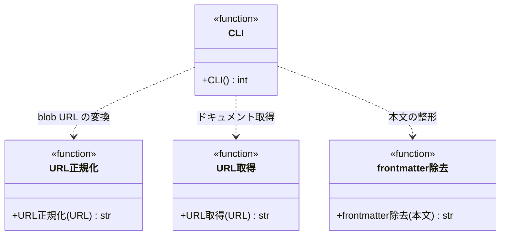

# モジュール構成: 注入 / URLドキュメント

`URLドキュメント` ドメイン（注入側）に属する構成要素詳細。
SKILL.md の動的コンテキスト注入・フェーズ内の実行時取得から呼ばれ、指定 URL の本文を標準出力に展開する。

## 一覧

| ユースケース | 役割 | コンテナ | 種別 | 名前 | 概要 | 補足 |
| --- | --- | --- | --- | --- | --- | --- |
| URLドキュメント注入 | URL 取得 | `inject/fetch.py` | 関数 | [`fetch_url`](#url-取得) | URL からテキストを取得する | エージェントドキュメント注入と共有 |
| URLドキュメント注入 | URL 正規化 | `inject/read_urls.py` | 関数 | [`normalize_github_url`](#url-正規化) | GitHub blob URL を raw URL に変換する | - |
| URLドキュメント注入 | front matter 除去 | `inject/read_urls.py` | 関数 | [`strip_frontmatter`](#front-matter-除去) | 本文先頭の YAML front matter を除去する | - |
| URLドキュメント注入 | CLI | `inject/read_urls.py` | 関数 | [`main`](#cli) | URL 一覧を受けて本文一式を出力する | - |

## ディレクトリ構成

```
plugins/ai-monitor/inject/
├── fetch.py         # fetch_url（エージェントドキュメント注入と共有）
└── read_urls.py     # normalize_github_url / strip_frontmatter / main
```

## 構成図



## `inject/fetch.py`
> 種別: ファイル

注入 CLI 共通の URL 取得ヘルパー。

---

### URL 取得
> 物理名: `fetch_url`<br>
> 種別: 関数

URL からテキストを取得する。

#### 引数

| 論理名 | 引数名 | 型 | 必須 | デフォルト | 説明 | 補足 |
| --- | --- | --- | --- | --- | --- | --- |
| URL | `url` | `str` | ✅ | - | 取得対象 URL | パスに日本語を含んでよい |

引数例:

```python
fetch_url("https://raw.githubusercontent.com/o/r/master/docs/wiki/規約/コメント.md")
```

#### 戻り値

| 型 | 説明 | 補足 |
| --- | --- | --- |
| `str` | 取得した本文 | UTF-8 デコード済み |

戻り値例:

```python
"# 規約: コメント\n..."
```

#### 処理

1. URL のパス部分の非 ASCII 文字を quote する
2. GET して本文を UTF-8 で返す

#### 例外

| 例外名 | 発生条件 | メッセージ | 補足 |
| --- | --- | --- | --- |
| `URLError` | 接続不可 / HTTP エラー（404 等） | urllib のエラー内容 | 呼び出し元へそのまま伝播（フォールバックしない） |

#### 単体テスト

| テスト名 | 正常/異常 | 概要 | 条件 | Mock | 期待値 | 補足 |
| --- | --- | --- | --- | --- | --- | --- |
| `test_fetch_url` | 正常 | 非 ASCII パスの quote と取得 | 日本語パスを含む URL | urllib | quote 済み URL でリクエストされ、本文が返る | - |

## `inject/read_urls.py`
> 種別: ファイル

指定 URL の本文一式を標準出力に展開する CLI スクリプト。

---

### URL 正規化
> 物理名: `normalize_github_url`<br>
> 種別: 関数

GitHub blob URL を raw URL に変換する。

#### 引数

| 論理名 | 引数名 | 型 | 必須 | デフォルト | 説明 | 補足 |
| --- | --- | --- | --- | --- | --- | --- |
| URL | `url` | `str` | ✅ | - | 変換対象 URL | - |

引数例:

```python
normalize_github_url("https://github.com/o/r/blob/master/docs/wiki/規約/コメント.md")
```

#### 戻り値

| 型 | 説明 | 補足 |
| --- | --- | --- |
| `str` | 変換後の URL | blob 形式以外はそのまま返す |

戻り値例:

```python
"https://raw.githubusercontent.com/o/r/master/docs/wiki/規約/コメント.md"
```

#### 処理

1. `github.com/{owner}/{repo}/blob/{パス}` 形式か判定する
2. 一致する場合、`raw.githubusercontent.com/{owner}/{repo}/{パス}` に変換して返す
3. 一致しない場合、そのまま返す

#### 例外

なし

#### 単体テスト

| テスト名 | 正常/異常 | 概要 | 条件 | Mock | 期待値 | 補足 |
| --- | --- | --- | --- | --- | --- | --- |
| `test_normalize_github_url` | 正常 | blob URL の raw 変換 | `github.com/{owner}/{repo}/blob/...` 形式の URL | なし | `raw.githubusercontent.com` の URL が返る | - |
| `test_normalize_github_url_when_not_blob` | 正常 | blob 形式以外はそのまま | raw URL | なし | 入力がそのまま返る | - |

---

### front matter 除去
> 物理名: `strip_frontmatter`<br>
> 種別: 関数

本文先頭の YAML front matter を除去する。

#### 引数

| 論理名 | 引数名 | 型 | 必須 | デフォルト | 説明 | 補足 |
| --- | --- | --- | --- | --- | --- | --- |
| 本文 | `text` | `str` | ✅ | - | 取得したページ本文 | - |

引数例:

```python
strip_frontmatter("---\ntitle: x\n---\n# 本文\n")
```

#### 戻り値

| 型 | 説明 | 補足 |
| --- | --- | --- |
| `str` | front matter を除いた本文 | 先頭に front matter が無ければそのまま返す |

戻り値例:

```python
"# 本文\n"
```

#### 処理

1. 先頭の `---` 行で囲まれた YAML front matter を 1 ブロックだけ除去して返す

#### 例外

なし

#### 単体テスト

| テスト名 | 正常/異常 | 概要 | 条件 | Mock | 期待値 | 補足 |
| --- | --- | --- | --- | --- | --- | --- |
| `test_strip_frontmatter` | 正常 | front matter の除去 | 先頭に YAML front matter が付いた本文 | なし | front matter を除いた本文が返る | - |
| `test_strip_frontmatter_when_no_frontmatter` | 正常 | front matter なしはそのまま | front matter の無い本文 | なし | 入力がそのまま返る | - |

---

### CLI
> 物理名: `main`<br>
> 種別: 関数

URL 一覧を受けて、本文一式をラベル行 + md コードブロックで標準出力に展開する。

#### 引数

なし（コマンドライン引数 `urls` を読む）

引数例:

```python
main()
```

#### 戻り値

| 型 | 説明 | 補足 |
| --- | --- | --- |
| `int` | 終了コード | `0` = 正常 / `1` = 引数不足・取得失敗 |

戻り値例:

```python
0
```

#### 処理

1. コマンドライン引数 `urls`（1 個以上）をパースする（不足なら stderr に使い方を出して `1` を返す）
2. 各 URL を raw URL に正規化する（[URL 正規化](#url-正規化)）
3. URL を順に取得し（[URL 取得](#url-取得)）、front matter を除去して（[front matter 除去](#front-matter-除去)）`**{取得元 URL}:**` のラベル行 + 5 連バッククォートの md コードブロックで標準出力に出す
   - ラベル行の URL は正規化後の取得 URL にする
4. 取得に失敗した場合、stderr に対象 URL を出して `1` を返す
5. 全件出力したら `0` を返す

#### 例外

なし

#### 単体テスト

| テスト名 | 正常/異常 | 概要 | 条件 | Mock | 期待値 | 補足 |
| --- | --- | --- | --- | --- | --- | --- |
| `test_main_when_no_args` | 異常 | 引数不足 | 引数なしで実行 | urllib | stderr に使い方 + 戻り値 `1`・HTTP は呼ばれない | - |
| `test_main_when_fetch_failed` | 異常 | 取得失敗 | 存在しないページの URL で実行 | urllib | stderr に対象 URL + 戻り値 `1` | - |
