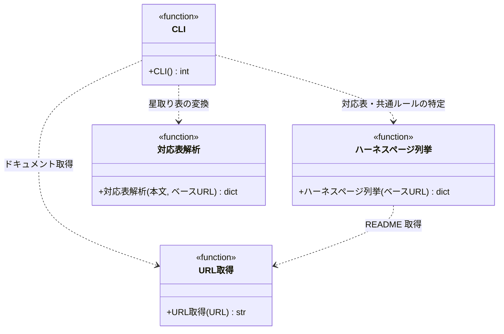

# モジュール構成: 注入 / エージェントドキュメント

`エージェントドキュメント` ドメイン（注入側）に属する構成要素詳細。
SKILL.md の動的コンテキスト注入から呼ばれ、エージェントごとの参照ドキュメント一式を標準出力に展開する。

## 一覧

| ユースケース | 役割 | コンテナ | 種別 | 名前 | 概要 | 補足 |
| --- | --- | --- | --- | --- | --- | --- |
| エージェントドキュメント注入 | URL 取得 | `inject/fetch.py` | 関数 | [`fetch_url`](./URLドキュメント.md#url-取得) | URL からテキストを取得する | URLドキュメント注入と共有 |
| エージェントドキュメント注入 | ハーネスページ列挙 | `inject/read_agent_docs.py` | 関数 | [`list_harness_pages`](#ハーネスページ列挙) | `Claudeハーネス/README.md` の目次を分類フォルダごとに列挙する | - |
| エージェントドキュメント注入 | 対応表解析 | `inject/read_agent_docs.py` | 関数 | [`parse_matrix`](#対応表解析) | 星取り表を {エージェント名: ドキュメント一覧} に変換する | - |
| エージェントドキュメント注入 | CLI | `inject/read_agent_docs.py` | 関数 | [`main`](#cli) | エージェント名を受けて参照ドキュメント一式を出力する | - |

## ディレクトリ構成

```
plugins/ai-monitor/inject/
├── fetch.py              # fetch_url（URLドキュメント注入と共有）
└── read_agent_docs.py    # list_harness_pages / parse_matrix / main
```

## 構成図



## `inject/read_agent_docs.py`
> 種別: ファイル

エージェント名から参照ドキュメント一式を標準出力に展開する CLI スクリプト。

---

### ハーネスページ列挙
> 物理名: `list_harness_pages`<br>
> 種別: 関数

`Claudeハーネス/README.md` の目次を分類フォルダ（`共通対応表` / `対応表` / `共通ルール`）ごとに列挙する。

#### 引数

| 論理名 | 引数名 | 型 | 必須 | デフォルト | 説明 | 補足 |
| --- | --- | --- | --- | --- | --- | --- |
| ベース URL | `base_url` | `str` | ✅ | - | Wiki raw URL のベース（`WIKI_BASE` / `AI_MONITOR_WIKI_BASE`） | - |

引数例:

```python
list_harness_pages("https://raw.githubusercontent.com/o/r/master/docs/wiki")
```

#### 戻り値

| 型 | 説明 | 補足 |
| --- | --- | --- |
| `dict[str, list[tuple[str, str]]]` | {分類フォルダ名: [(表示名, Wiki 相対パス), ...]}（README の目次順） | キーは `共通対応表` / `対応表` / `共通ルール` の 3 つ固定。目次に無い分類は空リスト。表示名は目次のリンクテキスト |

戻り値例:

```python
{
    "共通対応表": [("エージェント参照ドキュメント対応表", "Claudeハーネス/共通対応表/エージェント参照ドキュメント対応表.md")],
    "対応表": [("プロジェクトドキュメント対応表", "Claudeハーネス/対応表/プロジェクトドキュメント対応表.md")],
    "共通ルール": [("環境変数の解決", "Claudeハーネス/共通ルール/環境変数の解決.md")],
}
```

#### 処理

1. `Claudeハーネス/README.md` を取得する（[URL 取得](./URLドキュメント.md#url-取得)）
2. 目次のリンクをパスの分類フォルダ（`共通対応表/` / `対応表/` / `共通ルール/`）ごとに振り分け、（リンクテキスト, `Claudeハーネス/{リンクパス}` の相対パス）の一覧で返す（raw URL ではフォルダ一覧を取得できないため、README の目次が SoT。分類フォルダ外のリンクは無視する）

#### 例外

| 例外名 | 発生条件 | メッセージ | 補足 |
| --- | --- | --- | --- |
| `URLError` | README の取得失敗 | urllib のエラー内容 | `fetch_url` から伝播 |

#### 単体テスト

| テスト名 | 正常/異常 | 概要 | 条件 | Mock | 期待値 | 補足 |
| --- | --- | --- | --- | --- | --- | --- |
| `test_list_harness_pages` | 正常 | 分類フォルダごとの振り分け | 目次に共通対応表 1 本 + 対応表 2 本 + 共通ルール 1 本 + 分類フォルダ外のページが混在する README | urllib | 3 分類に（表示名, 相対パス）が目次順で振り分けられ、分類フォルダ外は含まれない | - |
| `test_list_harness_pages_when_empty` | 正常 | 分類フォルダのページなしは空リスト | 分類フォルダのページを含まない README | urllib | 3 キーとも `[]` | - |

---

### 対応表解析
> 物理名: `parse_matrix`<br>
> 種別: 関数

星取り表（行 = ドキュメント・列 = エージェント）を {エージェント名: [(表示名, URL), ...]} に変換する。

#### 引数

| 論理名 | 引数名 | 型 | 必須 | デフォルト | 説明 | 補足 |
| --- | --- | --- | --- | --- | --- | --- |
| 本文 | `text` | `str` | ✅ | - | 対応表ページの Markdown 本文 | - |
| ベース URL | `base_url` | `str` | ✅ | - | Wiki 相対リンクの解決に使うベース URL | - |

引数例:

```python
parse_matrix(text, "https://raw.githubusercontent.com/o/r/master/docs/wiki")
```

#### 戻り値

| 型 | 説明 | 補足 |
| --- | --- | --- |
| `dict[str, list[tuple[str, str]]]` | {エージェント名: [(表示名, 取得 URL), ...]} | ○ の付いた行のみ |

戻り値例:

```python
{"intake-issue-triager": [("規約/コメント.md", "https://.../docs/wiki/規約/コメント.md")]}
```

#### 処理

1. 本文から表の行を抽出する（表が無ければ `ValueError`）
2. ヘッダー行からエージェント名の列を確定する
3. 各行の先頭セルを（表示名, 取得 URL）に解決する
   - 絶対 URL のリンクの場合、リンク先をそのまま取得 URL にする
   - Wiki 相対リンクの場合、`{base_url}/{パス}` を取得 URL にする
4. ○ の付いたセルのエージェントへ行のドキュメントを対応付けて返す

#### 例外

| 例外名 | 発生条件 | メッセージ | 補足 |
| --- | --- | --- | --- |
| `ValueError` | 本文に星取り表が見つからない | `星取り表が見つからない` | - |

#### 単体テスト

| テスト名 | 正常/異常 | 概要 | 条件 | Mock | 期待値 | 補足 |
| --- | --- | --- | --- | --- | --- | --- |
| `test_parse_matrix` | 正常 | ○ の抽出と相対リンクの解決 | 2 エージェント × 3 ドキュメントの表 | なし | ○ の行だけが各エージェントに対応付き、URL が `{base_url}/{パス}` になる | - |
| `test_parse_matrix_when_absolute_url` | 正常 | 絶対 URL リンクの解決 | 行の先頭セルが絶対 URL のリンク | なし | リンク先 URL がそのまま取得 URL になる | - |
| `test_parse_matrix_when_no_table` | 異常 | 表なし | 表を含まない本文 | なし | `ValueError` | 例外表「星取り表が見つからない」に対応 |

---

### CLI
> 物理名: `main`<br>
> 種別: 関数

エージェント名を受けて、共通ルール一式と全対応表で ○ の付いた参照ドキュメント一式を標準出力に展開する。

#### 引数

なし（コマンドライン引数 `agent_name` と環境変数 `WIKI_BASE` / `AI_MONITOR_WIKI_BASE` を読む）

引数例:

```python
main()
```

#### 戻り値

| 型 | 説明 | 補足 |
| --- | --- | --- |
| `int` | 終了コード | `0` = 正常 / `1` = 引数・環境・未知エージェント |

戻り値例:

```python
0
```

#### 処理

1. コマンドライン引数 `agent_name` をパースする
2. 環境変数 `WIKI_BASE` と `AI_MONITOR_WIKI_BASE` を読む（どちらか未設定なら stderr にメッセージを出して `1` を返す）
3. 共通側（`AI_MONITOR_WIKI_BASE`）の README を列挙し、`共通対応表` と `共通ルール` のページ一覧を得る（[ハーネスページ列挙](#ハーネスページ列挙)）
4. プロジェクト側（`WIKI_BASE`）の README を列挙し、`対応表` のページ一覧を得る（2 つのベース URL が同じ場合は README が同一ファイルのため、3 の取得結果をそのまま使う）
5. 対応表（共通対応表 → 対応表の順）を取得・解析してエージェントごとの対応をマージする（[URL 取得](./URLドキュメント.md#url-取得)・[対応表解析](#対応表解析)。相対リンクの解決には各対応表側のベース URL を使う）
6. `agent_name` の対応を確定する
   - 全対応表に列が無い場合、stderr に有効なエージェント名の一覧を出して `1` を返す
7. 共通ルールページ → ○ の付いた対応ドキュメントの順に取得し、`**{表示名}:**` のラベル行 + 5 連バッククォートの md コードブロックで本文を包んで標準出力に出して `0` を返す（共通ルールの表示名は目次のリンクテキスト）（[URL 取得](./URLドキュメント.md#url-取得)）

#### 例外

| 例外名 | 発生条件 | メッセージ | 補足 |
| --- | --- | --- | --- |
| `URLError` | 対応表 / ドキュメントの取得失敗 | urllib のエラー内容 | traceback を出して異常終了（フォールバックしない） |

#### 単体テスト

| テスト名 | 正常/異常 | 概要 | 条件 | Mock | 期待値 | 補足 |
| --- | --- | --- | --- | --- | --- | --- |
| `test_main_when_same_base` | 正常 | ベースが同一の場合の README 使い回し | `WIKI_BASE` と `AI_MONITOR_WIKI_BASE` に同じベースを設定して実行 | urllib | README の取得が 1 回だけで、共通ルール・共通対応表・対応表の全てが出力に反映される | - |
| `test_main_when_separate_bases` | 正常 | ベースが異なる場合の 2 README 列挙 | `WIKI_BASE` と `AI_MONITOR_WIKI_BASE` に別ベースを設定して実行 | urllib | 両ベースの README が 1 回ずつ取得され、共通側の共通ルール・共通対応表とプロジェクト側の対応表が出力に反映される | - |
| `test_main_when_wiki_base_missing` | 異常 | `WIKI_BASE` 未設定 | 環境変数を消して実行 | urllib | stderr にメッセージ + 戻り値 `1`・HTTP は呼ばれない | - |
| `test_main_when_ai_monitor_wiki_base_missing` | 異常 | `AI_MONITOR_WIKI_BASE` 未設定 | 環境変数を消して実行 | urllib | stderr にメッセージ + 戻り値 `1`・HTTP は呼ばれない | - |
| `test_main_when_unknown_agent` | 異常 | 未知のエージェント名 | 対応表に無い名前で実行 | urllib | stderr に有効名一覧 + 戻り値 `1` | - |
